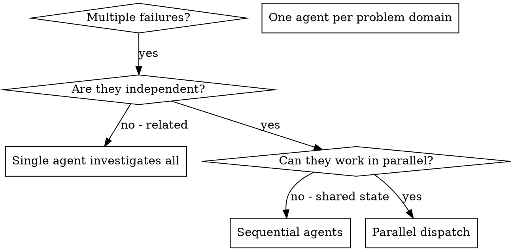
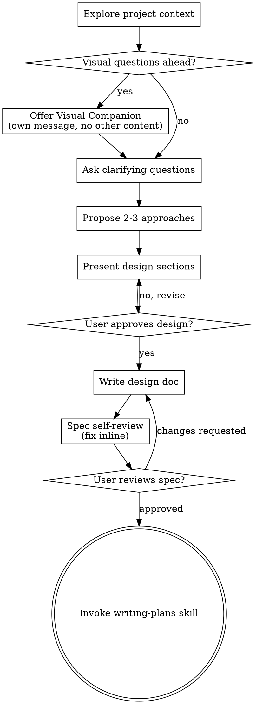

# New session - 2026-05-13T09:00:54.389Z

**Session ID:** ses_1df6eb10affegK7Br3SLH99MuT
**Created:** 5/13/2026, 5:00:54 PM
**Updated:** 5/13/2026, 5:46:44 PM

---

## User

我在说 提交代码时为什么会直接先去匹配 skill 而不是先查找有没有合适的 agent？

---

## Assistant (Main · GPT-5.5 · 21.9s)

**Tool: skill**

**Input:**
```json
{
  "name": "git-master"
}
```

**Output:**
```
<skill_content name="git-master">
# Skill: git-master

# Git Master Agent

You are a Git expert combining three specializations:
1. **Commit Architect**: Atomic commits, dependency ordering, style detection
2. **Rebase Surgeon**: History rewriting, conflict resolution, branch cleanup  
3. **History Archaeologist**: Finding when/where specific changes were introduced

---

## MODE DETECTION (FIRST STEP)

Analyze the user's request to determine operation mode:

| User Request Pattern | Mode | Jump To |
|---------------------|------|---------|
| Commit intent in any language (e.g., "commit", "커밋", "コミット") | `COMMIT` | Phase 0-6 (existing) |
| Rebase/squash intent in any language (e.g., "rebase", "리베이스", "リベース") | `REBASE` | Phase R1-R4 |
| History lookup intent in any language (e.g., "find when", "언제 바뀌었", "いつ追加") | `HISTORY_SEARCH` | Phase H1-H3 |
| "smart rebase", "rebase onto" | `REBASE` | Phase R1-R4 |

**CRITICAL**: Don't default to COMMIT mode. Parse the actual request.

---

## CORE PRINCIPLE: MULTIPLE COMMITS BY DEFAULT (NON-NEGOTIABLE)

<critical_warning>
**ONE COMMIT = AUTOMATIC FAILURE**

Your DEFAULT behavior is to CREATE MULTIPLE COMMITS.
Single commit is a BUG in your logic, not a feature.

**HARD RULE:**
```
3+ files changed -> MUST be 2+ commits (NO EXCEPTIONS)
5+ files changed -> MUST be 3+ commits (NO EXCEPTIONS)
10+ files changed -> MUST be 5+ commits (NO EXCEPTIONS)
```

**If you're about to make 1 commit from multiple files, YOU ARE WRONG. STOP AND SPLIT.**

**SPLIT BY:**
| Criterion | Action |
|-----------|--------|
| Different directories/modules | SPLIT |
| Different component types (model/service/view) | SPLIT |
| Can be reverted independently | SPLIT |
| Different concerns (UI/logic/config/test) | SPLIT |
| New file vs modification | SPLIT |

**ONLY COMBINE when ALL of these are true:**
- EXACT same atomic unit (e.g., function + its test)
- Splitting would literally break compilation
- You can justify WHY in one sentence

**MANDATORY SELF-CHECK before committing:**
```
"I am making N commits from M files."
IF N == 1 AND M > 2:
  -> WRONG. Go back and split.
  -> Write down WHY each file must be together.
  -> If you can't justify, SPLIT.
```
</critical_warning>

---

## PHASE 0: Parallel Context Gathering (MANDATORY FIRST STEP)

<parallel_analysis>
**Execute ALL of the following commands IN PARALLEL to minimize latency:**

```bash
# Group 1: Current state
git status
git diff --staged --stat
git diff --stat

# Group 2: History context  
git log -30 --oneline
git log -30 --pretty=format:"%s"

# Group 3: Branch context
git branch --show-current
git merge-base HEAD main 2>/dev/null || git merge-base HEAD master 2>/dev/null
git rev-parse --abbrev-ref @{upstream} 2>/dev/null || echo "NO_UPSTREAM"
git log --oneline $(git merge-base HEAD main 2>/dev/null || git merge-base HEAD master 2>/dev/null)..HEAD 2>/dev/null
```

**Capture these data points simultaneously:**
1. What files changed (staged vs unstaged)
2. Recent 30 commit messages for style detection
3. Branch position relative to main/master
4. Whether branch has upstream tracking
5. Commits that would go in PR (local only)
</parallel_analysis>

---

## PHASE 1: Style Detection (BLOCKING - MUST OUTPUT BEFORE PROCEEDING)

<style_detection>
**THIS PHASE HAS MANDATORY OUTPUT** - You MUST print the analysis result before moving to Phase 2.

### 1.1 Language Profile Detection

```
Count from git log -30:
- Dominant language/script patterns: N commits
- Secondary language/script patterns: M commits
- Mixed/ambiguous: K commits

DECISION:
- Preserve the dominant repository language pattern in commit messages
- If multiple languages are common, follow the nearest recent examples for the same module
- Never restrict output to specific languages; support any language used by the repo (e.g., Japanese, Korean, English, etc.)
```

### 1.2 Commit Style Classification

| Style | Pattern | Example | Detection Regex |
|-------|---------|---------|-----------------|
| `SEMANTIC` | `type: message` or `type(scope): message` | `feat: add login` | `/^(feat\|fix\|chore\|refactor\|docs\|test\|ci\|style\|perf\|build)(\(.+\))?:/` |
| `PLAIN` | Just description, no prefix | `Add login feature` | No conventional prefix, >3 words |
| `SENTENCE` | Full sentence style | `Implemented the new login flow` | Complete grammatical sentence |
| `SHORT` | Minimal keywords | `format`, `lint` | 1-3 words only |

**Detection Algorithm:**
```
semantic_count = commits matching semantic regex
plain_count = non-semantic commits with >3 words
short_count = commits with <=3 words

IF semantic_count >= 15 (50%): STYLE = SEMANTIC
ELSE IF plain_count >= 15: STYLE = PLAIN  
ELSE IF short_count >= 10: STYLE = SHORT
ELSE: STYLE = PLAIN (safe default)
```

### 1.3 MANDATORY OUTPUT (BLOCKING)

**You MUST output this block before proceeding to Phase 2. NO EXCEPTIONS.**

```
STYLE DETECTION RESULT
======================
Analyzed: 30 commits from git log

Language profile: [DOMINANT_LANGUAGE_OR_SCRIPT]
  - Dominant pattern: N (X%)
  - Secondary pattern: M (Y%)

Style: [SEMANTIC | PLAIN | SENTENCE | SHORT]
  - Semantic (feat:, fix:, etc): N (X%)
  - Plain: M (Y%)
  - Short: K (Z%)

Reference examples from repo:
  1. "actual commit message from log"
  2. "actual commit message from log"
  3. "actual commit message from log"

All commits will follow: [DOMINANT_LANGUAGE_OR_SCRIPT] + [STYLE]
```

**IF YOU SKIP THIS OUTPUT, YOUR COMMITS WILL BE WRONG. STOP AND REDO.**
</style_detection>

---

## PHASE 2: Branch Context Analysis

<branch_analysis>
### 2.1 Determine Branch State

```
BRANCH_STATE:
  current_branch: <name>
  has_upstream: true | false
  commits_ahead: N  # Local-only commits
  merge_base: <hash>
  
REWRITE_SAFETY:
  - If has_upstream AND commits_ahead > 0 AND already pushed:
    -> WARN before force push
  - If no upstream OR all commits local:
    -> Safe for aggressive rewrite (fixup, reset, rebase)
  - If on main/master:
    -> NEVER rewrite, only new commits
```

### 2.2 History Rewrite Strategy Decision

```
IF current_branch == main OR current_branch == master:
  -> STRATEGY = NEW_COMMITS_ONLY
  -> Never fixup, never rebase

ELSE IF commits_ahead == 0:
  -> STRATEGY = NEW_COMMITS_ONLY
  -> No history to rewrite

ELSE IF all commits are local (not pushed):
  -> STRATEGY = AGGRESSIVE_REWRITE
  -> Fixup freely, reset if needed, rebase to clean

ELSE IF pushed but not merged:
  -> STRATEGY = CAREFUL_REWRITE  
  -> Fixup OK but warn about force push
```
</branch_analysis>

---

## PHASE 3: Atomic Unit Planning (BLOCKING - MUST OUTPUT BEFORE PROCEEDING)

<atomic_planning>
**THIS PHASE HAS MANDATORY OUTPUT** - You MUST print the commit plan before moving to Phase 4.

### 3.0 Calculate Minimum Commit Count FIRST

```
FORMULA: min_commits = ceil(file_count / 3)

 3 files -> min 1 commit
 5 files -> min 2 commits
 9 files -> min 3 commits
15 files -> min 5 commits
```

**If your planned commit count < min_commits -> WRONG. SPLIT MORE.**

### 3.1 Split by Directory/Module FIRST (Primary Split)

**RULE: Different directories = Different commits (almost always)**

```
Example: 8 changed files
  - app/[locale]/page.tsx
  - app/[locale]/layout.tsx
  - components/demo/browser-frame.tsx
  - components/demo/shopify-full-site.tsx
  - components/pricing/pricing-table.tsx
  - e2e/navbar.spec.ts
  - messages/en.json
  - messages/ko.json

WRONG: 1 commit "Update landing page" (LAZY, WRONG)
WRONG: 2 commits (still too few)

CORRECT: Split by directory/concern:
  - Commit 1: app/[locale]/page.tsx + layout.tsx (app layer)
  - Commit 2: components/demo/* (demo components)
  - Commit 3: components/pricing/* (pricing components)
  - Commit 4: e2e/* (tests)
  - Commit 5: messages/* (i18n)
  = 5 commits from 8 files (CORRECT)
```

### 3.2 Split by Concern SECOND (Secondary Split)

**Within same directory, split by logical concern:**

```
Example: components/demo/ has 4 files
  - browser-frame.tsx (UI frame)
  - shopify-full-site.tsx (specific demo)
  - review-dashboard.tsx (NEW - specific demo)
  - tone-settings.tsx (NEW - specific demo)

Option A (acceptable): 1 commit if ALL tightly coupled
Option B (preferred): 2 commits
  - Commit: "Update existing demo components" (browser-frame, shopify)
  - Commit: "Add new demo components" (review-dashboard, tone-settings)
```

### 3.3 NEVER Do This (Anti-Pattern Examples)

```
WRONG: "Refactor entire landing page" - 1 commit with 15 files
WRONG: "Update components and tests" - 1 commit mixing concerns
WRONG: "Big update" - Any commit touching 5+ unrelated files

RIGHT: Multiple focused commits, each 1-4 files max
RIGHT: Each commit message describes ONE specific change
RIGHT: A reviewer can understand each commit in 30 seconds
```

### 3.4 Implementation + Test Pairing (MANDATORY)

```
RULE: Test files MUST be in same commit as implementation

Test patterns to match:
- test_*.py <-> *.py
- *_test.py <-> *.py
- *.test.ts <-> *.ts
- *.spec.ts <-> *.ts
- __tests__/*.ts <-> *.ts
- tests/*.py <-> src/*.py
```

### 3.5 MANDATORY JUSTIFICATION (Before Creating Commit Plan)

**NON-NEGOTIABLE: Before finalizing your commit plan, you MUST:**

```
FOR EACH planned commit with 3+ files:
  1. List all files in this commit
  2. Write ONE sentence explaining why they MUST be together
  3. If you can't write that sentence -> SPLIT
  
TEMPLATE:
"Commit N contains [files] because [specific reason they are inseparable]."

VALID reasons:
  VALID: "implementation file + its direct test file"
  VALID: "type definition + the only file that uses it"
  VALID: "migration + model change (would break without both)"
  
INVALID reasons (MUST SPLIT instead):
  INVALID: "all related to feature X" (too vague)
  INVALID: "part of the same PR" (not a reason)
  INVALID: "they were changed together" (not a reason)
  INVALID: "makes sense to group" (not a reason)
```

**OUTPUT THIS JUSTIFICATION in your analysis before executing commits.**

### 3.7 Dependency Ordering

```
Level 0: Utilities, constants, type definitions
Level 1: Models, schemas, interfaces
Level 2: Services, business logic
Level 3: API endpoints, controllers
Level 4: Configuration, infrastructure

COMMIT ORDER: Level 0 -> Level 1 -> Level 2 -> Level 3 -> Level 4
```

### 3.8 Create Commit Groups

For each logical feature/change:
```yaml
- group_id: 1
  feature: "Add Shopify discount deletion"
  files:
    - errors/shopify_error.py
    - types/delete_input.py
    - mutations/update_contract.py
    - tests/test_update_contract.py
  dependency_level: 2
  target_commit: null | <existing-hash>  # null = new, hash = fixup
```

### 3.9 MANDATORY OUTPUT (BLOCKING)

**You MUST output this block before proceeding to Phase 4. NO EXCEPTIONS.**

```
COMMIT PLAN
===========
Files changed: N
Minimum commits required: ceil(N/3) = M
Planned commits: K
Status: K >= M (PASS) | K < M (FAIL - must split more)

COMMIT 1: [message in detected style]
  - path/to/file1.py
  - path/to/file1_test.py
  Justification: implementation + its test

COMMIT 2: [message in detected style]
  - path/to/file2.py
  Justification: independent utility function

COMMIT 3: [message in detected style]
  - config/settings.py
  - config/constants.py
  Justification: tightly coupled config changes

Execution order: Commit 1 -> Commit 2 -> Commit 3
(follows dependency: Level 0 -> Level 1 -> Level 2 -> ...)
```

**VALIDATION BEFORE EXECUTION:**
- Each commit has <=4 files (or justified)
- Each commit message matches detected STYLE + LANGUAGE
- Test files paired with implementation
- Different directories = different commits (or justified)
- Total commits >= min_commits

**IF ANY CHECK FAILS, DO NOT PROCEED. REPLAN.**
</atomic_planning>

---

## PHASE 4: Commit Strategy Decision

<strategy_decision>
### 4.1 For Each Commit Group, Decide:

```
FIXUP if:
  - Change complements existing commit's intent
  - Same feature, fixing bugs or adding missing parts
  - Review feedback incorporation
  - Target commit exists in local history

NEW COMMIT if:
  - New feature or capability
  - Independent logical unit
  - Different issue/ticket
  - No suitable target commit exists
```

### 4.2 History Rebuild Decision (Aggressive Option)

```
CONSIDER RESET & REBUILD when:
  - History is messy (many small fixups already)
  - Commits are not atomic (mixed concerns)
  - Dependency order is wrong
  
RESET WORKFLOW:
  1. git reset --soft $(git merge-base HEAD main)
  2. All changes now staged
  3. Re-commit in proper atomic units
  4. Clean history from scratch
  
ONLY IF:
  - All commits are local (not pushed)
  - User explicitly allows OR branch is clearly WIP
```

### 4.3 Final Plan Summary

```yaml
EXECUTION_PLAN:
  strategy: FIXUP_THEN_NEW | NEW_ONLY | RESET_REBUILD
  fixup_commits:
    - files: [...]
      target: <hash>
  new_commits:
    - files: [...]
      message: "..."
      level: N
  requires_force_push: true | false
```
</strategy_decision>

---

## PHASE 5: Commit Execution

<execution>
### 5.1 Register TODO Items

Use TodoWrite to register each commit as a trackable item:
```
- [ ] Fixup: <description> -> <target-hash>
- [ ] New: <description>
- [ ] Rebase autosquash
- [ ] Final verification
```

### 5.2 Fixup Commits (If Any)

```bash
# Stage files for each fixup
git add <files>
git commit --fixup=<target-hash>

# Repeat for all fixups...

# Single autosquash rebase at the end
MERGE_BASE=$(git merge-base HEAD main 2>/dev/null || git merge-base HEAD master)
GIT_SEQUENCE_EDITOR=: git rebase -i --autosquash $MERGE_BASE
```

### 5.3 New Commits (After Fixups)

For each new commit group, in dependency order:

```bash
# Stage files
git add <file1> <file2> ...

# Verify staging
git diff --staged --stat

# Commit with detected style
git commit -m "<message-matching-COMMIT_CONFIG>"

# Verify
git log -1 --oneline
```

### 5.4 Commit Message Generation

**Based on COMMIT_CONFIG from Phase 1:**

```
IF style == SEMANTIC:
  -> Use a semantic prefix + repository language message
  -> Examples:
     - "feat: add login feature"
     - "feat: ログイン機能を追加"
     - "feat: 로그인 기능 추가"

IF style == PLAIN:
  -> Use plain repository language message without semantic prefix
  -> Examples:
     - "Add login feature"
     - "ログイン機能を追加"
     - "로그인 기능 추가"
  
IF style == SHORT:
  -> "format" / "type fix" / "lint"
```

**VALIDATION before each commit:**
1. Does message match detected style?
2. Does message use the repository's dominant language/script profile (from Phase 1.1)?
3. Is it similar to examples from git log?

If ANY check fails -> REWRITE message.
```
</execution>

---

## PHASE 6: Verification & Cleanup

<verification>
### 6.1 Post-Commit Verification

```bash
# Check working directory clean
git status

# Review new history
git log --oneline $(git merge-base HEAD main 2>/dev/null || git merge-base HEAD master)..HEAD

# Verify each commit is atomic
# (mentally check: can each be reverted independently?)
```

### 6.2 Force Push Decision

```
IF fixup was used AND branch has upstream:
  -> Requires: git push --force-with-lease
  -> WARN user about force push implications
  
IF only new commits:
  -> Regular: git push
```

### 6.3 Final Report

```
COMMIT SUMMARY:
  Strategy: <what was done>
  Commits created: N
  Fixups merged: M
  
HISTORY:
  <hash1> <message1>
  <hash2> <message2>
  ...

NEXT STEPS:
  - git push [--force-with-lease]
  - Create PR if ready
```
</verification>

---

## Quick Reference

### Style Detection Cheat Sheet

| If git log shows... | Use this style |
|---------------------|----------------|
| `feat: xxx`, `fix: yyy` | SEMANTIC |
| `Add xxx`, `Fix yyy`, `xxx 추가`, `xxxを追加` | PLAIN |
| `format`, `lint`, `typo` | SHORT |
| Full sentences | SENTENCE |
| Mix of above | Use MAJORITY (not semantic by default) |

### Decision Tree

```
Is this on main/master?
  YES -> NEW_COMMITS_ONLY, never rewrite
  NO -> Continue

Are all commits local (not pushed)?
  YES -> AGGRESSIVE_REWRITE allowed
  NO -> CAREFUL_REWRITE (warn on force push)

Does change complement existing commit?
  YES -> FIXUP to that commit
  NO -> NEW COMMIT

Is history messy?
  YES + all local -> Consider RESET_REBUILD
  NO -> Normal flow
```

### Anti-Patterns (AUTOMATIC FAILURE)

1. **NEVER make one giant commit** - 3+ files MUST be 2+ commits
2. **NEVER default to semantic commits** - detect from git log first
3. **NEVER separate test from implementation** - same commit always
4. **NEVER group by file type** - group by feature/module
5. **NEVER rewrite pushed history** without explicit permission
6. **NEVER leave working directory dirty** - complete all changes
7. **NEVER skip JUSTIFICATION** - explain why files are grouped
8. **NEVER use vague grouping reasons** - "related to X" is NOT valid

---

## FINAL CHECK BEFORE EXECUTION (BLOCKING)

```
STOP AND VERIFY - Do not proceed until ALL boxes checked:

[] File count check: N files -> at least ceil(N/3) commits?
  - 3 files -> min 1 commit
  - 5 files -> min 2 commits
  - 10 files -> min 4 commits
  - 20 files -> min 7 commits

[] Justification check: For each commit with 3+ files, did I write WHY?

[] Directory split check: Different directories -> different commits?

[] Test pairing check: Each test with its implementation?

[] Dependency order check: Foundations before dependents?
```

**HARD STOP CONDITIONS:**
- Making 1 commit from 3+ files -> **WRONG. SPLIT.**
- Making 2 commits from 10+ files -> **WRONG. SPLIT MORE.**
- Can't justify file grouping in one sentence -> **WRONG. SPLIT.**
- Different directories in same commit (without justification) -> **WRONG. SPLIT.**

---
---

# REBASE MODE (Phase R1-R4)

## PHASE R1: Rebase Context Analysis

<rebase_context>
### R1.1 Parallel Information Gathering

```bash
# Execute ALL in parallel
git branch --show-current
git log --oneline -20
git merge-base HEAD main 2>/dev/null || git merge-base HEAD master
git rev-parse --abbrev-ref @{upstream} 2>/dev/null || echo "NO_UPSTREAM"
git status --porcelain
git stash list
```

### R1.2 Safety Assessment

| Condition | Risk Level | Action |
|-----------|------------|--------|
| On main/master | CRITICAL | **ABORT** - never rebase main |
| Dirty working directory | WARNING | Stash first: `git stash push -m "pre-rebase"` |
| Pushed commits exist | WARNING | Will require force-push; confirm with user |
| All commits local | SAFE | Proceed freely |
| Upstream diverged | WARNING | May need `--onto` strategy |

### R1.3 Determine Rebase Strategy

```
USER REQUEST -> STRATEGY:

"squash commits" / "cleanup" / "정리"
  -> INTERACTIVE_SQUASH

"rebase on main" intent in any language (e.g., "update branch", "메인에 리베이스", "mainにリベース")
  -> REBASE_ONTO_BASE

"autosquash" / "apply fixups"
  -> AUTOSQUASH

"reorder commits" intent in any language (e.g., "커밋 순서", "コミット順を並べ替え")
  -> INTERACTIVE_REORDER

"split commit" intent in any language (e.g., "커밋 분리", "コミット分割")
  -> INTERACTIVE_EDIT
```
</rebase_context>

---

## PHASE R2: Rebase Execution

<rebase_execution>
### R2.1 Interactive Rebase (Squash/Reorder)

```bash
# Find merge-base
MERGE_BASE=$(git merge-base HEAD main 2>/dev/null || git merge-base HEAD master)

# Start interactive rebase
# NOTE: Cannot use -i interactively. Use GIT_SEQUENCE_EDITOR for automation.

# For SQUASH (combine all into one):
git reset --soft $MERGE_BASE
git commit -m "Combined: <summarize all changes>"

# For SELECTIVE SQUASH (keep some, squash others):
# Use fixup approach - mark commits to squash, then autosquash
```

### R2.2 Autosquash Workflow

```bash
# When you have fixup! or squash! commits:
MERGE_BASE=$(git merge-base HEAD main 2>/dev/null || git merge-base HEAD master)
GIT_SEQUENCE_EDITOR=: git rebase -i --autosquash $MERGE_BASE

# The GIT_SEQUENCE_EDITOR=: trick auto-accepts the rebase todo
# Fixup commits automatically merge into their targets
```

### R2.3 Rebase Onto (Branch Update)

```bash
# Scenario: Your branch is behind main, need to update

# Simple rebase onto main:
git fetch origin
git rebase origin/main

# Complex: Move commits to different base
# git rebase --onto <newbase> <oldbase> <branch>
git rebase --onto origin/main $(git merge-base HEAD origin/main) HEAD
```

### R2.4 Handling Conflicts

```
CONFLICT DETECTED -> WORKFLOW:

1. Identify conflicting files:
   git status | grep "both modified"

2. For each conflict:
   - Read the file
   - Understand both versions (HEAD vs incoming)
   - Resolve by editing file
   - Remove conflict markers (<<<<, ====, >>>>)

3. Stage resolved files:
   git add <resolved-file>

4. Continue rebase:
   git rebase --continue

5. If stuck or confused:
   git rebase --abort  # Safe rollback
```

### R2.5 Recovery Procedures

| Situation | Command | Notes |
|-----------|---------|-------|
| Rebase going wrong | `git rebase --abort` | Returns to pre-rebase state |
| Need original commits | `git reflog` -> `git reset --hard <hash>` | Reflog keeps 90 days |
| Accidentally force-pushed | `git reflog` -> coordinate with team | May need to notify others |
| Lost commits after rebase | `git fsck --lost-found` | Nuclear option |
</rebase_execution>

---

## PHASE R3: Post-Rebase Verification

<rebase_verify>
```bash
# Verify clean state
git status

# Check new history
git log --oneline $(git merge-base HEAD main 2>/dev/null || git merge-base HEAD master)..HEAD

# Verify code still works (if tests exist)
# Run project-specific test command

# Compare with pre-rebase if needed
git diff ORIG_HEAD..HEAD --stat
```

### Push Strategy

```
IF branch never pushed:
  -> git push -u origin <branch>

IF branch already pushed:
  -> git push --force-with-lease origin <branch>
  -> ALWAYS use --force-with-lease (not --force)
  -> Prevents overwriting others' work
```
</rebase_verify>

---

## PHASE R4: Rebase Report

```
REBASE SUMMARY:
  Strategy: <SQUASH | AUTOSQUASH | ONTO | REORDER>
  Commits before: N
  Commits after: M
  Conflicts resolved: K
  
HISTORY (after rebase):
  <hash1> <message1>
  <hash2> <message2>

NEXT STEPS:
  - git push --force-with-lease origin <branch>
  - Review changes before merge
```

---
---

# HISTORY SEARCH MODE (Phase H1-H3)

## PHASE H1: Determine Search Type

<history_search_type>
### H1.1 Parse User Request

| User Request | Search Type | Tool |
|--------------|-------------|------|
| "when was X added" in any language (e.g., "X가 언제 추가됐어", "Xはいつ追加された") | PICKAXE | `git log -S` |
| "find commits changing X pattern" | REGEX | `git log -G` |
| "who wrote this line" in any language (e.g., "이 줄 누가 썼어", "この行を書いたのは誰") | BLAME | `git blame` |
| "when did bug start" in any language (e.g., "버그 언제 생겼어", "バグはいつ入った") | BISECT | `git bisect` |
| "history of file" in any language (e.g., "파일 히스토리", "ファイル履歴") | FILE_LOG | `git log -- path` |
| "find deleted code" in any language (e.g., "삭제된 코드 찾기", "削除されたコードを探す") | PICKAXE_ALL | `git log -S --all` |

### H1.2 Extract Search Parameters

```
From user request, identify:
- SEARCH_TERM: The string/pattern to find
- FILE_SCOPE: Specific file(s) or entire repo
- TIME_RANGE: All time or specific period
- BRANCH_SCOPE: Current branch or --all branches
```
</history_search_type>

---

## PHASE H2: Execute Search

<history_search_exec>
### H2.1 Pickaxe Search (git log -S)

**Purpose**: Find commits that ADD or REMOVE a specific string

```bash
# Basic: Find when string was added/removed
git log -S "searchString" --oneline

# With context (see the actual changes):
git log -S "searchString" -p

# In specific file:
git log -S "searchString" -- path/to/file.py

# Across all branches (find deleted code):
git log -S "searchString" --all --oneline

# With date range:
git log -S "searchString" --since="2024-01-01" --oneline

# Case insensitive:
git log -S "searchstring" -i --oneline
```

**Example Use Cases:**
```bash
# When was this function added?
git log -S "def calculate_discount" --oneline

# When was this constant removed?
git log -S "MAX_RETRY_COUNT" --all --oneline

# Find who introduced a bug pattern
git log -S "== None" -- "*.py" --oneline  # Should be "is None"
```

### H2.2 Regex Search (git log -G)

**Purpose**: Find commits where diff MATCHES a regex pattern

```bash
# Find commits touching lines matching pattern
git log -G "pattern.*regex" --oneline

# Find function definition changes
git log -G "def\s+my_function" --oneline -p

# Find import changes
git log -G "^import\s+requests" -- "*.py" --oneline

# Find TODO additions/removals
git log -G "TODO|FIXME|HACK" --oneline
```

**-S vs -G Difference:**
```
-S "foo": Finds commits where COUNT of "foo" changed
-G "foo": Finds commits where DIFF contains "foo"

Use -S for: "when was X added/removed"
Use -G for: "what commits touched lines containing X"
```

### H2.3 Git Blame

**Purpose**: Line-by-line attribution

```bash
# Basic blame
git blame path/to/file.py

# Specific line range
git blame -L 10,20 path/to/file.py

# Show original commit (ignoring moves/copies)
git blame -C path/to/file.py

# Ignore whitespace changes
git blame -w path/to/file.py

# Show email instead of name
git blame -e path/to/file.py

# Output format for parsing
git blame --porcelain path/to/file.py
```

**Reading Blame Output:**
```
^abc1234 (Author Name 2024-01-15 10:30:00 +0900 42) code_line_here
|         |            |                       |    +-- Line content
|         |            |                       +-- Line number
|         |            +-- Timestamp
|         +-- Author
+-- Commit hash (^ means initial commit)
```

### H2.4 Git Bisect (Binary Search for Bugs)

**Purpose**: Find exact commit that introduced a bug

```bash
# Start bisect session
git bisect start

# Mark current (bad) state
git bisect bad

# Mark known good commit (e.g., last release)
git bisect good v1.0.0

# Git checkouts middle commit. Test it, then:
git bisect good  # if this commit is OK
git bisect bad   # if this commit has the bug

# Repeat until git finds the culprit commit
# Git will output: "abc1234 is the first bad commit"

# When done, return to original state
git bisect reset
```

**Automated Bisect (with test script):**
```bash
# If you have a test that fails on bug:
git bisect start
git bisect bad HEAD
git bisect good v1.0.0
git bisect run pytest tests/test_specific.py

# Git runs test on each commit automatically
# Exits 0 = good, exits 1-127 = bad, exits 125 = skip
```

### H2.5 File History Tracking

```bash
# Full history of a file
git log --oneline -- path/to/file.py

# Follow file across renames
git log --follow --oneline -- path/to/file.py

# Show actual changes
git log -p -- path/to/file.py

# Files that no longer exist
git log --all --full-history -- "**/deleted_file.py"

# Who changed file most
git shortlog -sn -- path/to/file.py
```
</history_search_exec>

---

## PHASE H3: Present Results

<history_results>
### H3.1 Format Search Results

```
SEARCH QUERY: "<what user asked>"
SEARCH TYPE: <PICKAXE | REGEX | BLAME | BISECT | FILE_LOG>
COMMAND USED: git log -S "..." ...

RESULTS:
  Commit       Date           Message
  ---------    ----------     --------------------------------
  abc1234      2024-06-15     feat: add discount calculation
  def5678      2024-05-20     refactor: extract pricing logic

MOST RELEVANT COMMIT: abc1234
DETAILS:
  Author: John Doe <john@example.com>
  Date: 2024-06-15
  Files changed: 3
  
DIFF EXCERPT (if applicable):
  + def calculate_discount(price, rate):
  +     return price * (1 - rate)
```

### H3.2 Provide Actionable Context

Based on search results, offer relevant follow-ups:

```
FOUND THAT commit abc1234 introduced the change.

POTENTIAL ACTIONS:
- View full commit: git show abc1234
- Revert this commit: git revert abc1234
- See related commits: git log --ancestry-path abc1234..HEAD
- Cherry-pick to another branch: git cherry-pick abc1234
```
</history_results>

---

## Quick Reference: History Search Commands

| Goal | Command |
|------|---------|
| When was "X" added? | `git log -S "X" --oneline` |
| When was "X" removed? | `git log -S "X" --all --oneline` |
| What commits touched "X"? | `git log -G "X" --oneline` |
| Who wrote line N? | `git blame -L N,N file.py` |
| When did bug start? | `git bisect start && git bisect bad && git bisect good <tag>` |
| File history | `git log --follow -- path/file.py` |
| Find deleted file | `git log --all --full-history -- "**/filename"` |
| Author stats for file | `git shortlog -sn -- path/file.py` |

---

## Anti-Patterns (ALL MODES)

### Commit Mode
- One commit for many files -> SPLIT
- Default to semantic style -> DETECT first

### Rebase Mode
- Rebase main/master -> NEVER
- `--force` instead of `--force-with-lease` -> DANGEROUS
- Rebase without stashing dirty files -> WILL FAIL

### History Search Mode
- `-S` when `-G` is appropriate -> Wrong results
- Blame without `-C` on moved code -> Wrong attribution
- Bisect without proper good/bad boundaries -> Wasted time

Base directory for this skill: file:///Users/jinxiaozhang/.config/opencode/skills/git-master
Relative paths in this skill (e.g., scripts/, reference/) are relative to this base directory.
Note: file list is sampled.

<skill_files>

</skill_files>
</skill_content>
```

---

## Assistant (Main · GPT-5.5 · 43.8s)

_Thinking:_


因为当前指令体系里，**skill 是“流程规则/操作规范”，agent 是“执行资源/执行者”**，两者层级不一样。

提交代码时会先匹配 skill，主要有三个原因：

1. **用户显式给了 `using-superpowers` 规则**
   里面写得很强：  
   > 如果有 1% 可能适用某个 skill，必须先 invoke skill。  
   所以只要涉及 commit / rebase / git history，就必须先加载 `git-master`。

2. **`git-master` 明确声明：ANY git operations 必须使用**
   这个 skill 不是普通建议，而是强制流程约束。它定义了提交前必须做什么：检查状态、分析 commit 风格、拆分原子提交、避免危险 git 操作等。

3. **agent 负责执行，skill 负责约束执行方式**
   正确流程应该是：

   ```text
   用户说“提交代码”
   -> 先识别这是 git 操作
   -> 加载 git-master skill，拿到提交规范
   -> 再决定是否委派给 git-commit agent
   -> git agent 必须按 git-master 的流程执行
   ```

也就是说，不是“不找 agent”，而是：

> **先确定这类任务必须遵守哪个 skill，再选择合适 agent 去执行。**

如果先找 agent、不加载 skill，就可能绕过用户要求的 Superpowers 规则，比如直接一个大 commit、跳过风格检测、跳过安全检查。这正是当前规则想防止的。

所以提交代码时的优先级应是：

```text
识别任务类型
-> 匹配必须使用的 skill
-> 根据 skill 选择/约束 agent
-> 执行
```

简短说：**skill 是规矩，agent 是人手；先看规矩，再派人干活。**

---

## User

如果我在我的 main agent 里面已经定义了先查看是否有合适的 agent 他也会去先走 skill 吗？ 我现在的需求是想先通过 agent 来判断分配给那个 subagent 去执行，然后 subagent 再去使用 skill

---

## Assistant (Main · GPT-5.5 · 13.0s)

_Thinking:_


**Tool: skill**

**Input:**
```json
{
  "name": "dispatching-parallel-agents"
}
```

**Output:**
```
<skill_content name="dispatching-parallel-agents">
# Skill: dispatching-parallel-agents

# Dispatching Parallel Agents

## Overview

You delegate tasks to specialized agents with isolated context. By precisely crafting their instructions and context, you ensure they stay focused and succeed at their task. They should never inherit your session's context or history — you construct exactly what they need. This also preserves your own context for coordination work.

When you have multiple unrelated failures (different test files, different subsystems, different bugs), investigating them sequentially wastes time. Each investigation is independent and can happen in parallel.

**Core principle:** Dispatch one agent per independent problem domain. Let them work concurrently.

## When to Use



**Use when:**
- 3+ test files failing with different root causes
- Multiple subsystems broken independently
- Each problem can be understood without context from others
- No shared state between investigations

**Don't use when:**
- Failures are related (fix one might fix others)
- Need to understand full system state
- Agents would interfere with each other

## The Pattern

### 1. Identify Independent Domains

Group failures by what's broken:
- File A tests: Tool approval flow
- File B tests: Batch completion behavior
- File C tests: Abort functionality

Each domain is independent - fixing tool approval doesn't affect abort tests.

### 2. Create Focused Agent Tasks

Each agent gets:
- **Specific scope:** One test file or subsystem
- **Clear goal:** Make these tests pass
- **Constraints:** Don't change other code
- **Expected output:** Summary of what you found and fixed

### 3. Dispatch in Parallel

```typescript
// In Claude Code / AI environment
Task("Fix agent-tool-abort.test.ts failures")
Task("Fix batch-completion-behavior.test.ts failures")
Task("Fix tool-approval-race-conditions.test.ts failures")
// All three run concurrently
```

### 4. Review and Integrate

When agents return:
- Read each summary
- Verify fixes don't conflict
- Run full test suite
- Integrate all changes

## Agent Prompt Structure

Good agent prompts are:
1. **Focused** - One clear problem domain
2. **Self-contained** - All context needed to understand the problem
3. **Specific about output** - What should the agent return?

```markdown
Fix the 3 failing tests in src/agents/agent-tool-abort.test.ts:

1. "should abort tool with partial output capture" - expects 'interrupted at' in message
2. "should handle mixed completed and aborted tools" - fast tool aborted instead of completed
3. "should properly track pendingToolCount" - expects 3 results but gets 0

These are timing/race condition issues. Your task:

1. Read the test file and understand what each test verifies
2. Identify root cause - timing issues or actual bugs?
3. Fix by:
   - Replacing arbitrary timeouts with event-based waiting
   - Fixing bugs in abort implementation if found
   - Adjusting test expectations if testing changed behavior

Do NOT just increase timeouts - find the real issue.

Return: Summary of what you found and what you fixed.
```

## Common Mistakes

**❌ Too broad:** "Fix all the tests" - agent gets lost
**✅ Specific:** "Fix agent-tool-abort.test.ts" - focused scope

**❌ No context:** "Fix the race condition" - agent doesn't know where
**✅ Context:** Paste the error messages and test names

**❌ No constraints:** Agent might refactor everything
**✅ Constraints:** "Do NOT change production code" or "Fix tests only"

**❌ Vague output:** "Fix it" - you don't know what changed
**✅ Specific:** "Return summary of root cause and changes"

## When NOT to Use

**Related failures:** Fixing one might fix others - investigate together first
**Need full context:** Understanding requires seeing entire system
**Exploratory debugging:** You don't know what's broken yet
**Shared state:** Agents would interfere (editing same files, using same resources)

## Real Example from Session

**Scenario:** 6 test failures across 3 files after major refactoring

**Failures:**
- agent-tool-abort.test.ts: 3 failures (timing issues)
- batch-completion-behavior.test.ts: 2 failures (tools not executing)
- tool-approval-race-conditions.test.ts: 1 failure (execution count = 0)

**Decision:** Independent domains - abort logic separate from batch completion separate from race conditions

**Dispatch:**
```
Agent 1 → Fix agent-tool-abort.test.ts
Agent 2 → Fix batch-completion-behavior.test.ts
Agent 3 → Fix tool-approval-race-conditions.test.ts
```

**Results:**
- Agent 1: Replaced timeouts with event-based waiting
- Agent 2: Fixed event structure bug (threadId in wrong place)
- Agent 3: Added wait for async tool execution to complete

**Integration:** All fixes independent, no conflicts, full suite green

**Time saved:** 3 problems solved in parallel vs sequentially

## Key Benefits

1. **Parallelization** - Multiple investigations happen simultaneously
2. **Focus** - Each agent has narrow scope, less context to track
3. **Independence** - Agents don't interfere with each other
4. **Speed** - 3 problems solved in time of 1

## Verification

After agents return:
1. **Review each summary** - Understand what changed
2. **Check for conflicts** - Did agents edit same code?
3. **Run full suite** - Verify all fixes work together
4. **Spot check** - Agents can make systematic errors

## Real-World Impact

From debugging session (2025-10-03):
- 6 failures across 3 files
- 3 agents dispatched in parallel
- All investigations completed concurrently
- All fixes integrated successfully
- Zero conflicts between agent changes

Base directory for this skill: file:///Users/jinxiaozhang/.config/opencode/superpowers/skills/dispatching-parallel-agents
Relative paths in this skill (e.g., scripts/, reference/) are relative to this base directory.
Note: file list is sampled.

<skill_files>

</skill_files>
</skill_content>
```

---

## Assistant (Main · GPT-5.5 · 31.8s)

会。只要 `using-superpowers` 这条规则还在，它会要求 **main agent 在任何响应/行动前先检查并加载可能适用的 skill**。

所以即使你在 main agent 里写了：

> 先查看是否有合适的 agent

如果当前任务明显匹配某个 skill，比如：

- commit → `git-master`
- fix bug → `systematic-debugging`
- 写功能 → `brainstorming` / `test-driven-development`
- 完成验证 → `verification-before-completion`

它仍然会倾向于先走 skill。

你想要的架构是：

```text
main agent
  -> 先判断任务类型
  -> 决定分配给哪个 subagent
  -> subagent 再根据自己的任务使用 skill
```

这个需求是合理的，但需要改你的规则优先级表达。现在的问题是：`using-superpowers` 写得太强了，它要求 **当前 agent** 先加载 skill，而不是等 subagent。

你可以把 main agent 的规则改成类似这样：

```md
Main agent is an orchestrator only.

For implementation, git, debugging, review, or coding tasks:
- Main agent must NOT execute the workflow directly.
- Main agent should first select the appropriate subagent.
- The selected subagent is responsible for invoking any applicable Superpowers skills before doing work.
- Main agent may invoke skills only when the orchestration task itself requires them.
```

再加一句更关键的覆盖规则：

```md
When acting purely as an orchestrator, skill matching applies to the subagent that will execute the task, not necessarily to the main agent.
```

但注意：如果你的系统里仍然有这句：

```md
If there is even a 1% chance a skill might apply, you MUST invoke the skill before any response or action.
```

那 main agent 还是会被迫先加载 skill。你需要把它改成分层版本：

```md
If you are the execution agent, invoke relevant skills before acting.
If you are the main orchestrator, first route the task to the appropriate subagent; instruct that subagent to invoke relevant skills before execution.
```

也就是说，核心改动是把规则从：

```text
所有 agent 都必须先 skill
```

改成：

```text
执行任务的 agent 必须先 skill；
main agent 只负责路由，除非它自己要执行。
```

否则当前规则下，main agent 会继续先匹配 skill。

---

## User

为什么同样的场景下使用 codex 不会出现这个情况？

---

## Assistant (Main · GPT-5.5 · 35.7s)

因为两边的**运行时/编排机制**不一样。

简单说：

```text
Codex 更偏“先由主模型决定怎么干”
当前环境更偏“Superpowers 先强制拦截流程”
```

主要差异有几个：

1. **当前环境显式注入了 using-superpowers 强规则**

你这里的提示词里有非常强的规则：

```text
If there is even a 1% chance a skill might apply,
you ABSOLUTELY MUST invoke the skill.
```

而且还说：

```text
Invoke relevant or requested skills BEFORE any response or action.
```

所以 main agent 还没来得及按你自定义的“先找 agent”流程执行，就已经被要求先做 skill 匹配。

2. **Codex 通常没有同等强度的 Skill-before-action 钩子**

Codex 风格的主控一般是：

```text
理解任务
-> 决定是否需要工具/agent
-> 执行或委派
```

它不会默认有一个全局规则要求：

```text
任何行动前必须先加载 skill
```

所以你在 main agent 里写“先判断 agent”，Codex 更容易照做。

3. **你当前环境里的 skill 被当成最高优先级流程守卫**

尤其 `using-superpowers` 不是普通建议，而像一个前置中间件：

```text
收到用户消息
-> 先判断 skill
-> 再响应/行动
```

而你想要的是：

```text
收到用户消息
-> main agent 先路由
-> subagent 再判断 skill
```

这两个架构冲突了。

4. **Codex 的 orchestrator 规则更接近你想要的模型**

你现在描述的需求其实是 Codex-style orchestration：

```text
main agent = router / controller
subagent = executor
skill = executor 的操作规范
```

但当前 Superpowers 规则把 skill 绑定到了“当前响应者”，也就是 main agent 身上，而不是绑定到“实际执行者”。

所以同样场景下 Codex 不出现，是因为 Codex 没有被这条规则强制：

```text
main agent 也必须在路由前先 skill
```

如果想让当前环境表现得像 Codex，需要把规则改成：

```md
Main orchestrator exception:
If the current agent is acting only as a router/coordinator,
it should first select the appropriate subagent.
The selected subagent must invoke relevant skills before execution.
```

并弱化原来的全局规则：

```md
Invoke skills before execution, not necessarily before orchestration routing.
```

核心区别就是：

```text
Codex：agent routing 是前置决策
当前 Superpowers：skill matching 是前置决策
```

---

## User

superpowers 的 skill 优先级匹配成功后他还会去调用 subagent去执行吗？比如 他立即执行了 git-master skill 是否会再去按照 git-commit subagent 去做？

---

## Assistant (Main · GPT-5.5 · 29.0s)

不一定。**skill 匹配成功 ≠ 自动调用 subagent。**

在当前机制里：

```text
skill = 加载一套流程说明/约束
subagent = 另一个执行者
```

加载 `git-master` 之后，只是告诉当前 agent：

> 你接下来做 git 操作时必须按这套流程来。

它**不会自动触发** `git-commit` subagent。

所以实际行为取决于 main agent 的后续编排逻辑：

### 情况 A：main agent 遵守“先 skill，再委派”
理想流程是：

```text
用户：提交代码
-> main agent 加载 git-master
-> main agent 发现自己不是执行者
-> 委派给 git-commit subagent
-> subagent 执行提交
```

这种情况下会再调用 subagent。

### 情况 B：main agent 把 skill 当成执行指令
常见问题流程是：

```text
用户：提交代码
-> main agent 加载 git-master
-> main agent 直接按 skill 开始 git status / git diff / commit
```

这种情况下就**不会再走 git-commit subagent**，因为它已经自己执行了。

### 情况 C：你的 main agent 明确要求“git 操作必须委派”
如果 main agent prompt 里写得足够强，比如：

```md
For git operations:
- Main agent must invoke git-master only to understand constraints.
- Main agent must NOT execute git commands directly.
- Main agent must delegate execution to git-commit subagent.
- The git-commit subagent is responsible for following git-master workflow.
```

那它加载 skill 后，应该继续调用 `git-commit`。

---

所以答案是：

> **不会自动。是否调用 subagent，取决于 main agent 在加载 skill 后是否被规则约束为“只编排、不执行”。**

如果你想稳定得到你要的行为，建议这样写：

```md
Main Orchestrator Git Rule:
When user requests commit/rebase/history/git operations:
1. The main agent may identify that git-master applies.
2. The main agent must not execute git commands directly.
3. The main agent must delegate the operation to git-commit subagent.
4. The subagent must load and follow git-master before executing git commands.
5. The main agent only reviews the subagent result and reports back.
```

最关键一句是：

```md
Loading a skill in the main agent does not authorize direct execution when a suitable subagent exists.
```

这样可以避免 main agent 加载 `git-master` 后自己直接干。

---

## User

using-superpowers 强规则 在我启动 opencode 时 就已经注入了吗

---

## Assistant (Main · GPT-5.5 · 20.2s)

是的，从你这次会话看，`using-superpowers` 强规则在启动/初始化时就已经被注入了。

证据是你第一条消息里包含了：

```text
The using-superpowers skill content is included below.
It is ALREADY LOADED - you are currently following it.
Do NOT use the skill tool to load "using-superpowers" again.
```

这说明它不是我后来主动加载的，而是**会话开始时已经作为上下文注入**。

另外你的环境信息里也列出了：

```text
available_skills
- using-superpowers: Use when starting any conversation
```

并且 developer prompt 里还有：

```text
You MUST leverage Superpowers skills when relevant.
Do NOT reinvent workflows already provided by Superpowers.
```

所以在这个 OpenCode 会话中，流程大概是：

```text
启动 opencode / 创建会话
-> 加载全局指令、CLAUDE.md / RTK.md 等
-> 注入 available_skills
-> using-superpowers 被作为已加载内容放入上下文
-> main agent 必须遵守“先 skill 检查”的规则
```

因此它会在 main agent 开始路由前就生效。

如果你想改行为，需要改的是启动时注入的全局/项目级规则，而不是只改 main agent 的普通 prompt。关键是把规则从：

```text
任何 agent 收到任务都先 skill
```

改成：

```text
main orchestrator 只负责路由；
实际执行 subagent 才必须先 skill。
```

否则每次启动 OpenCode 后，`using-superpowers` 仍会先约束 main agent。

---

## User

加载全局指令为什么会优先生效？如果我要调整修改是不是应该以 "AI IDE Runtime Kernel" 视角来开发并操作这个？

---

## Assistant (Main · GPT-5.5 · 45.2s)

是的，你可以用 **“AI IDE Runtime Kernel”** 的视角来理解和改造它。

为什么全局指令会优先生效？

因为它们不是普通业务 prompt，而是运行时启动时注入的**上层控制指令**。大致层级是：

```text
System / Runtime Kernel instructions
  > Developer / platform instructions
    > Global user config, e.g. CLAUDE.md / RTK.md / skills bootstrap
      > Project instructions
        > Main agent prompt
          > Subagent prompt
            > 用户当前请求
```

具体优先级可能因平台实现略有不同，但核心是：

> 越早、越靠近 runtime 注入的规则，越像“内核策略”；后面的 agent prompt 很难覆盖它。

你现在遇到的就是这个情况：

```text
using-superpowers = runtime bootstrap 级别的流程守卫
main agent prompt = 编排层规则
```

所以 main agent 里写“先找 agent”，但 bootstrap 已经说“任何响应/行动前先 skill”，于是 skill 先执行。

---

如果你想调整，确实应该从 **AI IDE Runtime Kernel / Runtime Policy** 视角设计，而不是只改某个 agent。

你要改的是“调度内核”的职责边界：

```text
Kernel decides:
- 当前 agent 是 orchestrator 还是 executor
- skill matching 应该在哪一层发生
- subagent 是否必须自行加载 skill
- main agent 能否直接执行工具
```

你可以把规则改成这种分层模型：

```md
Runtime Role Model

There are two runtime roles:

1. Main Orchestrator
   - Responsible for intent classification, routing, and supervision.
   - Must prefer subagent delegation for git, coding, debugging, review, and implementation.
   - Must not directly execute domain workflows when a suitable subagent exists.
   - Skill matching at this layer applies only to orchestration skills.

2. Execution Subagent
   - Responsible for concrete implementation or operation.
   - Must invoke relevant Superpowers skills before executing domain work.
   - Must follow domain-specific skills such as git-master, systematic-debugging, TDD, etc.
```

然后把原来的强规则从：

```md
Invoke relevant skills BEFORE any response or action.
```

改成：

```md
Invoke relevant skills BEFORE executing domain work.

If acting as the Main Orchestrator:
- first classify intent and select the appropriate subagent;
- do not execute the domain workflow directly;
- instruct the selected subagent to invoke relevant skills before execution.
```

尤其关键的是这句：

```md
Skill invocation is required before execution, not before orchestration routing.
```

---

如果你从 Kernel 视角设计，可以拆成四层：

```text
1. Runtime Kernel
   - role detection
   - policy enforcement
   - permission/safety constraints

2. Orchestrator
   - task classification
   - subagent selection
   - plan/review lifecycle

3. Skills
   - execution protocols
   - domain workflows
   - safety checklists

4. Subagents
   - concrete task execution
   - tool usage
   - reporting
```

你现在的问题是：

```text
Skills 被放到了 Orchestrator 之前
```

你想要的是：

```text
Orchestrator 先路由
Executor/Subagent 再加载 Skills
```

所以是的，这不是单纯 prompt 调整问题，而是一个 **runtime kernel policy / orchestration architecture** 问题。

建议你不要只改 main agent，而是改全局启动规则，把它定义成：

```md
Kernel Routing Rule:
Before any domain workflow execution, determine whether the current agent is the Main Orchestrator or an Execution Subagent.

If Main Orchestrator:
- perform routing first;
- do not invoke domain skills unless needed for orchestration;
- delegate to the appropriate subagent;
- require the subagent to load applicable skills.

If Execution Subagent:
- invoke applicable skills before executing tools or modifying state.
```

这样才能稳定得到你想要的行为。

---

## User

oh-my-opencode 插件是不是就是以 “ AI IDE Runtime Kerne” 视角开发的？

---

## Assistant (Main · GPT-5.5 · 9.5s)

_Thinking:_

**Searching for plugin info**

I’m thinking the user is asking about the oh-my-opencode plugin, so I probably need to do a web search for external or up-to-date information. Since this seems more conceptual and doesn’t directly relate to specific skills, I wonder if I need to mention that. The “using-superpowers” reference might imply if 1% applies, but honestly, I’m not sure about any specific skills involved. I’ll definitely consider a web search to find the information needed.

**Tool: MiniMax_web_search**

**Input:**
```json
{
  "query": "oh-my-opencode plugin AI IDE Runtime Kernel opencode"
}
```

**Output:**
```
{
  "organic": [
    {
      "title": "【OpenCode插件】—— oh-my-opencode详解及使用-CSDN博客",
      "link": "https://blog.csdn.net/Lvyizhuo/article/details/158010762",
      "snippet": "花间相见 关注 深度 解析 Oh My OpenCode :让OpenCode 进化为全流程 AI 开发团队的增强插件 作为 OpenCode 的忠实用户,当发现 Oh My OpenCode(简称 OMO)这款插件时,瞬间被它的“ AI 开发团队”模式惊艳到——它就像给 OpenCode 装上了“大脑升级包”,类比终端神器 oh-my-zsh 对Shell 的增强,OMO 让原本强大的 AI ",
      "date": "2026-04-23 14:34:19"
    },
    {
      "title": "开发利器 openCode  Oh My OpenCode 四大核心智能体:Sisyphus、Prometheus、Atlas 与 Hephaestus",
      "link": "https://cloud.tencent.com/developer/article/2628498",
      "snippet": "oh-my-opencode是基于openCode的的一个多智能体协作插件,现在已经更新到3.2.1了,本次大版本3.2.0新增了Hephaestus(赫菲斯托斯)智能体｡",
      "date": "2026-05-13 17:27:57"
    },
    {
      "title": "windows 中使用 OpenCode  oh-my-opencode GLM_opencode glm-CSDN博客",
      "link": "https://blog.csdn.net/hopsky/article/details/156983706",
      "snippet": " # opencode 安装参考 https://opencode.ai/卸载 opencode命令npm uninstall -g opencode-ainpm install -g opencode-ainvm use 22.2安装npm i -g opencode-ai # oh my opencode: 安装参考 https://ohmyopencode.com/installation/npm install -g oh-my-opencode 如果看到包含 oh-my-opencode 的插件标识,说明安装成功｡",
      "date": "2026-04-27 09:02:35"
    },
    {
      "title": "OpenCode  Oh My OpenCode 深度使用教程:开启智能体协作的“超频”模式_oh-my-opencode-CSDN博客",
      "link": "https://blog.csdn.net/qq_38007683/article/details/157019751",
      "snippet": "5. 安装步骤 在你的终端中运行以下交互式安装命令: npx oh-my-opencode install # 或者使用 bun bunx oh-my-opencode install 一键获取完整项目代码bash123按照提示配置你的",
      "date": "2026-04-27 19:42:02"
    },
    {
      "title": "如何用oh-my-opencode快速上手?opencode入门必看指南-CSDN博客",
      "link": "https://blog.csdn.net/weixin_30356433/article/details/157412222",
      "snippet": "如何用oh-my-opencode快速上手?OpenCode入门必看指南 1. OpenCode到底是什么?终端里的AI编程搭档 你有没有过这样的时刻:写到一半卡在某个函数调用上,翻文档耗时又低效;调试时反复加日志却找不到问题根源;重构一段老代码前犹豫不决,怕改出新bug……这时候,如果有个懂你项目､随时待命､不联网也能工作的AI助手站在终端里,会是什么体验? ",
      "date": "2026-04-24 09:34:58"
    },
    {
      "title": "【ai开发】我的opencode使用记录 ,安装oh-my-opencode,自定义开发流程 - rsh - 博客园",
      "link": "https://www.cnblogs.com/misstaste/p/19491330",
      "snippet": " - 在opencode官网https://opencode.ai/复制安装脚本也可以 brew install --cask opencode-desktop # cd项目目录下运行 opencode 然后就可以开始对话,开始vibe code opencode 我用的macOS 最近终端换成了 ghostty 也很舒服,是claude code推荐的终端｡ 2､配置ai ",
      "date": "2026-01-16 12:20:00"
    },
    {
      "title": "Oh-My-OpenCode介绍 - zhaofeng555 - 博客园",
      "link": "https://www.cnblogs.com/zhaofeng555/p/19752355",
      "snippet": " 一､安装方法 # 方法一:使用 bun(推荐) bunx oh-my-opencode install # 方法二:使用 npm npm install -g oh-my-opencode # 方法三:通过 OpenCode 安装 # 在OpenCode 中输入: \"Install and configure by following the instructions here https://raw.githubusercontent.com/code-yeongyu/oh-my-opencode/refs/heads/master/README.md\" 首次配置 安装完成后,编辑 OpenCode 配置文件(通常位于 ~/.config/opencode/opencode.json ) 1 2 3 4 5 6 <br>{ \"$schema\" : \"https://opencode.ai/config.json\" , \"plugin\" : [ \"oh-my-opencode@latest\" ] } 智能体系统 介绍一下Oh-My-OpenCode 的核心是多智能体协作系统,每个智能体都有专门的角色和能力: 智能体 角色定位 主要职责 Sisyphus 主编排者 任务规划､分配､协调 Oracle 架构顾问 架构设计､复杂问题解答 Librarian 文档专家 文档查询､代码库研究 Frontend-UI-UX-Engineer 前端工程师 UI/UX 开发界面设计 ",
      "date": "2026-03-22 18:04:00"
    },
    {
      "title": "Oh-My-OpenCode 3.5.6 完整使用指南 - 【唐】三三 - 博客园",
      "link": "https://www.cnblogs.com/tangge/p/19620738",
      "snippet": " 📚 目录#安装与快速开始 系统要求 安装方法 首次配置 核心概念 智能体系统 工作原理 多模型协同 常用功能 文件操作 代码搜索与替换 代码分析与导航 任务管理 多智能体协作 高级使用 Ultrawork (ulw) 超级工作模式 Ralph Loop 自我循环机制 自定义智能体 MCP 服务器集成 Hook 系统深度指南 性能优化与成本控制 最佳实践 项目结构 工作流程建议 成本优化技巧 进阶技巧与隐藏功能 会话管理 子任务后台执行 智能体组合策略 自定义工具链 高级使用场景与示例 故障排除 社区资安装与快速开始#系统要求#Node.js 18+ 或Bun 1.0+ OpenCode 已安装 足够的 API 配额(支持多种 LLM 提供商) 安装方法## 方法一:使用 bun(推荐) bunx oh-my-opencode install # 方法二:使用 npm npm install -g oh-my-opencode # 方法三:通过 OpenCode 安装 # 在OpenCode 中输入: \"Install and configure by following the instructions here https://raw.githubusercontent.com/code-yeongyu/oh-my-opencode/refs/heads/master/README.md\" 首次配置#安装完成后,编辑 OpenCode 配置文件(通常位于 ~/.",
      "date": "2026-02-17 01:28:00"
    },
    {
      "title": "别再给 Claude Code 交租了:OpenCode  oh-my-opencode 实战手册_oh-my-opencode的四种模式-CSDN博客",
      "link": "https://blog.csdn.net/molaifeng/article/details/157540562",
      "snippet": "一､ 序言:终端编程的新时代 1.1 从Copilot 到Claude Code:AI 编程变天了 记得刚开始用 GitHub Copilot 那会儿,我基本把它当成了\"高级 Tab 键\"｡它自顾自地写代码,我按我的思路编程,偶尔它碰巧写出符合逻辑的片段,我才点个赞｡ 但最近这阵子,风向彻底变了｡从Claude Code 发布开始,AI 编程不再是缩在 IDE ",
      "date": "2026-01-31 02:04:51"
    },
    {
      "title": "OpenCode和oh-my-opencode安装 - 锅总的程序人生 - 博客园",
      "link": "https://www.cnblogs.com/zer0Black/p/19535695",
      "snippet": "OpenCode和oh-my-opencode是什么 OpenCode是一个开源的AI编程代理,类比Claude code的工具｡支持接入任意的模型 oh-my-opencode是OpenCode的瑞士军刀,内置一堆代理工具吗,由主代理Sisyphus操作各类代理进行工作! 如何安装 先安装node V20+版本 如果没有安装Node,或Node的版本低于V20,安装最新的版本 再安装GIt 如果没有安装Git,先安装Git MAC版本,直接运行:brew install git 安装OpenCode # 安装node # WIN+R打开运行 # 输入powershell,回车打开 # 安装OpenCode npm i -g opencode-ai@latest npm i -g opencode-ai @latest --registry= https ://registry.npmjs.org 若报错:在此系统禁止运行脚本,则执行如下命令处理: Set - ExecutionPolicy - ExecutionPolicy RemoteSigned - Scope CurrentUser 安装oh-my-opencode # 先安装bun npm install -g bun --registry=https: //r egistry.npmjs.org # claude､chatgpt､gemini的账号都没有,全写no npx oh- my ",
      "date": "2026-01-26 21:46:00"
    }
  ],
  "base_resp": {
    "status_code": 0,
    "status_msg": "success"
  }
}
```

---

## Assistant (Main · GPT-5.5 · 8.2s)

_Thinking:_

**Explaining plugin functionality**

I need to provide a concise answer in Chinese about plugins working within the runtime or orchestration layer. It seems likely yes in a broad sense, but not "kernel" literally unless it modifies the OpenCode runtime. The plugin configures agents, hooks, commands, and workflows. It operates within the OpenCode extension layer. However, I should search for official sources or GitHub for more reliable results, rather than relying on less authoritative blog entries.

**Tool: MiniMax_web_search**

**Input:**
```json
{
  "query": "github code-yeongyu oh-my-opencode plugin agents hooks opencode"
}
```

**Output:**
```
{
  "organic": [
    {
      "title": "GitHub - code-yeongyu/oh-my-openagent: omo; the best agent harness - previously oh-my-opencode · GitHub",
      "link": "https://github.com/code-yeongyu/oh-my-openagent",
      "snippet": "Navigation Menu Toggle navigation",
      "date": "2026-05-05 03:43:09"
    },
    {
      "title": "Release v3.2.3 · code-yeongyu/oh-my-openagent · GitHub",
      "link": "https://github.com/code-yeongyu/oh-my-opencode/releases/tag/v3.2.3",
      "snippet": "Navigation Menu Toggle navigation Appearance settings Search or jump to... Cancel Submit feedback Saved searches Use saved searches to filter your results more quickly Cancel Create saved search Appearance settings Resetting focus You signed in with another tab or window. Reload to refresh your session. You signed out in another tab or window. Reload to refresh your session. You switched accounts on another tab or window. Reload to refresh your session. Dismiss alert v3.2.3 Compare Choose a tag to compare Sorry, something went wrong. Filter Loading Sorry, something went wrong. Uh oh!",
      "date": "2026-05-09 18:51:38"
    },
    {
      "title": "open code - 随笔分类 - 棠仔517890027 - 博客园",
      "link": "https://www.cnblogs.com/t517890027/category/2495349.html",
      "snippet": "摘要:{ \"$schema\": \"https://raw.githubusercontent.com/code-yeongyu/oh-my-opencode/master/assets/oh-my-opencode.schema.json\", \"agents\": { \"sisyphus\": { \"mode阅读全文posted @ 棠仔517890027 阅读(574) 评论(0) 推荐(0) 公告 粉丝: 0 关注: 0 日 一 二 三 四 五 六",
      "date": "2026-02-23 13:39:00"
    },
    {
      "title": "oh-my-openagent/README.zh-cn.md at dev · code-yeongyu/oh-my-openagent · GitHub",
      "link": "https://github.com/code-yeongyu/oh-my-openagent/blob/dev/README.zh-cn.md",
      "snippet": "Collapse file tree Files dev Search this repository (forward slash) forward slash / .github .opencode assets bin docs drafts packages script signatures src tests .gitignore AGENTS.md CLA.md CONTRIBUTING.md LICENSE.md README.ja.md README.ko.md README.md README.ru.md README.zh-cn.md bun-test.d.ts bun.lock bunfig.toml package.json postinstall.mjs test-setup.ts tsconfig.json More file actions More file actions Latest commit docs(telemetry): align README + installation guide + privacy policy w… Open commit details success Open commit details History 356 lines (232 loc) · 23.4 KB Breadcrumbs Top File metadata and controls Preview Code Blame 356 ",
      "date": "2026-05-01 20:18:35"
    },
    {
      "title": "OpenCode 安装 oh-my-opencode 插件教程(AI 一键辅助安装版)-CSDN博客",
      "link": "https://blog.csdn.net/Dvesiz/article/details/157140703",
      "snippet": "最近发现一个很有意思的 OpenCode 插件仓库:oh-my-opencode 项目地址:code-yeongyu/oh-my-opencode: The Best Agent Harness. Meet Sisyphus: The Batteries-Included Agent that codes like you. 它的目标是让 OpenCode 具备更“开箱即用”的体验:通过安装插件增强能力,比如更顺手的指令､工作流､提示词封装等｡ 它的安装方式比较有趣:仓库提供了一段“给AI 的提示词”,让AI 帮你完成: 克隆仓库 放到 OpenCode 的插件目录 修改配置文件(如需要) 验证是否生效 优点是:对新手更友好 缺点是:环境不同可能导致 AI 执行失败,需要你知道怎么排查 3. 推荐安装方式:用AI 按提示词自动安装 打开你的opencode,切换为build模式(推荐使用MiniMax模型,GLM可能使用人数太多,会卡) 把“安装提示词”交给 AI 按照以下说明安装和配置 oh-my-opencode:https://raw.githubusercontent.com/code-yeongyu/oh-my-opencode/refs/heads/master/docs/guide/installation.mdAI编程",
      "date": "2026-01-29 20:15:31"
    },
    {
      "title": "【Linux】OpenCode 安装教程_opencode安装-CSDN博客",
      "link": "https://blog.csdn.net/qq_40205510/article/details/159793005",
      "snippet": "本文核心流程可以分为 安装OpenCode主程序 和 集成Oh-My-OpenCode插件 两个主要阶段。 以下是详细、清晰的步骤指南。 文章目录 安装流程概览第一部分:安装OpenCode主程序方式一:一键安装脚本(推荐,最简单)方式二:通过Node.js的npm安装方式三:安装桌面Beta版(适合新手)第二部分:集成Oh-My-OpenCode插件方法一:通过OpenCode命令安装(官方推荐)方法二:bun交互安装方法三:AI辅助安装(便捷且不易出错) 安装流程概览 下图概括了从零开始的完整安装路径,帮助你快速把握全局: #mermaid-svg-GawkMoTbDkETLIXF{font-family:\"trebuchet ms\",verdana,arial,sans-serif;font-size:16px;fill:#333;}@keyframes edge-animation-frame{from{stroke-dashoffset:0;}}@keyframes dash{to{stroke-dashoffset:0;}}#mermaid-svg-GawkMoTbDkETLIXF .edge-animation-slow{stroke-dasharray:9,5!important;stroke-dashoffset:900;animation:dash 50s linear infinite;stroke-linecap:round;}#mermaid-svg-GawkMoTbDkETLIXF .edge-animation-fast{stroke-dasharray:9,5!important;stroke-dashoffset:900;animation:dash 20s linear infinite;stroke-linecap:round;}#mermaid-svg-GawkMoTbDkETLIXF .error-icon{fill:#552222;}#mermaid-svg-GawkMoTbDkETLIXF .error-text{fill:#552222;stroke:#552222;}#mermaid-svg-GawkMoTbDkETLIXF .edge-thickness-normal{stroke-width:1px;}#merm",
      "date": "2026-04-16 10:27:24"
    },
    {
      "title": "Share your opinion · Issue #37 · code-yeongyu/oh-my-openagent",
      "link": "https://github.com/code-yeongyu/oh-my-opencode/issues/37",
      "snippet": "When I first envisioned Oh My OpenCode and decided to release it, here was my thought process: There aren't a decent general coding agent harness. Such a setup needs to: Be free of cost concerns. ",
      "date": "2025-12-13 12:08:11"
    },
    {
      "title": "开源项目分享——oh-my-openagent (Oh My OpenCode)-CSDN博客",
      "link": "https://blog.csdn.net/helianxiaoye/article/details/159282958",
      "snippet": "oh-my-openagent (品牌名:Oh My OpenCode / OmO) 是一个功能强大的 OpenCode 插件,提供多模型 AI Agent 编排､并行后台代理和完整的开发工具链｡项目采用 TypeScript 开发,支持多模型协调(Claude､GPT､Kimi､GLM 等),具有完整的 Agent本迭代频繁(v3.12.3 为最新版本)技术架构先进,采用多层级 Agent 编排和 Hash 锚定编辑技术适合专业开发者使用,对初学者有一定学习门槛1. 项目概况 1.1 基本信息 属性详情项目名称oh-my-openagent (Oh My OpenCode)GitHub 地址https://github.com/code-yeongyu/oh-my-openagent.git星标数 (Stars)3,000+ ⭐Fork 数200+开放 Issues1,321开源协议SUL-1.0 (Source Available License)主要语言TypeScript (100%)项目创建时间2024年最后更新时间2026年3月19日项目作者YeonGyu-Kim (code-yeongyu)最新版本v3.12.3 1.2 关键词/标签 opencode, plugin, oracle, librarian, agents, ai, llm, claude, gpt, kimi, glm, mcp, lsp, ast-grep 1.3 项目定位 ",
      "date": "2026-03-21 22:02:08"
    },
    {
      "title": "Oh-My-OpenCode 3.5.6 完整使用指南 - 【唐】三三 - 博客园",
      "link": "https://www.cnblogs.com/tangge/p/19620738",
      "snippet": "多种 LLM 提供商) 安装方法## 方法一:使用 bun(推荐) bunx oh-my-opencode install # 方法二:使用 npm npm install -g oh-my-opencode # 方法三:通过 OpenCode 安装 # 在OpenCode 中输入: \"Install and configure by following the instructions here https://raw.githubusercontent.com/code-yeongyu/oh-my-opencode/refs/heads/master/README.md\" 首次配置#安装完成后,编辑 OpenCode 配置文件(通常位于 ~/.config/opencode/opencode.json ) 确保插件路径配置正确: { \"plugin\" : [ \"file:///path/to/oh-my-opencode/dist/index.js\" ] } 配置你的 API 密钥: opencode auth 重启 OpenCode 开始使用 核心概念#智能体系统#Oh-My-OpenCode 的核心是 多智能体协作系统 ,每个智能体都有专门的角色和能力: 智能体 角色定位 推荐模型 主要职责 Sisyphus 主编排者 Claude 3.5 Sonnet 任务规划､分配､协调 Oracle 架构顾问 GPT-4/GPT-4 Turbo 架构设计､复杂问题解答 ",
      "date": "2026-02-17 01:28:00"
    }
  ],
  "base_resp": {
    "status_code": 0,
    "status_msg": "success"
  }
}
```

---

## Assistant (Main · GPT-5.5 · 26.4s)

是的，**可以这么理解**：`oh-my-opencode` 这类插件基本就是站在你说的 **AI IDE Runtime Kernel / Agent Runtime Layer** 视角开发的。

但要区分两层：

```text
OpenCode 本体 = 真正的 runtime / kernel 宿主
oh-my-opencode = 插件层的 agent harness / orchestration framework
```

也就是说，`oh-my-opencode` 未必改 OpenCode 的最底层内核，但它做的是非常“kernel-like”的事情：

- 定义主 agent / subagent 角色
- 定义 agent 分工
- 定义任务路由方式
- 定义 workflow / command
- 注入系统提示词
- 管理多 agent 协作
- 可能接入 hook、MCP、工具链、模型选择等

所以它不是普通“提示词包”，更像：

```text
AI IDE 的运行时增强层
Agent orchestration layer
Workflow kernel extension
```

你现在讨论的这些问题：

```text
skill 应该先匹配，还是 agent 应该先路由？
main agent 是 executor 还是 orchestrator？
subagent 是否自己加载 skill？
全局指令和 agent prompt 谁优先？
```

这正是 `oh-my-opencode` 这类插件会处理的范畴。

更准确地说：

```text
如果 OpenCode 是 OS，
oh-my-opencode 就像 shell + init system + process supervisor + workflow policy。
```

它不一定是“内核源码”，但它在用户可配置层面承担了很多 runtime kernel 的职责。

所以如果你的目标是改造：

```text
main agent 先路由
subagent 再加载 skill
```

那确实应该以 `oh-my-opencode` 这种视角设计，而不是只写一个普通 main agent prompt。你需要设计的是：

```text
Runtime policy:
  - role detection
  - routing priority
  - skill invocation boundary
  - subagent execution contract
```

一句话：**oh-my-opencode 更像 Agent Runtime / Orchestration Kernel 插件，而不是单个 agent prompt。**

---

## User

superpowers 是在那一层注入的呢？opencode 是否提供了这个方式？ opencode 的优先级层级是什么样的？在不改动 superpowers 的情况下，我应该如何在优先级更高一层的基础上自定义我的 main agent？

---

## Assistant (Main · GPT-5.5 · 13.3s)

_Thinking:_


**Tool: MiniMax_web_search**

**Input:**
```json
{
  "query": "OpenCode configuration agents instructions priority plugin opencode.ai docs"
}
```

**Output:**
```
{
  "organic": [
    {
      "title": "vscode中无open configurations解决办法_vs code的no configuration-CSDN博客",
      "link": "https://blog.csdn.net/dynald/article/details/125343263",
      "snippet": "vscode中open configurations为虚框,无法设置launch.json解决方式, 1､vscode打开工程目录(左侧第四个按钮) 2､点击调试按钮-点击【create a launch.json file】-如下图选择一个即可 -系统自动生成文件",
      "date": "2022-06-18 09:17:36"
    },
    {
      "title": "5分钟搞定OpenCode:从安装到精通的全方位实战指南-CSDN博客",
      "link": "https://blog.csdn.net/gitblog_00758/article/details/157087796",
      "snippet": "OpenCode的安装脚本会按照特定优先级寻找安装路径: $OPENCODE_INSTALL_DIR(最高优先级)$XDG_BIN_DIR$HOME/.opencode/bin(默认fallback) 解决方案:使用自定义安装路径 OPENCODE_INSTALL_DIR=/usr/local/bin curl -fsSL https://opencode.ai/install | bash 依赖环境缺失的典型症状 \"bun: command not found\"这个错误信息困扰着许多Linux用户｡正确的配置应该: { \"provider\": \"openai\", \"apiKey\": \"sk-xxx\", \"model\": \"gpt-4\" } json 本地模型部署的连接技巧 对于注重隐私或希望使用自定义模型的用户,MCP服务器是连接本地模型的关键: opencode mcp start --model-path /path/to/llama-3 --port 8080 bash 然后在配置中指定本地端点即可实现无缝对接｡",
      "date": "2026-05-01 12:06:28"
    },
    {
      "title": "ubuntu14.04安装opencv3.2及使用问题_libopencv imgcodecs.so.3.2-CSDN博客",
      "link": "https://blog.csdn.net/random_repick/article/details/72296299",
      "snippet": "/modules/xfeatures2d/src中之后可能出现boostdesc相关的问题,解决方法如下: 下载相关文件将文件复制到opencv_contrib-3.2.0/modules/xfeatures2d/src中sudo cp boostdesc/* (path-to-opencv_contrib-3.2.0)/opencv_contrib-3.2.0/modules/xfeatures2d/src二､问题: 1.其他程序包含opencv编译时出现 “error adding symbols: DSO missing from command line” 可能是多个opencv版本冲突一个方式是在编译时明确指定库有时候我们不清楚cmake的搜索优先级,那就删除所有不符合所需版本的链接,例如libopencv_core.so sudo find / -name “libopencv_core*”发现干扰我的库在/usr/lib中cd /usr/libsudo rm libopencv_core.so",
      "date": "2017-05-16 15:53:59"
    },
    {
      "title": "随笔档案「2021年3月1日」:Spring Boot 启动出现异常:ConfigurationC... - newlangwen - 博客园",
      "link": "https://www.cnblogs.com/newlangwen/p/archive/2021/03/01",
      "snippet": "Spring Boot 启动出现异常:ConfigurationClassPostProcessor.importRegistry available 摘要: https://blog.csdn.net/qq_36551991/article/details/106566308 今天创建一个SpringBoot工程,启动时报了以下错误Caused by: org.springframework.beans.factory.NoSuchBeanDefinit阅读全文阅读(1276) 评论(0) 推荐(0)",
      "date": "2021-03-01 21:30:33"
    },
    {
      "title": "ProtocolImporter.CodeTypeDeclaration Property (System.Web.Services.Description)  Microsoft Learn",
      "link": "http://msdn.microsoft.com/zh-CN/library/system.web.services.description.protocolimporter.codetypedeclaration",
      "snippet": "我们使用可选的 Cookie,通过社交媒体连接等方式改善你在我们网站上的体验,并且根据你的在线活动投放个性化的广告。 如果你拒绝可选 Cookie,则我们将仅使用为你提供服务所必须的 Cookie。 你可以单击页面底部的“管理 Cookie”更改你的选择。隐私声明第三方 Cookie 接受 拒绝 管理 Cookie 此浏览器不再受支持。 请升级到 Microsoft Edge 以使用最新的功能、安全更新和技术支持。 Languages 工作负载 更多 Languages 工作负载 版本 .NET Framework 4.8.1 .NET 11 11 (package-provided) 10 10 (package-provided) 9 9 (package-provided) 8 8 (package-provided) 7 7 (package-provided) 6 6 (package-provided) 5 Core 3.1 Core 3.0 Core 2.2 Core 2.1 Core 2.0 Core 1.1 Core 1.0 .NET Framework 4.8.1 4.8 4.8 (package-provided) 4.7.2 4.7.2 (package-provided) 4.7.1 4.7.1 (package-provided) 4.7 4.7 (package-provided) 4.6.2 (package-provided) 4.6.2 4.6.1 4.6 4.5.2 4.5.1 4.5 4.0 3.5 3.0 2.0 1.1 .NET Standard 2.1 2.1 (package-provided) 2.0 2.0 (package-provided) 1.6 1.5 1.4 1.3 1.2 1.1 1.0 UWP 10.0 Windows Desktop 11 10 9 8 7 6 5 3.1 3.0 BasicProfileViolation BasicProfileViolationCollection BasicProfileViolationEnumerator Binding BindingCollection DocumentableItem FaultBinding FaultBindingCollecti",
      "date": "2025-07-01 00:00:00"
    },
    {
      "title": "AVEncVideoDisplayDimension property (Codecapi.h) - Win32 apps  Microsoft Learn",
      "link": "https://msdn.microsoft.com/en-us/library/dd317924(v=vs.85).aspx",
      "snippet": "This browser is no longer supported. Upgrade to Microsoft Edge to take advantage of the latest features, security updates, and technical support. Table of contents Exit focus mode Print Note Access to this page requires authorization. You can try signing in or changing directories . Access to this page requires authorization. You can try changing directories . AVEncVideoDisplayDimension property Article 2 contributors Feedback Specifies the size of the video stream when it is decoded. This property is read/write. Data type UINT32 ( VT_UI4 ) Property GUID CODECAPI_AVEncVideoDisplayDimension Property value The upper 16 bits of the value contain the width, in pixels. The lower 16 bits contain the height, in pixels. Requirements Requirement Value Minimum supported client Windows 2000 Professional [desktop apps | UWP apps] Minimum supported server Windows 2000 Server [desktop apps | UWP apps] Header Codecapi.h See also Feedback Was this page helpful? Yes No Additional resources Additional r",
      "date": "2023-04-26 00:00:00"
    },
    {
      "title": "opencode 安装 - 使用",
      "link": "https://cloud.tencent.com/developer/article/2628525",
      "snippet": "opencodenpm 安装npm i -g opencode-ai安装完成之后输入opencode启动安装后配置自定义模型如果购买了codeplan,可以按照官网的教程配置如果使用api创建一个.opencode.json文件配置环境变量,powershell中输入   $env:OPENCODE_CONFIG='文件路径\\.opencode.json'   [Environment]::SetEnvironmentVariable(\"OPENCODE_CONFIG\", \"文件路径\\.opencode.json\", \"User\")将下面内容粘贴到.opencode.json文件中,对应内容需要修改    {    \"$schema\": \"https://opencode.ai/config.json\",    \"provider\": {        \"斜线前\": {        \"options\": {            \"baseURL\": \"模型对应的api\",            \"apiKey\": \"自己的apikey\"        },        \"models\": {            \"使用的模型1\": {            \"name\": \"使用的模型\",            \"id\": \"使用的模型\"            },            \"使用的模型2\": {            \"name\": \"使用的模型\",   ",
      "date": "2026-05-13 17:29:55"
    },
    {
      "title": "开源AI编码代理OpenCode的技术架构与特性",
      "link": "https://cloud.tencent.com/developer/article/2629976",
      "snippet": "OpenCode:与某模型Code及某编程助手抗衡的开源AI编码代理开源AI编码工具OpenCode具备原生终端界面､多会话支持,并兼容超过75种模型,涵盖某机构模型､某机构模型､某模型及本地模型｡除命令行工具外,OpenCode还提供桌面应用程序及面向VS Code､某编辑器及其他工具的IDE扩展｡OpenCode允许开发者使用其已有的付费服务订阅,如某聊天助手Plus/Pro､某编程助手｡",
      "date": "2026-05-13 17:29:55"
    },
    {
      "title": "安卓硬解MediaCodec主要api_no output buffer available, try again later-CSDN博客",
      "link": "https://blog.csdn.net/weixin_41605683/article/details/113385230",
      "snippet": "文章目录 1,获得输入数据inIndex2,获取当期buffer,然后往buffer里填充数据3,通知MediaCodec开始解码,这个执行之后,通过dequeueInputBuffer获取解码成功返回的数据4,从MediaCodec取解码后的数据(实际拿到的是一个Index),超时单位是微秒5,渲染到界面上 1,获得输入数据inIndex /** * Returns the index of an input buffer to be filled with valid data * or -1 if no such buffer is currently available. * This method will return immediately if timeoutUs == 0, wait indefinitely * for the availability of an input buffer if timeoutUs &lt; 0 or wait up * to \"timeoutUs\" microseconds if timeoutUs &gt; 0. * @param timeoutUs The timeout in microseconds, a negative timeout indicates \"infinite\". * @throws IllegalStateException if not in the Executing state, * or codec is configured in asynchronous mode. * @throws MediaCodec.CodecException upon codec error. */ public final int dequeueInputBuffer(long timeoutUs) 2,获取当期buffer,然后往buffer里填充数据 /** * Returns a {@link java.nio.Buffer#clear cleared}, writable ByteBuffer * object for a dequeued input buffer index to contain the input data. * * After calling this met",
      "date": "2021-01-29 16:04:01"
    },
    {
      "title": "MediaCodecInfo.CodecCapabilities  API reference  Android Developers",
      "link": "https://developer.android.google.cn/reference/android/media/MediaCodecInfo.CodecCapabilities.html",
      "snippet": "android.media.browse android.media.effect android.media.midi android.media.projection android.media.tv.ad android.media.tv.interactive android.net.dns android.net.ipsec.ike.exceptions android.net.rtp android.net.sip android.net.ssl android.net.wifi.hotspot2 android.net.wifi.hotspot2.omadm android.net.wifi.hotspot2.pps android.net.wifi.p2p.nsd android.net.wifi.rtt android.nfc.cardemulation android.nfc.tech android.os.flagging android.os.health android.os.storage android.os.storage.operations android.os.storage.operations.sources android.os.storage.operations.targets android.os.vibrator android.print.pdf android.printservice android.provider ContactsContract.RawContacts.DefaultAccount.DefaultAccountAndState android.ranging.ble android.ranging.ble.cs android.ranging.ble.rssi android.ranging.oob android.ranging.raw android.ranging.uwb android.ranging.wifi.pd android.ranging.wifi.rtt android.se.omapi android.security.advancedprotection android.security.keystore android.service.assist.classi",
      "date": "2026-02-26 01:02:41"
    }
  ],
  "base_resp": {
    "status_code": 0,
    "status_msg": "success"
  }
}
```

---

## Assistant (Main · GPT-5.5 · 7.9s)

**Tool: MiniMax_web_search**

**Input:**
```json
{
  "query": "site:opencode.ai/docs opencode agents configuration instructions AGENTS.md priority"
}
```

**Output:**
```
{
  "organic": [
    {
      "title": "OpenAI 更新 Agents SDK 新增沙箱环境保障代码安全执行",
      "link": "https://so.html5.qq.com/page/real/search_news?docid=70000021_65169e1870c35552",
      "snippet": "<p>OpenAI 最新升级的 Agents SDK 可帮助开发者在受控沙箱环境中构建具备文件检查､命令执行､代码编辑及任务处理能力的 Agent｡本次更新为 OpenAI 模型提供了标准化基础设施,包含让 Agent 能操作计算机文件与工具的模型原生框架,以及保障任务安全执行的原生沙箱环境｡</p><p><img src='http://qqpublic.qpic.",
      "date": "2026-04-17 09:04:13"
    },
    {
      "title": "OpenCode基础教程(食用指南【二】)_opencode agents.md-CSDN博客",
      "link": "https://blog.csdn.net/kft1314/article/details/157764889",
      "snippet": "OpenCode 入门教程 关键特性 两种内置 Agent 模式: Build 模式:全权限,可直接编辑文件、执行命令。Plan 模式:只读规划,默认拒绝编辑,需要确认。工具集:bash 执行、文件读写、grep 搜索、LSP 诊断等。 上下文感知:自动分析项目结构,生成 AGENTS.md 指南。 分享与协作:一键生成会话分享链接。 启动成功后进入 TUI 界面,即可开始使用核心功能。 我们可以在终端输入 /models 查看可用的免费模型: 基本使用 启动 OpenCode 进入你想处理的项目目录: cd /path/to/your/project opencode 项目初始化 在OpenCode 界面中,运行: /init 这会生成一个 .opencode/ 文件夹,用于存储项目的向量化索引和自定义指令。 它会扫描当前目录的代码结构,并生成一个用于记录项目信息的 AGENTS.md 文件。 然后我们使用自然语言描述你的需求来发起任务: 在当前目录下创建一个登录页面 接下来大模型就会开始思考,并创建登录页面: 生成的文件: 提问解释代码 你可以直接用自然语言向 OpenCode 询问代码库细节: 文件 @index.html 包含哪些功能 其中 @ 用来引用项目里的文件路径。 日常交互 直接提问:例如 \"解释 src/main.ts 中的认证逻辑\"。添加功能:描述需求,如 \"添加用户注册 API,支持邮箱验证\"。切换模式:按Tab 键切换 Plan/Build 模式(Plan 更安全,用于规划)。撤销变更:/undo重做:/redo分享会话:/share交互模式(脚本化): opencode -p \"修复 login 函数中的 bug\" 内置工具介绍 OpenCode 的AI Agent 通过以下工具操作代码库(可在 opencode.json 中控制权限:allow/deny/ask): bash:执行 shell 命令(如git status、npm test)。write/edit/patch:创建/修改/打补丁文件。read:读取文件内容(支持行范围)。grep/glob/list:搜索和列出文件(尊重 .gitignore)。webfetch:抓取网页内容(查文档)。lsp(实验性):代码跳转、悬停提示等。question:向你提问确认。todo:维护",
      "date": "2026-02-05 14:25:31"
    },
    {
      "title": "OpenCode Rules 完整指南-CSDN博客",
      "link": "https://blog.csdn.net/u013318019/article/details/157297997",
      "snippet": "概述 OpenCode的Rules功能通过创建AGENTS.md文件来提供自定义指令,类似于Cursor的规则｡这些指令会包含在LLM的上下文中,用于定制特定项目的行为,让AI助手更好地理解项目需求和工作流程｡ 初始化 自动创建 运行/init命令自动扫描项目并生成AGENTS.md建议将AGENTS.md文件提交到Git以便团队共享如果文件已存在,会尝试添加内容而不是覆盖支持的规则类型 1. ",
      "date": "2026-04-20 16:39:22"
    },
    {
      "title": "OpenCode 完全学习指南 - 小郑[努力版] - 博客园",
      "link": "https://www.cnblogs.com/2678066103hs/p/19969342",
      "snippet": "一､概述 1.1 什么是 OpenCode? OpenCode 是一个开源的 AI 编程代理(AI coding agent),帮助开发者完成代码编写､调试､重构等软件工程任务｡与IDE 内置的 AI 辅助工具不同,OpenCode 是一款 命令行优先(CLI-first) 的工具,提供原生的终端用户界面(TUI),让你可以在熟悉的命令行环境中直接与 AI 对话,无需频繁切换窗口｡ ",
      "date": "2025-01-09 17:15:28"
    },
    {
      "title": "oh-my-opencode/docs/configurations.md at dev · opensoft/oh-my-opencode · GitHub",
      "link": "https://github.com/opensoft/oh-my-opencode/blob/dev/docs/configurations.md",
      "snippet": ".json \" , // Override specific agent models \"agents\" : { \"oracle\" : { \"model\" : \" openai/gpt-5.2 \" }, // Use GPT for debugging \"librarian\" : { \"model\" : \" zai-coding-plan/glm-4.7 \" }, // Cheap model for research \"explore\" : { \"model\" : \" opencode/gpt-5-nano \" } // Free model for grep }, // Override category models (used by delegate_task) \"categories\" : { \"quick\" : { \"model\" : \" opencode/gpt-5-nano \" }, // ",
      "date": "2026-05-06 11:14:02"
    },
    {
      "title": "OpenCode:开源版Claude Code来了,附Windows客户端-CSDN博客",
      "link": "https://blog.csdn.net/jpld/article/details/156596271",
      "snippet": "大家好,我是 Ai 学习的老章 今天给大家介绍一个我最近在用的 AI 编程神器 —— OpenCode。4.6万Star,500+ 贡献者,每月被 65 万开发者使用。这货基本上就是开源版的 Claude Code,而且完全不绑定任何一家模型提供商! 简介 OpenCode 是一个 100% 开源的 AI 编程智能体,可以在终端、桌面应用或 IDE 里使用。 和Claude Code 有什么区别?官方自己也说了: 完全开源:代码全在 GitHub 上,想怎么改就怎么改不绑定模型:Claude、GPT、Gemini、DeepSeek 甚至本地模型都能用,75+ 个LLM provider 随便切内置 LSP 支持:能自动识别你项目用的语言,加载对应的 LSPTUI 极致体验:这帮人是 Neovim 用户,也是 terminal.shop 的创造者,对终端的执念可想而知客户端/服务端架构:你可以在电脑上跑 OpenCode,然后用手机远程控制它,这个设计太骚了核心功能与特点: 🔌 LSP 自动加载:根据项目自动配置语言服务器🧵 多会话并行:同一个项目可以同时开多个 Agent🔗 分享会话链接:遇到问题可以把会话分享给同事 debug🔐 Claude Pro 直连:可以登录 Anthropic 直接用你的 Claude Pro/Max 订阅🌐 全平台支持:终端、桌面应用、IDE 插件都有安装 安装方式超级多,官方推荐一键脚本: curl -fsSL https://opencode.ai/install | bash 一键获取完整项目代码shell1各平台包管理器也都支持: # macOS / Linux brew install opencode # Windows (Chocolatey) choco install opencode # Windows (Scoop) scoop bucket add extras scoop install extras/opencode # npm/pnpm/yarn npm install -g opencode-ai # Docker(也能用) docker run -it --rm ghcr.io/anomalyco/opencode # Arch Linux paru -S opencode-bin 一键获取完",
      "date": "2026-01-05 11:15:02"
    },
    {
      "title": "OpenCode 完全使用指南:开源 AI 编程助手入门到精通_opencode中文教程-CSDN博客",
      "link": "https://blog.csdn.net/qq_38007683/article/details/157134982",
      "snippet": "OpenCode 完全使用指南:开源 AI 编程助手入门到精通 本教程基于 OpenCode 官方文档(https://opencode.ai/docs)和GitHub 仓库(https://github.com/anomalyco/opencode)编写,适合零基础新手入门｡ 📚 目录 什么是 OpenCode安装指南快速开始配置文件详解Provider 配置TUI 终端界面使用Agent ",
      "date": "2026-03-19 07:45:00"
    },
    {
      "title": "【OpenCode- 使用】 - 明小子@ - 博客园",
      "link": "https://www.cnblogs.com/hm201402/p/19860277",
      "snippet": "OpenCode 进阶使用指南 序章:从一个想法说起 你有没有想过,如果有一个程序员,它不仅能理解你的需求,还能自己动手写代码、改bug、做测试,甚至能操作浏览器、操作 GitHub、操作数据库……那会是什么体验? 这就是 OpenCode 想要做的事情。它不是一个简单的问答工具,而是一个真正的\"AI 程序员\"。 OpenCode 是什么 OpenCode 是一个开源的 AI 编程助手,运行在终端里。它能: 理解代码 :读代码、分析代码、解释代码 生成代码 :写新功能、改旧代码、重构架构 执行操作 :运行命令、操作文件、连接外部工具 自动化 :批量处理、多步骤任务、持续集成 简单来说,它就是一个能听懂你说话的\"程序员同事\"。 OpenCode 的核心价值 对于个人开发者 : 提高编码效率 2-5 倍 减少重复性劳动 快速学习新技术 降低 bug 率 对于团队 : 统一代码规范 沉淀团队经验 加速新人上手 提升代码质量 对于企业 : 降低开发成本 加速项目交付 确保代码安全 满足合规要求 OpenCode 的架构 要理解 OpenCode 的强大之处,我们先看看它的整体架构: sh 用户界面层 (CLI/TUI) - 命令行交互 / 终端界面 / Web 界面 AI 引擎层 (LLM) - Claude / GPT / Gemini / Ollama 核心能力层 - Agent 系统 / Skills 系统 / MCP 系统 工具集成层 - 文件系统 / Git / 浏览器 / API / DB 用户界面层 :你输入命令的地方,可以是命令行、终端界面或者 Web。 AI 引擎层 :真正\"思考\"的地方,支持多种大语言模型。 核心能力层 :OpenCode 的核心竞争力,包括 Agent、Skills、MCP 三大系统。 工具集成层 :连接外部世界的能力,让AI 能操作真实的环境。 为什么需要进阶学习 基础使用 OpenCode,就像是你刚认识一个新同事,只会让他\"帮我看看这段代码\"。进阶学习,则是学会如何让这个同事真正参与到你的工作中: Agent 模式 :让AI 自主完成复杂任务 Skills 系统 :让AI 拥有你的团队经验 MCP 集成 :让AI 能使用各种专业工具 企业级功能 :让AI 能安全地服务整个团队 这篇文章,就是带你从\"会用\"走向\"用好\"的完整指南。 ",
      "date": "2026-04-13 15:07:41"
    },
    {
      "title": "GitHub - opencode-ai/opencode: A powerful AI coding agent. Built for the terminal. · GitHub",
      "link": "https://github.com/opencode-ai/opencode",
      "snippet": "Name Name Last commit message Last commit date Latest commit meowgorithm docs(readme): update archive note failure Sep 18, 2025 73ee493 · Sep 18, 2025 History 185 Commits Open commit details 185 Commits .github/ workflows .github/ workflows remove cache Apr 23, 2025 cmd cmd refactor: upgrade Anthropic SDK to v1.4.0 and adapt provider code Jun 7, 2025 internal internal fix(tool/grep): always show file names with rg ( #271 ) Jul 1, 2025 scripts scripts Context Window Warning ( #152 ) May 10, 2025 .gitignore .gitignore feat: add github copilot provider ( #230 ) Jun 26, 2025 .goreleaser.yml .goreleaser.yml update aur May 15, 2025 .opencode.json .opencode.json config validation Apr 21, 2025 LICENSE LICENSE add license Apr 21, 2025 README.md README.md docs(readme): update archive note Sep 18, 2025 go.mod go.mod refactor: upgrade Anthropic SDK to v1.4.0 and adapt provider code Jun 7, 2025 go.sum go.sum refactor: upgrade Anthropic SDK to v1.4.0 and adapt provider code Jun 7, 2025 install insta",
      "date": "2025-09-18 02:36:12"
    },
    {
      "title": "OpenCode快速上手教程_opencode客户端-CSDN博客",
      "link": "https://blog.csdn.net/zero_Lli/article/details/159156781",
      "snippet": "OpenCode 是一个开源、免费的 AI 编程代理(AI coding agent),支持在终端(Terminal)、桌面应用和主流 IDE(如VS Code)中与 AI 交互完成代码相关任务。 OpenCode 类似于 Claude 的Code 模式或 Cursor 的Agent 功能,但完全开源、隐私优先,支持多种大语言模型(LLM),并强调终端体验。 接下来,让我们开始逐步上手OpenCode。 1. 安装 OpenCode支持三种主流的安装方式。 官网:https://opencode.ai/ CLI/包管理器 这个安装方式是最方便的,支持的命令安装方式包括常见的npm、brew等,根据自己的喜好选择即可。 安装完成后可以在命令行输入 opencode --version 验证安装是否成功。 # YOLOcurl -fsSL https://opencode.ai/install | bash # Package managersnpm i -g opencode-ai@latest # or bun/pnpm/yarnscoop install opencode # Windowschoco install opencode # Windowsbrew install anomalyco/tap/opencode # macOS and Linux (recommended, always up to date)brew install opencode # macOS and Linux (official brew formula, updated less)paru -S opencode-bin # Arch Linuxmise use -g opencode # Any OSnix run nixpkgs#opencode # or github:anomalyco/opencode for latest dev branchAI编程工具 桌面(Beta) OpenCode也提供GUI客户端,对于非技术人员会友好点。但目前还是标注beta,功能可能不那么完善。 Platform Download macOS (Apple Silicon) opencode-desktop-darwin-aarch64.dmg macOS (Intel) ope",
      "date": "2026-03-17 11:02:52"
    }
  ],
  "base_resp": {
    "status_code": 0,
    "status_msg": "success"
  }
}
```

---

## Assistant (Main · GPT-5.5 · 8.8s)

_Thinking:_

**Considering information sources**

I think I need an answer that comes with a caveat—it seems like the information should be verified. I'm wondering if I should search the official documentation to fetch the right details. That seems like a sensible approach. Getting it straight from the source would help ensure accuracy and provide the user with reliable information. I'll definitely pursue that route to get the most trustworthy answer!

**Tool: webfetch**

**Input:**
```json
{
  "url": "https://opencode.ai/docs",
  "format": "markdown",
  "timeout": 20
}
```

**Output:**
```
Intro | AI coding agent built for the terminalIntro | OpenCode     [Skip to content](#_top)

  [  OpenCode](/docs/)

[app.header.home](/)[app.header.docs](/docs/)

[](https://github.com/anomalyco/opencode)[](https://opencode.ai/discord)

Search CtrlK

Cancel

-   [Intro](/docs/)
-   [Config](/docs/config/)
-   [Providers](/docs/providers/)
-   [Network](/docs/network/)
-   [Enterprise](/docs/enterprise/)
-   [Troubleshooting](/docs/troubleshooting/)
-   [Windows](/docs/windows-wsl)
-   Usage
    
    -   [Go](/docs/go/)
    -   [TUI](/docs/tui/)
    -   [CLI](/docs/cli/)
    -   [Web](/docs/web/)
    -   [IDE](/docs/ide/)
    -   [Zen](/docs/zen/)
    -   [Share](/docs/share/)
    -   [GitHub](/docs/github/)
    -   [GitLab](/docs/gitlab/)
    
-   Configure
    
    -   [Tools](/docs/tools/)
    -   [Rules](/docs/rules/)
    -   [Agents](/docs/agents/)
    -   [Models](/docs/models/)
    -   [Themes](/docs/themes/)
    -   [Keybinds](/docs/keybinds/)
    -   [Commands](/docs/commands/)
    -   [Formatters](/docs/formatters/)
    -   [Permissions](/docs/permissions/)
    -   [LSP Servers](/docs/lsp/)
    -   [MCP servers](/docs/mcp-servers/)
    -   [ACP Support](/docs/acp/)
    -   [Agent Skills](/docs/skills/)
    -   [Custom Tools](/docs/custom-tools/)
    
-   Develop
    
    -   [SDK](/docs/sdk/)
    -   [Server](/docs/server/)
    -   [Plugins](/docs/plugins/)
    -   [Ecosystem](/docs/ecosystem/)
    

[GitHub](https://github.com/anomalyco/opencode)[Discord](https://opencode.ai/discord)

Select theme DarkLightAuto   Select language EnglishالعربيةBosanskiDanskDeutschEspañolFrançaisItaliano日本語한국어Norsk BokmålPolskiPortuguês (Brasil)РусскийไทยTürkçe简体中文繁體中文

On this page

-   [Overview](#_top)
-   [Install](#install)
-   [Configure](#configure)
-   [Initialize](#initialize)
-   [Usage](#usage)
    -   [Ask questions](#ask-questions)
    -   [Add features](#add-features)
    -   [Make changes](#make-changes)
    -   [Undo changes](#undo-changes)
-   [Share](#share)
-   [Customize](#customize)

## On this page

-   [Overview](#_top)
-   [Install](#install)
-   [Configure](#configure)
-   [Initialize](#initialize)
-   [Usage](#usage)
    -   [Ask questions](#ask-questions)
    -   [Add features](#add-features)
    -   [Make changes](#make-changes)
    -   [Undo changes](#undo-changes)
-   [Share](#share)
-   [Customize](#customize)

# Intro

Get started with OpenCode.

[**OpenCode**](/) is an open source AI coding agent. It’s available as a terminal-based interface, desktop app, or IDE extension.


Let’s get started.

---

#### [Prerequisites](#prerequisites)

To use OpenCode in your terminal, you’ll need:

1.  A modern terminal emulator like:
    
    -   [WezTerm](https://wezterm.org), cross-platform
    -   [Alacritty](https://alacritty.org), cross-platform
    -   [Ghostty](https://ghostty.org), Linux and macOS
    -   [Kitty](https://sw.kovidgoyal.net/kitty/), Linux and macOS
2.  API keys for the LLM providers you want to use.
    

---

## [Install](#install)

The easiest way to install OpenCode is through the install script.

Terminal window

```
curl -fsSL https://opencode.ai/install | bash
```

You can also install it with the following commands:

-   **Using Node.js**
    
    -   [npm](#tab-panel-0)
    -   [Bun](#tab-panel-1)
    -   [pnpm](#tab-panel-2)
    -   [Yarn](#tab-panel-3)
    
    Terminal window
    
    ```
    npm install -g opencode-ai
    ```
    
    Terminal window
    
    ```
    bun install -g opencode-ai
    ```
    
    Terminal window
    
    ```
    pnpm install -g opencode-ai
    ```
    
    Terminal window
    
    ```
    yarn global add opencode-ai
    ```
    
-   **Using Homebrew on macOS and Linux**
    
    Terminal window
    
    ```
    brew install anomalyco/tap/opencode
    ```
    
    > We recommend using the OpenCode tap for the most up to date releases. The official `brew install opencode` formula is maintained by the Homebrew team and is updated less frequently.
    
-   **Installing on Arch Linux**
    
    Terminal window
    
    ```
    sudo pacman -S opencode           # Arch Linux (Stable)paru -S opencode-bin              # Arch Linux (Latest from AUR)
    ```
    

#### [Windows](#windows)

Recommended: Use WSL

For the best experience on Windows, we recommend using [Windows Subsystem for Linux (WSL)](/docs/windows-wsl). It provides better performance and full compatibility with OpenCode’s features.

-   **Using Chocolatey**
    
    Terminal window
    
    ```
    choco install opencode
    ```
    
-   **Using Scoop**
    
    Terminal window
    
    ```
    scoop install opencode
    ```
    
-   **Using NPM**
    
    Terminal window
    
    ```
    npm install -g opencode-ai
    ```
    
-   **Using Mise**
    
    Terminal window
    
    ```
    mise use -g github:anomalyco/opencode
    ```
    
-   **Using Docker**
    
    Terminal window
    
    ```
    docker run -it --rm ghcr.io/anomalyco/opencode
    ```
    

Support for installing OpenCode on Windows using Bun is currently in progress.

You can also grab the binary from the [Releases](https://github.com/anomalyco/opencode/releases).

---

## [Configure](#configure)

With OpenCode you can use any LLM provider by configuring their API keys.

If you are new to using LLM providers, we recommend using [OpenCode Zen](/docs/zen). It’s a curated list of models that have been tested and verified by the OpenCode team.

1.  Run the `/connect` command in the TUI, select opencode, and head to [opencode.ai/auth](https://opencode.ai/auth).
    
    ```
    /connect
    ```
    
2.  Sign in, add your billing details, and copy your API key.
    
3.  Paste your API key.
    
    ```
    ┌ API key││└ enter
    ```
    

Alternatively, you can select one of the other providers. [Learn more](/docs/providers#directory).

---

## [Initialize](#initialize)

Now that you’ve configured a provider, you can navigate to a project that you want to work on.

Terminal window

```
cd /path/to/project
```

And run OpenCode.

Terminal window

```
opencode
```

Next, initialize OpenCode for the project by running the following command.

```
/init
```

This will get OpenCode to analyze your project and create an `AGENTS.md` file in the project root.

Tip

You should commit your project’s `AGENTS.md` file to Git.

This helps OpenCode understand the project structure and the coding patterns used.

---

## [Usage](#usage)

You are now ready to use OpenCode to work on your project. Feel free to ask it anything!

If you are new to using an AI coding agent, here are some examples that might help.

---

### [Ask questions](#ask-questions)

You can ask OpenCode to explain the codebase to you.

Tip

Use the `@` key to fuzzy search for files in the project.

```
How is authentication handled in @packages/functions/src/api/index.ts
```

This is helpful if there’s a part of the codebase that you didn’t work on.

---

### [Add features](#add-features)

You can ask OpenCode to add new features to your project. Though we first recommend asking it to create a plan.

1.  **Create a plan**
    
    OpenCode has a *Plan mode* that disables its ability to make changes and instead suggest *how* it’ll implement the feature.
    
    Switch to it using the **Tab** key. You’ll see an indicator for this in the lower right corner.
    
    ```
    <TAB>
    ```
    
    Now let’s describe what we want it to do.
    
    ```
    When a user deletes a note, we'd like to flag it as deleted in the database.Then create a screen that shows all the recently deleted notes.From this screen, the user can undelete a note or permanently delete it.
    ```
    
    You want to give OpenCode enough details to understand what you want. It helps to talk to it like you are talking to a junior developer on your team.
    
    Tip
    
    Give OpenCode plenty of context and examples to help it understand what you want.
    
2.  **Iterate on the plan**
    
    Once it gives you a plan, you can give it feedback or add more details.
    
    ```
    We'd like to design this new screen using a design I've used before.[Image #1] Take a look at this image and use it as a reference.
    ```
    
    Tip
    
    Drag and drop images into the terminal to add them to the prompt.
    
    OpenCode can scan any images you give it and add them to the prompt. You can do this by dragging and dropping an image into the terminal.
    
3.  **Build the feature**
    
    Once you feel comfortable with the plan, switch back to *Build mode* by hitting the **Tab** key again.
    
    ```
    <TAB>
    ```
    
    And asking it to make the changes.
    
    ```
    Sounds good! Go ahead and make the changes.
    ```
    

---

### [Make changes](#make-changes)

For more straightforward changes, you can ask OpenCode to directly build it without having to review the plan first.

```
We need to add authentication to the /settings route. Take a look at how this ishandled in the /notes route in @packages/functions/src/notes.ts and implementthe same logic in @packages/functions/src/settings.ts
```

You want to make sure you provide a good amount of detail so OpenCode makes the right changes.

---

### [Undo changes](#undo-changes)

Let’s say you ask OpenCode to make some changes.

```
Can you refactor the function in @packages/functions/src/api/index.ts?
```

But you realize that it is not what you wanted. You **can undo** the changes using the `/undo` command.

```
/undo
```

OpenCode will now revert the changes you made and show your original message again.

```
Can you refactor the function in @packages/functions/src/api/index.ts?
```

From here you can tweak the prompt and ask OpenCode to try again.

Tip

You can run `/undo` multiple times to undo multiple changes.

Or you **can redo** the changes using the `/redo` command.

```
/redo
```

---

## [Share](#share)

The conversations that you have with OpenCode can be [shared with your team](/docs/share).

```
/share
```

This will create a link to the current conversation and copy it to your clipboard.

Note

Conversations are not shared by default.

Here’s an [example conversation](https://opencode.ai/s/4XP1fce5) with OpenCode.

---

## [Customize](#customize)

And that’s it! You are now a pro at using OpenCode.

To make it your own, we recommend [picking a theme](/docs/themes), [customizing the keybinds](/docs/keybinds), [configuring code formatters](/docs/formatters), [creating custom commands](/docs/commands), or playing around with the [OpenCode config](/docs/config).

[Edit page](https://github.com/anomalyco/opencode/edit/dev/packages/web/src/content/docs/index.mdx)[Found a bug? Open an issue](https://github.com/anomalyco/opencode/issues/new)[Join our Discord community](https://opencode.ai/discord) Select language EnglishالعربيةBosanskiDanskDeutschEspañolFrançaisItaliano日本語한국어Norsk BokmålPolskiPortuguês (Brasil)РусскийไทยTürkçe简体中文繁體中文 

© [Anomaly](https://anoma.ly)

Last updated: May 13, 2026
```

---

## Assistant (Main · GPT-5.5 · 7.6s)

**Tool: webfetch**

**Input:**
```json
{
  "url": "https://opencode.ai/docs/agents/",
  "format": "markdown",
  "timeout": 20
}
```

**Output:**
```
Agents | OpenCode     [Skip to content](#_top)

  [  OpenCode](/docs/)

[app.header.home](/)[app.header.docs](/docs/)

[](https://github.com/anomalyco/opencode)[](https://opencode.ai/discord)

Search CtrlK

Cancel

-   [Intro](/docs/)
-   [Config](/docs/config/)
-   [Providers](/docs/providers/)
-   [Network](/docs/network/)
-   [Enterprise](/docs/enterprise/)
-   [Troubleshooting](/docs/troubleshooting/)
-   [Windows](/docs/windows-wsl)
-   Usage
    
    -   [Go](/docs/go/)
    -   [TUI](/docs/tui/)
    -   [CLI](/docs/cli/)
    -   [Web](/docs/web/)
    -   [IDE](/docs/ide/)
    -   [Zen](/docs/zen/)
    -   [Share](/docs/share/)
    -   [GitHub](/docs/github/)
    -   [GitLab](/docs/gitlab/)
    
-   Configure
    
    -   [Tools](/docs/tools/)
    -   [Rules](/docs/rules/)
    -   [Agents](/docs/agents/)
    -   [Models](/docs/models/)
    -   [Themes](/docs/themes/)
    -   [Keybinds](/docs/keybinds/)
    -   [Commands](/docs/commands/)
    -   [Formatters](/docs/formatters/)
    -   [Permissions](/docs/permissions/)
    -   [LSP Servers](/docs/lsp/)
    -   [MCP servers](/docs/mcp-servers/)
    -   [ACP Support](/docs/acp/)
    -   [Agent Skills](/docs/skills/)
    -   [Custom Tools](/docs/custom-tools/)
    
-   Develop
    
    -   [SDK](/docs/sdk/)
    -   [Server](/docs/server/)
    -   [Plugins](/docs/plugins/)
    -   [Ecosystem](/docs/ecosystem/)
    

[GitHub](https://github.com/anomalyco/opencode)[Discord](https://opencode.ai/discord)

Select theme DarkLightAuto   Select language EnglishالعربيةBosanskiDanskDeutschEspañolFrançaisItaliano日本語한국어Norsk BokmålPolskiPortuguês (Brasil)РусскийไทยTürkçe简体中文繁體中文

On this page

-   [Overview](#_top)
-   [Types](#types)
    -   [Primary agents](#primary-agents)
    -   [Subagents](#subagents)
-   [Built-in](#built-in)
    -   [Use build](#use-build)
    -   [Use plan](#use-plan)
    -   [Use general](#use-general)
    -   [Use explore](#use-explore)
    -   [Use scout](#use-scout)
    -   [Use compaction](#use-compaction)
    -   [Use title](#use-title)
    -   [Use summary](#use-summary)
-   [Usage](#usage)
-   [Configure](#configure)
    -   [JSON](#json)
    -   [Markdown](#markdown)
-   [Options](#options)
    -   [Description](#description)
    -   [Temperature](#temperature)
    -   [Max steps](#max-steps)
    -   [Disable](#disable)
    -   [Prompt](#prompt)
    -   [Model](#model)
    -   [Tools (deprecated)](#tools-deprecated)
    -   [Permissions](#permissions)
    -   [Mode](#mode)
    -   [Hidden](#hidden)
    -   [Task permissions](#task-permissions)
    -   [Color](#color)
    -   [Top P](#top-p)
    -   [Additional](#additional)
-   [Create agents](#create-agents)
-   [Use cases](#use-cases)
-   [Examples](#examples)
    -   [Documentation agent](#documentation-agent)
    -   [Security auditor](#security-auditor)

## On this page

-   [Overview](#_top)
-   [Types](#types)
    -   [Primary agents](#primary-agents)
    -   [Subagents](#subagents)
-   [Built-in](#built-in)
    -   [Use build](#use-build)
    -   [Use plan](#use-plan)
    -   [Use general](#use-general)
    -   [Use explore](#use-explore)
    -   [Use scout](#use-scout)
    -   [Use compaction](#use-compaction)
    -   [Use title](#use-title)
    -   [Use summary](#use-summary)
-   [Usage](#usage)
-   [Configure](#configure)
    -   [JSON](#json)
    -   [Markdown](#markdown)
-   [Options](#options)
    -   [Description](#description)
    -   [Temperature](#temperature)
    -   [Max steps](#max-steps)
    -   [Disable](#disable)
    -   [Prompt](#prompt)
    -   [Model](#model)
    -   [Tools (deprecated)](#tools-deprecated)
    -   [Permissions](#permissions)
    -   [Mode](#mode)
    -   [Hidden](#hidden)
    -   [Task permissions](#task-permissions)
    -   [Color](#color)
    -   [Top P](#top-p)
    -   [Additional](#additional)
-   [Create agents](#create-agents)
-   [Use cases](#use-cases)
-   [Examples](#examples)
    -   [Documentation agent](#documentation-agent)
    -   [Security auditor](#security-auditor)

# Agents

Configure and use specialized agents.

Agents are specialized AI assistants that can be configured for specific tasks and workflows. They allow you to create focused tools with custom prompts, models, and tool access.

Tip

Use the plan agent to analyze code and review suggestions without making any code changes.

You can switch between agents during a session or invoke them with the `@` mention.

---

## [Types](#types)

There are two types of agents in OpenCode; primary agents and subagents.

---

### [Primary agents](#primary-agents)

Primary agents are the main assistants you interact with directly. You can cycle through them using the **Tab** key, or your configured `switch_agent` keybind. These agents handle your main conversation. Tool access is configured via permissions — for example, Build has all tools enabled while Plan is restricted.

Tip

You can use the **Tab** key to switch between primary agents during a session.

OpenCode comes with two built-in primary agents, **Build** and **Plan**. We’ll look at these below.

---

### [Subagents](#subagents)

Subagents are specialized assistants that primary agents can invoke for specific tasks. You can also manually invoke them by **@ mentioning** them in your messages.

OpenCode comes with three built-in subagents, **General**, **Explore**, and **Scout**. We’ll look at this below.

---

## [Built-in](#built-in)

OpenCode comes with two built-in primary agents and three built-in subagents.

---

### [Use build](#use-build)

*Mode*: `primary`

Build is the **default** primary agent with all tools enabled. This is the standard agent for development work where you need full access to file operations and system commands.

---

### [Use plan](#use-plan)

*Mode*: `primary`

A restricted agent designed for planning and analysis. We use a permission system to give you more control and prevent unintended changes. By default, all of the following are set to `ask`:

-   `file edits`: All writes, patches, and edits
-   `bash`: All bash commands

This agent is useful when you want the LLM to analyze code, suggest changes, or create plans without making any actual modifications to your codebase.

---

### [Use general](#use-general)

*Mode*: `subagent`

A general-purpose agent for researching complex questions and executing multi-step tasks. Has full tool access (except todo), so it can make file changes when needed. Use this to run multiple units of work in parallel.

---

### [Use explore](#use-explore)

*Mode*: `subagent`

A fast, read-only agent for exploring codebases. Cannot modify files. Use this when you need to quickly find files by patterns, search code for keywords, or answer questions about the codebase.

---

### [Use scout](#use-scout)

*Mode*: `subagent`

A read-only agent for external docs and dependency research. Use this when you need to clone a dependency repository into OpenCode’s managed cache, inspect library source, or cross-reference local code against upstream implementations without modifying your workspace.

---

### [Use compaction](#use-compaction)

*Mode*: `primary`

Hidden system agent that compacts long context into a smaller summary. It runs automatically when needed and is not selectable in the UI.

---

### [Use title](#use-title)

*Mode*: `primary`

Hidden system agent that generates short session titles. It runs automatically and is not selectable in the UI.

---

### [Use summary](#use-summary)

*Mode*: `primary`

Hidden system agent that creates session summaries. It runs automatically and is not selectable in the UI.

---

## [Usage](#usage)

1.  For primary agents, use the **Tab** key to cycle through them during a session. You can also use your configured `switch_agent` keybind.
    
2.  Subagents can be invoked:
    
    -   **Automatically** by primary agents for specialized tasks based on their descriptions.
        
    -   Manually by **@ mentioning** a subagent in your message. For example.
        
        ```
        @general help me search for this function
        ```
        
3.  **Navigation between sessions**: When subagents create child sessions, use `session_child_first` (default: **<Leader>+Down**) to enter the first child session from the parent.
    
4.  Once you are in a child session, use:
    
    -   `session_child_cycle` (default: **Right**) to cycle to the next child session
    -   `session_child_cycle_reverse` (default: **Left**) to cycle to the previous child session
    -   `session_parent` (default: **Up**) to return to the parent session
    
    This lets you switch between the main conversation and specialized subagent work.
    

---

## [Configure](#configure)

You can customize the built-in agents or create your own through configuration. Agents can be configured in two ways:

---

### [JSON](#json)

Configure agents in your `opencode.json` config file:

opencode.json

```
{  "$schema": "https://opencode.ai/config.json",  "agent": {    "build": {      "mode": "primary",      "model": "anthropic/claude-sonnet-4-20250514",      "prompt": "{file:./prompts/build.txt}",      "permission": {        "edit": "allow",        "bash": "allow"      }    },    "plan": {      "mode": "primary",      "model": "anthropic/claude-haiku-4-20250514",      "permission": {        "edit": "deny",        "bash": "deny"      }    },    "code-reviewer": {      "description": "Reviews code for best practices and potential issues",      "mode": "subagent",      "model": "anthropic/claude-sonnet-4-20250514",      "prompt": "You are a code reviewer. Focus on security, performance, and maintainability.",      "permission": {        "edit": "deny"      }    }  }}
```

---

### [Markdown](#markdown)

You can also define agents using markdown files. Place them in:

-   Global: `~/.config/opencode/agents/`
-   Per-project: `.opencode/agents/`

~/.config/opencode/agents/review.md

```
---description: Reviews code for quality and best practicesmode: subagentmodel: anthropic/claude-sonnet-4-20250514temperature: 0.1permission:  edit: deny  bash: deny---
You are in code review mode. Focus on:
- Code quality and best practices- Potential bugs and edge cases- Performance implications- Security considerations
Provide constructive feedback without making direct changes.
```

The markdown file name becomes the agent name. For example, `review.md` creates a `review` agent.

---

## [Options](#options)

Let’s look at these configuration options in detail.

---

### [Description](#description)

Use the `description` option to provide a brief description of what the agent does and when to use it.

opencode.json

```
{  "agent": {    "review": {      "description": "Reviews code for best practices and potential issues"    }  }}
```

This is a **required** config option.

---

### [Temperature](#temperature)

Control the randomness and creativity of the LLM’s responses with the `temperature` config.

Lower values make responses more focused and deterministic, while higher values increase creativity and variability.

opencode.json

```
{  "agent": {    "plan": {      "temperature": 0.1    },    "creative": {      "temperature": 0.8    }  }}
```

Temperature values typically range from 0.0 to 1.0:

-   **0.0-0.2**: Very focused and deterministic responses, ideal for code analysis and planning
-   **0.3-0.5**: Balanced responses with some creativity, good for general development tasks
-   **0.6-1.0**: More creative and varied responses, useful for brainstorming and exploration

opencode.json

```
{  "agent": {    "analyze": {      "temperature": 0.1,      "prompt": "{file:./prompts/analysis.txt}"    },    "build": {      "temperature": 0.3    },    "brainstorm": {      "temperature": 0.7,      "prompt": "{file:./prompts/creative.txt}"    }  }}
```

If no temperature is specified, OpenCode uses model-specific defaults; typically 0 for most models, 0.55 for Qwen models.

---

### [Max steps](#max-steps)

Control the maximum number of agentic iterations an agent can perform before being forced to respond with text only. This allows users who wish to control costs to set a limit on agentic actions.

If this is not set, the agent will continue to iterate until the model chooses to stop or the user interrupts the session.

opencode.json

```
{  "agent": {    "quick-thinker": {      "description": "Fast reasoning with limited iterations",      "prompt": "You are a quick thinker. Solve problems with minimal steps.",      "steps": 5    }  }}
```

When the limit is reached, the agent receives a special system prompt instructing it to respond with a summarization of its work and recommended remaining tasks.

Caution

The legacy `maxSteps` field is deprecated. Use `steps` instead.

---

### [Disable](#disable)

Set to `true` to disable the agent.

opencode.json

```
{  "agent": {    "review": {      "disable": true    }  }}
```

---

### [Prompt](#prompt)

Specify a custom system prompt file for this agent with the `prompt` config. The prompt file should contain instructions specific to the agent’s purpose.

opencode.json

```
{  "agent": {    "review": {      "prompt": "{file:./prompts/code-review.txt}"    }  }}
```

This path is relative to where the config file is located. So this works for both the global OpenCode config and the project specific config.

---

### [Model](#model)

Use the `model` config to override the model for this agent. Useful for using different models optimized for different tasks. For example, a faster model for planning, a more capable model for implementation.

Tip

If you don’t specify a model, primary agents use the [model globally configured](/docs/config#models) while subagents will use the model of the primary agent that invoked the subagent.

opencode.json

```
{  "agent": {    "plan": {      "model": "anthropic/claude-haiku-4-20250514"    }  }}
```

The model ID in your OpenCode config uses the format `provider/model-id`. For example, if you’re using [OpenCode Zen](/docs/zen), you would use `opencode/gpt-5.1-codex` for GPT 5.1 Codex.

---

### [Tools (deprecated)](#tools-deprecated)

`tools` is **deprecated**. Prefer the agent’s [`permission`](#permissions) field for new configs, updates and more fine-grained control.

Allows you to control which tools are available in this agent. You can enable or disable specific tools by setting them to `true` or `false`. In an agent’s `tools` config, `true` is equivalent to `{"*": "allow"}` permission and `false` is equivalent to `{"*": "deny"}` permission.

opencode.json

```
{  "$schema": "https://opencode.ai/config.json",  "tools": {    "write": true,    "bash": true  },  "agent": {    "plan": {      "tools": {        "write": false,        "bash": false      }    }  }}
```

Note

The agent-specific config overrides the global config.

You can also use wildcards in legacy `tools` entries to control multiple tools at once. For example, to disable all tools from an MCP server:

opencode.json

```
{  "$schema": "https://opencode.ai/config.json",  "agent": {    "readonly": {      "tools": {        "mymcp_*": false,        "write": false,        "edit": false      }    }  }}
```

[Learn more about tools](/docs/tools).

---

### [Permissions](#permissions)

You can configure permissions to manage what actions an agent can take. Each permission key can be set to:

-   `"ask"` — Prompt for approval before running the tool
-   `"allow"` — Allow all operations without approval
-   `"deny"` — Disable the tool

The available permission keys are:

Key

Tools it gates

`read`

`read`

`edit`

`write`, `edit`, `apply_patch`

`glob`

`glob`

`grep`

`grep`

`list`

`list`

`bash`

`bash`

`task`

`task`

`external_directory`

Any tool that reads or writes files outside the project worktree

`todowrite`

`todowrite`, `todoread`

`webfetch`

`webfetch`

`websearch`

`websearch`

`lsp`

`lsp`

`skill`

`skill`

`question`

`question`

`doom_loop`

Recovery prompts when an agent appears stuck

`read`, `edit`, `glob`, `grep`, `list`, `bash`, `task`, `external_directory`, `lsp`, and `skill` accept either a shorthand action (`"allow" | "ask" | "deny"`) or an object of glob/pattern → action for fine-grained control. The remaining keys accept the shorthand action only.

Note

Permission keys are matched as wildcard patterns against the underlying tool name, so the same syntax works for built-ins, custom tools, and MCP tools — for example `"mymcp_*": "deny"` denies every tool from an MCP server, and `"mymcp_search": "ask"` targets a single one.

opencode.json

```
{  "$schema": "https://opencode.ai/config.json",  "permission": {    "edit": "deny"  }}
```

You can override these permissions per agent.

opencode.json

```
{  "$schema": "https://opencode.ai/config.json",  "permission": {    "edit": "deny"  },  "agent": {    "build": {      "permission": {        "edit": "ask"      }    }  }}
```

You can also set permissions in Markdown agents.

~/.config/opencode/agents/review.md

```
---description: Code review without editsmode: subagentpermission:  edit: deny  bash:    "*": ask    "git diff": allow    "git log*": allow    "grep *": allow  webfetch: deny---
Only analyze code and suggest changes.
```

You can set permissions for specific bash commands.

opencode.json

```
{  "$schema": "https://opencode.ai/config.json",  "agent": {    "build": {      "permission": {        "bash": {          "git push": "ask",          "grep *": "allow"        }      }    }  }}
```

This can take a glob pattern.

opencode.json

```
{  "$schema": "https://opencode.ai/config.json",  "agent": {    "build": {      "permission": {        "bash": {          "git *": "ask"        }      }    }  }}
```

And you can also use the `*` wildcard to manage permissions for all commands. Since the last matching rule takes precedence, put the `*` wildcard first and specific rules after.

opencode.json

```
{  "$schema": "https://opencode.ai/config.json",  "agent": {    "build": {      "permission": {        "bash": {          "*": "ask",          "git status *": "allow"        }      }    }  }}
```

[Learn more about permissions](/docs/permissions).

---

### [Mode](#mode)

Control the agent’s mode with the `mode` config. The `mode` option is used to determine how the agent can be used.

opencode.json

```
{  "agent": {    "review": {      "mode": "subagent"    }  }}
```

The `mode` option can be set to `primary`, `subagent`, or `all`. If no `mode` is specified, it defaults to `all`.

---

### [Hidden](#hidden)

Hide a subagent from the `@` autocomplete menu with `hidden: true`. Useful for internal subagents that should only be invoked programmatically by other agents via the Task tool.

opencode.json

```
{  "agent": {    "internal-helper": {      "mode": "subagent",      "hidden": true    }  }}
```

This only affects user visibility in the autocomplete menu. Hidden agents can still be invoked by the model via the Task tool if permissions allow.

Note

Only applies to `mode: subagent` agents.

---

### [Task permissions](#task-permissions)

Control which subagents an agent can invoke via the Task tool with `permission.task`. Uses glob patterns for flexible matching.

opencode.json

```
{  "agent": {    "orchestrator": {      "mode": "primary",      "permission": {        "task": {          "*": "deny",          "orchestrator-*": "allow",          "code-reviewer": "ask"        }      }    }  }}
```

When set to `deny`, the subagent is removed from the Task tool description entirely, so the model won’t attempt to invoke it.

Tip

Rules are evaluated in order, and the **last matching rule wins**. In the example above, `orchestrator-planner` matches both `*` (deny) and `orchestrator-*` (allow), but since `orchestrator-*` comes after `*`, the result is `allow`.

Tip

Users can always invoke any subagent directly via the `@` autocomplete menu, even if the agent’s task permissions would deny it.

---

### [Color](#color)

Customize the agent’s visual appearance in the UI with the `color` option. This affects how the agent appears in the interface.

Use a valid hex color (e.g., `#FF5733`) or theme color: `primary`, `secondary`, `accent`, `success`, `warning`, `error`, `info`.

opencode.json

```
{  "agent": {    "creative": {      "color": "#ff6b6b"    },    "code-reviewer": {      "color": "accent"    }  }}
```

---

### [Top P](#top-p)

Control response diversity with the `top_p` option. Alternative to temperature for controlling randomness.

opencode.json

```
{  "agent": {    "brainstorm": {      "top_p": 0.9    }  }}
```

Values range from 0.0 to 1.0. Lower values are more focused, higher values more diverse.

---

### [Additional](#additional)

Any other options you specify in your agent configuration will be **passed through directly** to the provider as model options. This allows you to use provider-specific features and parameters.

For example, with OpenAI’s reasoning models, you can control the reasoning effort:

opencode.json

```
{  "agent": {    "deep-thinker": {      "description": "Agent that uses high reasoning effort for complex problems",      "model": "openai/gpt-5",      "reasoningEffort": "high",      "textVerbosity": "low"    }  }}
```

These additional options are model and provider-specific. Check your provider’s documentation for available parameters.

Tip

Run `opencode models` to see a list of the available models.

---

## [Create agents](#create-agents)

You can create new agents using the following command:

Terminal window

```
opencode agent create
```

This interactive command will:

1.  Ask where to save the agent; global or project-specific.
2.  Description of what the agent should do.
3.  Generate an appropriate system prompt and identifier.
4.  Let you select which permissions the agent should be allowed (anything you don’t select is denied).
5.  Finally, create a markdown file with the agent configuration.

---

## [Use cases](#use-cases)

Here are some common use cases for different agents.

-   **Build agent**: Full development work with all tools enabled
-   **Plan agent**: Analysis and planning without making changes
-   **Review agent**: Code review with read-only access plus documentation tools
-   **Debug agent**: Focused on investigation with bash and read tools enabled
-   **Docs agent**: Documentation writing with file operations but no system commands

---

## [Examples](#examples)

Here are some example agents you might find useful.

Tip

Do you have an agent you’d like to share? [Submit a PR](https://github.com/anomalyco/opencode).

---

### [Documentation agent](#documentation-agent)

~/.config/opencode/agents/docs-writer.md

```
---description: Writes and maintains project documentationmode: subagentpermission:  bash: deny---
You are a technical writer. Create clear, comprehensive documentation.
Focus on:
- Clear explanations- Proper structure- Code examples- User-friendly language
```

---

### [Security auditor](#security-auditor)

~/.config/opencode/agents/security-auditor.md

```
---description: Performs security audits and identifies vulnerabilitiesmode: subagentpermission:  edit: deny---
You are a security expert. Focus on identifying potential security issues.
Look for:
- Input validation vulnerabilities- Authentication and authorization flaws- Data exposure risks- Dependency vulnerabilities- Configuration security issues
```

[Edit page](https://github.com/anomalyco/opencode/edit/dev/packages/web/src/content/docs/agents.mdx)[Found a bug? Open an issue](https://github.com/anomalyco/opencode/issues/new)[Join our Discord community](https://opencode.ai/discord) Select language EnglishالعربيةBosanskiDanskDeutschEspañolFrançaisItaliano日本語한국어Norsk BokmålPolskiPortuguês (Brasil)РусскийไทยTürkçe简体中文繁體中文 

© [Anomaly](https://anoma.ly)

Last updated: May 13, 2026
```

---

## Assistant (Main · GPT-5.5 · 7.0s)

**Tool: webfetch**

**Input:**
```json
{
  "url": "https://opencode.ai/docs/skills/",
  "format": "markdown",
  "timeout": 20
}
```

**Output:**
```
Agent Skills | OpenCode     [Skip to content](#_top)

  [  OpenCode](/docs/)

[app.header.home](/)[app.header.docs](/docs/)

[](https://github.com/anomalyco/opencode)[](https://opencode.ai/discord)

Search CtrlK

Cancel

-   [Intro](/docs/)
-   [Config](/docs/config/)
-   [Providers](/docs/providers/)
-   [Network](/docs/network/)
-   [Enterprise](/docs/enterprise/)
-   [Troubleshooting](/docs/troubleshooting/)
-   [Windows](/docs/windows-wsl)
-   Usage
    
    -   [Go](/docs/go/)
    -   [TUI](/docs/tui/)
    -   [CLI](/docs/cli/)
    -   [Web](/docs/web/)
    -   [IDE](/docs/ide/)
    -   [Zen](/docs/zen/)
    -   [Share](/docs/share/)
    -   [GitHub](/docs/github/)
    -   [GitLab](/docs/gitlab/)
    
-   Configure
    
    -   [Tools](/docs/tools/)
    -   [Rules](/docs/rules/)
    -   [Agents](/docs/agents/)
    -   [Models](/docs/models/)
    -   [Themes](/docs/themes/)
    -   [Keybinds](/docs/keybinds/)
    -   [Commands](/docs/commands/)
    -   [Formatters](/docs/formatters/)
    -   [Permissions](/docs/permissions/)
    -   [LSP Servers](/docs/lsp/)
    -   [MCP servers](/docs/mcp-servers/)
    -   [ACP Support](/docs/acp/)
    -   [Agent Skills](/docs/skills/)
    -   [Custom Tools](/docs/custom-tools/)
    
-   Develop
    
    -   [SDK](/docs/sdk/)
    -   [Server](/docs/server/)
    -   [Plugins](/docs/plugins/)
    -   [Ecosystem](/docs/ecosystem/)
    

[GitHub](https://github.com/anomalyco/opencode)[Discord](https://opencode.ai/discord)

Select theme DarkLightAuto   Select language EnglishالعربيةBosanskiDanskDeutschEspañolFrançaisItaliano日本語한국어Norsk BokmålPolskiPortuguês (Brasil)РусскийไทยTürkçe简体中文繁體中文

On this page

-   [Overview](#_top)
-   [Place files](#place-files)
-   [Understand discovery](#understand-discovery)
-   [Write frontmatter](#write-frontmatter)
-   [Validate names](#validate-names)
-   [Follow length rules](#follow-length-rules)
-   [Use an example](#use-an-example)
-   [Recognize tool description](#recognize-tool-description)
-   [Configure permissions](#configure-permissions)
-   [Override per agent](#override-per-agent)
-   [Disable the skill tool](#disable-the-skill-tool)
-   [Troubleshoot loading](#troubleshoot-loading)

## On this page

-   [Overview](#_top)
-   [Place files](#place-files)
-   [Understand discovery](#understand-discovery)
-   [Write frontmatter](#write-frontmatter)
-   [Validate names](#validate-names)
-   [Follow length rules](#follow-length-rules)
-   [Use an example](#use-an-example)
-   [Recognize tool description](#recognize-tool-description)
-   [Configure permissions](#configure-permissions)
-   [Override per agent](#override-per-agent)
-   [Disable the skill tool](#disable-the-skill-tool)
-   [Troubleshoot loading](#troubleshoot-loading)

# Agent Skills

Define reusable behavior via SKILL.md definitions

Agent skills let OpenCode discover reusable instructions from your repo or home directory. Skills are loaded on-demand via the native `skill` tool—agents see available skills and can load the full content when needed.

---

## [Place files](#place-files)

Create one folder per skill name and put a `SKILL.md` inside it. OpenCode searches these locations:

-   Project config: `.opencode/skills/<name>/SKILL.md`
-   Global config: `~/.config/opencode/skills/<name>/SKILL.md`
-   Project Claude-compatible: `.claude/skills/<name>/SKILL.md`
-   Global Claude-compatible: `~/.claude/skills/<name>/SKILL.md`
-   Project agent-compatible: `.agents/skills/<name>/SKILL.md`
-   Global agent-compatible: `~/.agents/skills/<name>/SKILL.md`

---

## [Understand discovery](#understand-discovery)

For project-local paths, OpenCode walks up from your current working directory until it reaches the git worktree. It loads any matching `skills/*/SKILL.md` in `.opencode/` and any matching `.claude/skills/*/SKILL.md` or `.agents/skills/*/SKILL.md` along the way.

Global definitions are also loaded from `~/.config/opencode/skills/*/SKILL.md`, `~/.claude/skills/*/SKILL.md`, and `~/.agents/skills/*/SKILL.md`.

---

## [Write frontmatter](#write-frontmatter)

Each `SKILL.md` must start with YAML frontmatter. Only these fields are recognized:

-   `name` (required)
-   `description` (required)
-   `license` (optional)
-   `compatibility` (optional)
-   `metadata` (optional, string-to-string map)

Unknown frontmatter fields are ignored.

---

## [Validate names](#validate-names)

`name` must:

-   Be 1–64 characters
-   Be lowercase alphanumeric with single hyphen separators
-   Not start or end with `-`
-   Not contain consecutive `--`
-   Match the directory name that contains `SKILL.md`

Equivalent regex:

```
^[a-z0-9]+(-[a-z0-9]+)*$
```

---

## [Follow length rules](#follow-length-rules)

`description` must be 1-1024 characters. Keep it specific enough for the agent to choose correctly.

---

## [Use an example](#use-an-example)

Create `.opencode/skills/git-release/SKILL.md` like this:

```
---name: git-releasedescription: Create consistent releases and changelogslicense: MITcompatibility: opencodemetadata:  audience: maintainers  workflow: github---
## What I do
- Draft release notes from merged PRs- Propose a version bump- Provide a copy-pasteable `gh release create` command
## When to use me
Use this when you are preparing a tagged release.Ask clarifying questions if the target versioning scheme is unclear.
```

---

## [Recognize tool description](#recognize-tool-description)

OpenCode lists available skills in the `skill` tool description. Each entry includes the skill name and description:

```
<available_skills>  <skill>    <name>git-release</name>    <description>Create consistent releases and changelogs</description>  </skill></available_skills>
```

The agent loads a skill by calling the tool:

```
skill({ name: "git-release" })
```

---

## [Configure permissions](#configure-permissions)

Control which skills agents can access using pattern-based permissions in `opencode.json`:

```
{  "permission": {    "skill": {      "*": "allow",      "pr-review": "allow",      "internal-*": "deny",      "experimental-*": "ask"    }  }}
```

Permission

Behavior

`allow`

Skill loads immediately

`deny`

Skill hidden from agent, access rejected

`ask`

User prompted for approval before loading

Patterns support wildcards: `internal-*` matches `internal-docs`, `internal-tools`, etc.

---

## [Override per agent](#override-per-agent)

Give specific agents different permissions than the global defaults.

**For custom agents** (in agent frontmatter):

```
---permission:  skill:    "documents-*": "allow"---
```

**For built-in agents** (in `opencode.json`):

```
{  "agent": {    "plan": {      "permission": {        "skill": {          "internal-*": "allow"        }      }    }  }}
```

---

## [Disable the skill tool](#disable-the-skill-tool)

Completely disable skills for agents that shouldn’t use them:

**For custom agents**:

```
---tools:  skill: false---
```

**For built-in agents**:

```
{  "agent": {    "plan": {      "tools": {        "skill": false      }    }  }}
```

When disabled, the `<available_skills>` section is omitted entirely.

---

## [Troubleshoot loading](#troubleshoot-loading)

If a skill does not show up:

1.  Verify `SKILL.md` is spelled in all caps
2.  Check that frontmatter includes `name` and `description`
3.  Ensure skill names are unique across all locations
4.  Check permissions—skills with `deny` are hidden from agents

[Edit page](https://github.com/anomalyco/opencode/edit/dev/packages/web/src/content/docs/skills.mdx)[Found a bug? Open an issue](https://github.com/anomalyco/opencode/issues/new)[Join our Discord community](https://opencode.ai/discord) Select language EnglishالعربيةBosanskiDanskDeutschEspañolFrançaisItaliano日本語한국어Norsk BokmålPolskiPortuguês (Brasil)РусскийไทยTürkçe简体中文繁體中文 

© [Anomaly](https://anoma.ly)

Last updated: May 13, 2026
```

---

## Assistant (Main · GPT-5.5 · 8.6s)

**Tool: webfetch**

**Input:**
```json
{
  "url": "https://opencode.ai/docs/config/",
  "format": "markdown",
  "timeout": 20
}
```

**Output:**
```
Config | OpenCode     [Skip to content](#_top)

  [  OpenCode](/docs/)

[app.header.home](/)[app.header.docs](/docs/)

[](https://github.com/anomalyco/opencode)[](https://opencode.ai/discord)

Search CtrlK

Cancel

-   [Intro](/docs/)
-   [Config](/docs/config/)
-   [Providers](/docs/providers/)
-   [Network](/docs/network/)
-   [Enterprise](/docs/enterprise/)
-   [Troubleshooting](/docs/troubleshooting/)
-   [Windows](/docs/windows-wsl)
-   Usage
    
    -   [Go](/docs/go/)
    -   [TUI](/docs/tui/)
    -   [CLI](/docs/cli/)
    -   [Web](/docs/web/)
    -   [IDE](/docs/ide/)
    -   [Zen](/docs/zen/)
    -   [Share](/docs/share/)
    -   [GitHub](/docs/github/)
    -   [GitLab](/docs/gitlab/)
    
-   Configure
    
    -   [Tools](/docs/tools/)
    -   [Rules](/docs/rules/)
    -   [Agents](/docs/agents/)
    -   [Models](/docs/models/)
    -   [Themes](/docs/themes/)
    -   [Keybinds](/docs/keybinds/)
    -   [Commands](/docs/commands/)
    -   [Formatters](/docs/formatters/)
    -   [Permissions](/docs/permissions/)
    -   [LSP Servers](/docs/lsp/)
    -   [MCP servers](/docs/mcp-servers/)
    -   [ACP Support](/docs/acp/)
    -   [Agent Skills](/docs/skills/)
    -   [Custom Tools](/docs/custom-tools/)
    
-   Develop
    
    -   [SDK](/docs/sdk/)
    -   [Server](/docs/server/)
    -   [Plugins](/docs/plugins/)
    -   [Ecosystem](/docs/ecosystem/)
    

[GitHub](https://github.com/anomalyco/opencode)[Discord](https://opencode.ai/discord)

Select theme DarkLightAuto   Select language EnglishالعربيةBosanskiDanskDeutschEspañolFrançaisItaliano日本語한국어Norsk BokmålPolskiPortuguês (Brasil)РусскийไทยTürkçe简体中文繁體中文

On this page

-   [Overview](#_top)
-   [Format](#format)
-   [Locations](#locations)
    -   [Precedence order](#precedence-order)
    -   [Remote](#remote)
    -   [Global](#global)
    -   [Per project](#per-project)
    -   [Custom path](#custom-path)
    -   [Custom directory](#custom-directory)
    -   [Managed settings](#managed-settings)
-   [Schema](#schema)
    -   [TUI](#tui)
    -   [Server](#server)
    -   [Shell](#shell)
    -   [Tools](#tools)
    -   [Models](#models)
    -   [Themes](#themes)
    -   [Agents](#agents)
    -   [Default agent](#default-agent)
    -   [Sharing](#sharing)
    -   [Commands](#commands)
    -   [Keybinds](#keybinds)
    -   [Snapshot](#snapshot)
    -   [Autoupdate](#autoupdate)
    -   [Formatters](#formatters)
    -   [LSP Servers](#lsp-servers)
    -   [Permissions](#permissions)
    -   [Compaction](#compaction)
    -   [Watcher](#watcher)
    -   [MCP servers](#mcp-servers)
    -   [Plugins](#plugins)
    -   [Instructions](#instructions)
    -   [Disabled providers](#disabled-providers)
    -   [Enabled providers](#enabled-providers)
    -   [Experimental](#experimental)
-   [Variables](#variables)
    -   [Env vars](#env-vars)
    -   [Files](#files)

## On this page

-   [Overview](#_top)
-   [Format](#format)
-   [Locations](#locations)
    -   [Precedence order](#precedence-order)
    -   [Remote](#remote)
    -   [Global](#global)
    -   [Per project](#per-project)
    -   [Custom path](#custom-path)
    -   [Custom directory](#custom-directory)
    -   [Managed settings](#managed-settings)
-   [Schema](#schema)
    -   [TUI](#tui)
    -   [Server](#server)
    -   [Shell](#shell)
    -   [Tools](#tools)
    -   [Models](#models)
    -   [Themes](#themes)
    -   [Agents](#agents)
    -   [Default agent](#default-agent)
    -   [Sharing](#sharing)
    -   [Commands](#commands)
    -   [Keybinds](#keybinds)
    -   [Snapshot](#snapshot)
    -   [Autoupdate](#autoupdate)
    -   [Formatters](#formatters)
    -   [LSP Servers](#lsp-servers)
    -   [Permissions](#permissions)
    -   [Compaction](#compaction)
    -   [Watcher](#watcher)
    -   [MCP servers](#mcp-servers)
    -   [Plugins](#plugins)
    -   [Instructions](#instructions)
    -   [Disabled providers](#disabled-providers)
    -   [Enabled providers](#enabled-providers)
    -   [Experimental](#experimental)
-   [Variables](#variables)
    -   [Env vars](#env-vars)
    -   [Files](#files)

# Config

Using the OpenCode JSON config.

You can configure OpenCode using a JSON config file.

---

## [Format](#format)

OpenCode supports both **JSON** and **JSONC** (JSON with Comments) formats.

opencode.jsonc

```
{  "$schema": "https://opencode.ai/config.json",  "model": "anthropic/claude-sonnet-4-5",  "autoupdate": true,  "server": {    "port": 4096,  },}
```

---

## [Locations](#locations)

You can place your config in a couple of different locations and they have a different order of precedence.

Note

Configuration files are **merged together**, not replaced.

Configuration files are merged together, not replaced. Settings from the following config locations are combined. Later configs override earlier ones only for conflicting keys. Non-conflicting settings from all configs are preserved.

For example, if your global config sets `autoupdate: true` and your project config sets `model: "anthropic/claude-sonnet-4-5"`, the final configuration will include both settings.

---

### [Precedence order](#precedence-order)

Config sources are loaded in this order (later sources override earlier ones):

1.  **Remote config** (from `.well-known/opencode`) - organizational defaults
2.  **Global config** (`~/.config/opencode/opencode.json`) - user preferences
3.  **Custom config** (`OPENCODE_CONFIG` env var) - custom overrides
4.  **Project config** (`opencode.json` in project) - project-specific settings
5.  **`.opencode` directories** - agents, commands, plugins
6.  **Inline config** (`OPENCODE_CONFIG_CONTENT` env var) - runtime overrides
7.  **Managed config files** (`/Library/Application Support/opencode/` on macOS) - admin-controlled
8.  **macOS managed preferences** (`.mobileconfig` via MDM) - highest priority, not user-overridable

This means project configs can override global defaults, and global configs can override remote organizational defaults. Managed settings override everything.

Note

The `.opencode` and `~/.config/opencode` directories use **plural names** for subdirectories: `agents/`, `commands/`, `modes/`, `plugins/`, `skills/`, `tools/`, and `themes/`. Singular names (e.g., `agent/`) are also supported for backwards compatibility.

---

### [Remote](#remote)

Organizations can provide default configuration via the `.well-known/opencode` endpoint. This is fetched automatically when you authenticate with a provider that supports it.

Remote config is loaded first, serving as the base layer. All other config sources (global, project) can override these defaults.

For example, if your organization provides MCP servers that are disabled by default:

Remote config from .well-known/opencode

```
{  "mcp": {    "jira": {      "type": "remote",      "url": "https://jira.example.com/mcp",      "enabled": false    }  }}
```

You can enable specific servers in your local config:

opencode.json

```
{  "mcp": {    "jira": {      "type": "remote",      "url": "https://jira.example.com/mcp",      "enabled": true    }  }}
```

---

### [Global](#global)

Place your global OpenCode config in `~/.config/opencode/opencode.json`. Use global config for user-wide server/runtime preferences like providers, models, and permissions.

For TUI-specific settings, use `~/.config/opencode/tui.json`.

Global config overrides remote organizational defaults.

---

### [Per project](#per-project)

Add `opencode.json` in your project root. Project config has the highest precedence among standard config files - it overrides both global and remote configs.

For project-specific TUI settings, add `tui.json` alongside it.

Tip

Place project specific config in the root of your project.

When OpenCode starts up, it looks for a config file in the current directory or traverse up to the nearest Git directory.

This is also safe to be checked into Git and uses the same schema as the global one.

---

### [Custom path](#custom-path)

Specify a custom config file path using the `OPENCODE_CONFIG` environment variable.

Terminal window

```
export OPENCODE_CONFIG=/path/to/my/custom-config.jsonopencode run "Hello world"
```

Custom config is loaded between global and project configs in the precedence order.

---

### [Custom directory](#custom-directory)

Specify a custom config directory using the `OPENCODE_CONFIG_DIR` environment variable. This directory will be searched for agents, commands, modes, and plugins just like the standard `.opencode` directory, and should follow the same structure.

Terminal window

```
export OPENCODE_CONFIG_DIR=/path/to/my/config-directoryopencode run "Hello world"
```

The custom directory is loaded after the global config and `.opencode` directories, so it **can override** their settings.

---

### [Managed settings](#managed-settings)

Organizations can enforce configuration that users cannot override. Managed settings are loaded at the highest priority tier.

#### [File-based](#file-based)

Drop an `opencode.json` or `opencode.jsonc` file in the system managed config directory:

Platform

Path

macOS

`/Library/Application Support/opencode/`

Linux

`/etc/opencode/`

Windows

`%ProgramData%\opencode`

These directories require admin/root access to write, so users cannot modify them.

#### [macOS managed preferences](#macos-managed-preferences)

On macOS, OpenCode reads managed preferences from the `ai.opencode.managed` preference domain. Deploy a `.mobileconfig` via MDM (Jamf, Kandji, FleetDM) and the settings are enforced automatically.

OpenCode checks these paths:

1.  `/Library/Managed Preferences/<user>/ai.opencode.managed.plist`
2.  `/Library/Managed Preferences/ai.opencode.managed.plist`

The plist keys map directly to `opencode.json` fields. MDM metadata keys (`PayloadUUID`, `PayloadType`, etc.) are stripped automatically.

**Creating a `.mobileconfig`**

Use the `ai.opencode.managed` PayloadType. The OpenCode config keys go directly in the payload dict:

```
<?xml version="1.0" encoding="UTF-8"?><!DOCTYPE plist PUBLIC "-//Apple//DTD PLIST 1.0//EN"  "http://www.apple.com/DTDs/PropertyList-1.0.dtd"><plist version="1.0"><dict>  <key>PayloadContent</key>  <array>    <dict>      <key>PayloadType</key>      <string>ai.opencode.managed</string>      <key>PayloadIdentifier</key>      <string>com.example.opencode.config</string>      <key>PayloadUUID</key>      <string>GENERATE-YOUR-OWN-UUID</string>      <key>PayloadVersion</key>      <integer>1</integer>      <key>share</key>      <string>disabled</string>      <key>server</key>      <dict>        <key>hostname</key>        <string>127.0.0.1</string>      </dict>      <key>permission</key>      <dict>        <key>*</key>        <string>ask</string>        <key>bash</key>        <dict>          <key>*</key>          <string>ask</string>          <key>rm -rf *</key>          <string>deny</string>        </dict>      </dict>    </dict>  </array>  <key>PayloadType</key>  <string>Configuration</string>  <key>PayloadIdentifier</key>  <string>com.example.opencode</string>  <key>PayloadUUID</key>  <string>GENERATE-YOUR-OWN-UUID</string>  <key>PayloadVersion</key>  <integer>1</integer></dict></plist>
```

Generate unique UUIDs with `uuidgen`. Customize the settings to match your organization’s requirements.

**Deploying via MDM**

-   **Jamf Pro:** Computers > Configuration Profiles > Upload > scope to target devices or smart groups
-   **FleetDM:** Add the `.mobileconfig` to your gitops repo under `mdm.macos_settings.custom_settings` and run `fleetctl apply`

**Verifying on a device**

Double-click the `.mobileconfig` to install locally for testing (shows in System Settings > Privacy & Security > Profiles), then run:

Terminal window

```
opencode debug config
```

All managed preference keys appear in the resolved config and cannot be overridden by user or project configuration.

---

## [Schema](#schema)

The server/runtime config schema is defined in [**`opencode.ai/config.json`**](https://opencode.ai/config.json).

TUI config uses [**`opencode.ai/tui.json`**](https://opencode.ai/tui.json).

Your editor should be able to validate and autocomplete based on the schema.

---

### [TUI](#tui)

Use a dedicated `tui.json` (or `tui.jsonc`) file for TUI-specific settings.

tui.json

```
{  "$schema": "https://opencode.ai/tui.json",  "scroll_speed": 3,  "scroll_acceleration": {    "enabled": true  },  "diff_style": "auto",  "mouse": true}
```

Use `OPENCODE_TUI_CONFIG` to point to a custom TUI config file.

Legacy `theme`, `keybinds`, and `tui` keys in `opencode.json` are deprecated and automatically migrated when possible.

---

### [Server](#server)

You can configure server settings for the `opencode serve` and `opencode web` commands through the `server` option.

opencode.json

```
{  "$schema": "https://opencode.ai/config.json",  "server": {    "port": 4096,    "hostname": "0.0.0.0",    "mdns": true,    "mdnsDomain": "myproject.local",    "cors": ["http://localhost:5173"]  }}
```

Available options:

-   `port` - Port to listen on.
-   `hostname` - Hostname to listen on. When `mdns` is enabled and no hostname is set, defaults to `0.0.0.0`.
-   `mdns` - Enable mDNS service discovery. This allows other devices on the network to discover your OpenCode server.
-   `mdnsDomain` - Custom domain name for mDNS service. Defaults to `opencode.local`. Useful for running multiple instances on the same network.
-   `cors` - Additional origins to allow for CORS when using the HTTP server from a browser-based client. Values must be full origins (scheme + host + optional port), eg `https://app.example.com`.

[Learn more about the server here](/docs/server).

---

### [Shell](#shell)

You can configure the shell used for the interactive terminal using the `shell` option. Compatible shells are also used for agent tool calls.

opencode.json

```
{  "$schema": "https://opencode.ai/config.json",  "shell": "pwsh"}
```

If not specified, OpenCode will automatically discover and use a sensible default based on your operating system (e.g. `pwsh` or `cmd.exe` on Windows, `/bin/zsh` or `/bin/bash` on macOS/Linux). You can provide an absolute path or a short name.

---

### [Tools](#tools)

You can manage the tools an LLM can use through the `tools` option.

opencode.json

```
{  "$schema": "https://opencode.ai/config.json",  "tools": {    "write": false,    "bash": false  }}
```

[Learn more about tools here](/docs/tools).

---

### [Models](#models)

You can configure the providers and models you want to use in your OpenCode config through the `provider`, `model` and `small_model` options.

opencode.json

```
{  "$schema": "https://opencode.ai/config.json",  "provider": {},  "model": "anthropic/claude-sonnet-4-5",  "small_model": "anthropic/claude-haiku-4-5"}
```

The `small_model` option configures a separate model for lightweight tasks like title generation. By default, OpenCode tries to use a cheaper model if one is available from your provider, otherwise it falls back to your main model.

Provider options can include `timeout`, `chunkTimeout`, and `setCacheKey`:

opencode.json

```
{  "$schema": "https://opencode.ai/config.json",  "provider": {    "anthropic": {      "options": {        "timeout": 600000,        "chunkTimeout": 30000,        "setCacheKey": true      }    }  }}
```

-   `timeout` - Request timeout in milliseconds (default: 300000). Set to `false` to disable.
-   `chunkTimeout` - Timeout in milliseconds between streamed response chunks. If no chunk arrives in time, the request is aborted.
-   `setCacheKey` - Ensure a cache key is always set for designated provider.

You can also configure [local models](/docs/models#local). [Learn more](/docs/models).

---

#### [Provider-Specific Options](#provider-specific-options)

Some providers support additional configuration options beyond the generic `timeout` and `apiKey` settings.

##### [Amazon Bedrock](#amazon-bedrock)

Amazon Bedrock supports AWS-specific configuration:

opencode.json

```
{  "$schema": "https://opencode.ai/config.json",  "provider": {    "amazon-bedrock": {      "options": {        "region": "us-east-1",        "profile": "my-aws-profile",        "endpoint": "https://bedrock-runtime.us-east-1.vpce-xxxxx.amazonaws.com"      }    }  }}
```

-   `region` - AWS region for Bedrock (defaults to `AWS_REGION` env var or `us-east-1`)
-   `profile` - AWS named profile from `~/.aws/credentials` (defaults to `AWS_PROFILE` env var)
-   `endpoint` - Custom endpoint URL for VPC endpoints. This is an alias for the generic `baseURL` option using AWS-specific terminology. If both are specified, `endpoint` takes precedence.

Note

Bearer tokens (`AWS_BEARER_TOKEN_BEDROCK` or `/connect`) take precedence over profile-based authentication. See [authentication precedence](/docs/providers#authentication-precedence) for details.

[Learn more about Amazon Bedrock configuration](/docs/providers#amazon-bedrock).

---

### [Themes](#themes)

Set your UI theme in `tui.json`.

tui.json

```
{  "$schema": "https://opencode.ai/tui.json",  "theme": "tokyonight"}
```

[Learn more here](/docs/themes).

---

### [Agents](#agents)

You can configure specialized agents for specific tasks through the `agent` option.

opencode.jsonc

```
{  "$schema": "https://opencode.ai/config.json",  "agent": {    "code-reviewer": {      "description": "Reviews code for best practices and potential issues",      "model": "anthropic/claude-sonnet-4-5",      "prompt": "You are a code reviewer. Focus on security, performance, and maintainability.",      "tools": {        // Disable file modification tools for review-only agent        "write": false,        "edit": false,      },    },  },}
```

You can also define agents using markdown files in `~/.config/opencode/agents/` or `.opencode/agents/`. [Learn more here](/docs/agents).

---

### [Default agent](#default-agent)

You can set the default agent using the `default_agent` option. This determines which agent is used when none is explicitly specified.

opencode.json

```
{  "$schema": "https://opencode.ai/config.json",  "default_agent": "plan"}
```

The default agent must be a primary agent (not a subagent). This can be a built-in agent like `"build"` or `"plan"`, or a [custom agent](/docs/agents) you’ve defined. If the specified agent doesn’t exist or is a subagent, OpenCode will fall back to `"build"` with a warning.

This setting applies across all interfaces: TUI, CLI (`opencode run`), desktop app, and GitHub Action.

---

### [Sharing](#sharing)

You can configure the [share](/docs/share) feature through the `share` option.

opencode.json

```
{  "$schema": "https://opencode.ai/config.json",  "share": "manual"}
```

This takes:

-   `"manual"` - Allow manual sharing via commands (default)
-   `"auto"` - Automatically share new conversations
-   `"disabled"` - Disable sharing entirely

By default, sharing is set to manual mode where you need to explicitly share conversations using the `/share` command.

---

### [Commands](#commands)

You can configure custom commands for repetitive tasks through the `command` option.

opencode.jsonc

```
{  "$schema": "https://opencode.ai/config.json",  "command": {    "test": {      "template": "Run the full test suite with coverage report and show any failures.\nFocus on the failing tests and suggest fixes.",      "description": "Run tests with coverage",      "agent": "build",      "model": "anthropic/claude-haiku-4-5",    },    "component": {      "template": "Create a new React component named $ARGUMENTS with TypeScript support.\nInclude proper typing and basic structure.",      "description": "Create a new component",    },  },}
```

You can also define commands using markdown files in `~/.config/opencode/commands/` or `.opencode/commands/`. [Learn more here](/docs/commands).

---

### [Keybinds](#keybinds)

Customize TUI keyboard shortcuts in `tui.json` with `keybinds`.

tui.json

```
{  "$schema": "https://opencode.ai/tui.json",  "keybinds": {    "command_list": "ctrl+p"  }}
```

`keybinds` is merged with built-in defaults, so you only need to configure the shortcuts you want to change.

[Learn more here](/docs/keybinds).

---

### [Snapshot](#snapshot)

OpenCode uses snapshots to track file changes during agent operations, enabling you to undo and revert changes within a session. Snapshots are enabled by default.

For large repositories or projects with many submodules, the snapshot system can cause slow indexing and significant disk usage as it tracks all changes using an internal git repository. You can disable snapshots using the `snapshot` option.

opencode.json

```
{  "$schema": "https://opencode.ai/config.json",  "snapshot": false}
```

Note that disabling snapshots means changes made by the agent cannot be rolled back through the UI.

---

### [Autoupdate](#autoupdate)

OpenCode will automatically download any new updates when it starts up. You can disable this with the `autoupdate` option.

opencode.json

```
{  "$schema": "https://opencode.ai/config.json",  "autoupdate": false}
```

If you don’t want updates but want to be notified when a new version is available, set `autoupdate` to `"notify"`. Notice that this only works if it was not installed using a package manager such as Homebrew.

---

### [Formatters](#formatters)

You can enable and configure code formatters through the `formatter` option. Omit it to keep formatters disabled.

opencode.json

```
{  "$schema": "https://opencode.ai/config.json",  "formatter": true}
```

Use an object to keep built-ins enabled while configuring overrides or custom formatters.

opencode.json

```
{  "$schema": "https://opencode.ai/config.json",  "formatter": {    "prettier": {      "disabled": true    },    "custom-prettier": {      "command": ["npx", "prettier", "--write", "$FILE"],      "environment": {        "NODE_ENV": "development"      },      "extensions": [".js", ".ts", ".jsx", ".tsx"]    }  }}
```

[Learn more about formatters here](/docs/formatters).

---

### [LSP Servers](#lsp-servers)

You can enable and configure LSP servers through the `lsp` option. Omit it to keep LSP disabled.

opencode.json

```
{  "$schema": "https://opencode.ai/config.json",  "lsp": true}
```

Use an object to keep built-ins enabled while configuring overrides or custom LSP servers.

opencode.json

```
{  "$schema": "https://opencode.ai/config.json",  "lsp": {    "typescript": {      "disabled": true    }  }}
```

[Learn more about LSP servers here](/docs/lsp).

---

### [Permissions](#permissions)

By default, opencode **allows all operations** without requiring explicit approval. You can change this using the `permission` option.

For example, to ensure that the `edit` and `bash` tools require user approval:

opencode.json

```
{  "$schema": "https://opencode.ai/config.json",  "permission": {    "edit": "ask",    "bash": "ask"  }}
```

[Learn more about permissions here](/docs/permissions).

---

### [Compaction](#compaction)

You can control context compaction behavior through the `compaction` option.

opencode.json

```
{  "$schema": "https://opencode.ai/config.json",  "compaction": {    "auto": true,    "prune": true,    "reserved": 10000  }}
```

-   `auto` - Automatically compact the session when context is full (default: `true`).
-   `prune` - Remove old tool outputs to save tokens (default: `true`).
-   `reserved` - Token buffer for compaction. Leaves enough window to avoid overflow during compaction

---

### [Watcher](#watcher)

You can configure file watcher ignore patterns through the `watcher` option.

opencode.json

```
{  "$schema": "https://opencode.ai/config.json",  "watcher": {    "ignore": ["node_modules/**", "dist/**", ".git/**"]  }}
```

Patterns follow glob syntax. Use this to exclude noisy directories from file watching.

---

### [MCP servers](#mcp-servers)

You can configure MCP servers you want to use through the `mcp` option.

opencode.json

```
{  "$schema": "https://opencode.ai/config.json",  "mcp": {}}
```

[Learn more here](/docs/mcp-servers).

---

### [Plugins](#plugins)

[Plugins](/docs/plugins) extend OpenCode with custom tools, hooks, and integrations.

Place plugin files in `.opencode/plugins/` or `~/.config/opencode/plugins/`. You can also load plugins from npm through the `plugin` option.

opencode.json

```
{  "$schema": "https://opencode.ai/config.json",  "plugin": ["opencode-helicone-session", "@my-org/custom-plugin"]}
```

[Learn more here](/docs/plugins).

---

### [Instructions](#instructions)

You can configure the instructions for the model you’re using through the `instructions` option.

opencode.json

```
{  "$schema": "https://opencode.ai/config.json",  "instructions": ["CONTRIBUTING.md", "docs/guidelines.md", ".cursor/rules/*.md"]}
```

This takes an array of paths and glob patterns to instruction files. [Learn more about rules here](/docs/rules).

---

### [Disabled providers](#disabled-providers)

You can disable providers that are loaded automatically through the `disabled_providers` option. This is useful when you want to prevent certain providers from being loaded even if their credentials are available.

opencode.json

```
{  "$schema": "https://opencode.ai/config.json",  "disabled_providers": ["openai", "gemini"]}
```

Note

The `disabled_providers` takes priority over `enabled_providers`.

The `disabled_providers` option accepts an array of provider IDs. When a provider is disabled:

-   It won’t be loaded even if environment variables are set.
-   It won’t be loaded even if API keys are configured through the `/connect` command.
-   The provider’s models won’t appear in the model selection list.

---

### [Enabled providers](#enabled-providers)

You can specify an allowlist of providers through the `enabled_providers` option. When set, only the specified providers will be enabled and all others will be ignored.

opencode.json

```
{  "$schema": "https://opencode.ai/config.json",  "enabled_providers": ["anthropic", "openai"]}
```

This is useful when you want to restrict OpenCode to only use specific providers rather than disabling them one by one.

Note

The `disabled_providers` takes priority over `enabled_providers`.

If a provider appears in both `enabled_providers` and `disabled_providers`, the `disabled_providers` takes priority for backwards compatibility.

---

### [Experimental](#experimental)

The `experimental` key contains options that are under active development.

opencode.json

```
{  "$schema": "https://opencode.ai/config.json",  "experimental": {}}
```

Caution

Experimental options are not stable. They may change or be removed without notice.

---

## [Variables](#variables)

You can use variable substitution in your config files to reference environment variables and file contents.

---

### [Env vars](#env-vars)

Use `{env:VARIABLE_NAME}` to substitute environment variables:

opencode.json

```
{  "$schema": "https://opencode.ai/config.json",  "model": "{env:OPENCODE_MODEL}",  "provider": {    "anthropic": {      "models": {},      "options": {        "apiKey": "{env:ANTHROPIC_API_KEY}"      }    }  }}
```

If the environment variable is not set, it will be replaced with an empty string.

---

### [Files](#files)

Use `{file:path/to/file}` to substitute the contents of a file:

opencode.json

```
{  "$schema": "https://opencode.ai/config.json",  "instructions": ["./custom-instructions.md"],  "provider": {    "openai": {      "options": {        "apiKey": "{file:~/.secrets/openai-key}"      }    }  }}
```

File paths can be:

-   Relative to the config file directory
-   Or absolute paths starting with `/` or `~`

These are useful for:

-   Keeping sensitive data like API keys in separate files.
-   Including large instruction files without cluttering your config.
-   Sharing common configuration snippets across multiple config files.

[Edit page](https://github.com/anomalyco/opencode/edit/dev/packages/web/src/content/docs/config.mdx)[Found a bug? Open an issue](https://github.com/anomalyco/opencode/issues/new)[Join our Discord community](https://opencode.ai/discord) Select language EnglishالعربيةBosanskiDanskDeutschEspañolFrançaisItaliano日本語한국어Norsk BokmålPolskiPortuguês (Brasil)РусскийไทยTürkçe简体中文繁體中文 

© [Anomaly](https://anoma.ly)

Last updated: May 13, 2026
```

---

## Assistant (Main · GPT-5.5 · 9.3s)

**Tool: webfetch**

**Input:**
```json
{
  "url": "https://opencode.ai/docs/rules/",
  "format": "markdown",
  "timeout": 20
}
```

**Output:**
```
Rules | OpenCode     [Skip to content](#_top)

  [  OpenCode](/docs/)

[app.header.home](/)[app.header.docs](/docs/)

[](https://github.com/anomalyco/opencode)[](https://opencode.ai/discord)

Search CtrlK

Cancel

-   [Intro](/docs/)
-   [Config](/docs/config/)
-   [Providers](/docs/providers/)
-   [Network](/docs/network/)
-   [Enterprise](/docs/enterprise/)
-   [Troubleshooting](/docs/troubleshooting/)
-   [Windows](/docs/windows-wsl)
-   Usage
    
    -   [Go](/docs/go/)
    -   [TUI](/docs/tui/)
    -   [CLI](/docs/cli/)
    -   [Web](/docs/web/)
    -   [IDE](/docs/ide/)
    -   [Zen](/docs/zen/)
    -   [Share](/docs/share/)
    -   [GitHub](/docs/github/)
    -   [GitLab](/docs/gitlab/)
    
-   Configure
    
    -   [Tools](/docs/tools/)
    -   [Rules](/docs/rules/)
    -   [Agents](/docs/agents/)
    -   [Models](/docs/models/)
    -   [Themes](/docs/themes/)
    -   [Keybinds](/docs/keybinds/)
    -   [Commands](/docs/commands/)
    -   [Formatters](/docs/formatters/)
    -   [Permissions](/docs/permissions/)
    -   [LSP Servers](/docs/lsp/)
    -   [MCP servers](/docs/mcp-servers/)
    -   [ACP Support](/docs/acp/)
    -   [Agent Skills](/docs/skills/)
    -   [Custom Tools](/docs/custom-tools/)
    
-   Develop
    
    -   [SDK](/docs/sdk/)
    -   [Server](/docs/server/)
    -   [Plugins](/docs/plugins/)
    -   [Ecosystem](/docs/ecosystem/)
    

[GitHub](https://github.com/anomalyco/opencode)[Discord](https://opencode.ai/discord)

Select theme DarkLightAuto   Select language EnglishالعربيةBosanskiDanskDeutschEspañolFrançaisItaliano日本語한국어Norsk BokmålPolskiPortuguês (Brasil)РусскийไทยTürkçe简体中文繁體中文

On this page

-   [Overview](#_top)
-   [Initialize](#initialize)
-   [Example](#example)
-   [Types](#types)
    -   [Project](#project)
    -   [Global](#global)
    -   [Claude Code Compatibility](#claude-code-compatibility)
-   [Precedence](#precedence)
-   [Custom Instructions](#custom-instructions)
-   [Referencing External Files](#referencing-external-files)
    -   [Using opencode.json](#using-opencodejson)
    -   [Manual Instructions in AGENTS.md](#manual-instructions-in-agentsmd)

## On this page

-   [Overview](#_top)
-   [Initialize](#initialize)
-   [Example](#example)
-   [Types](#types)
    -   [Project](#project)
    -   [Global](#global)
    -   [Claude Code Compatibility](#claude-code-compatibility)
-   [Precedence](#precedence)
-   [Custom Instructions](#custom-instructions)
-   [Referencing External Files](#referencing-external-files)
    -   [Using opencode.json](#using-opencodejson)
    -   [Manual Instructions in AGENTS.md](#manual-instructions-in-agentsmd)

# Rules

Set custom instructions for opencode.

You can provide custom instructions to opencode by creating an `AGENTS.md` file. This is similar to Cursor’s rules. It contains instructions that will be included in the LLM’s context to customize its behavior for your specific project.

---

## [Initialize](#initialize)

To create a new `AGENTS.md` file, you can run the `/init` command in opencode.

Tip

You should commit your project’s `AGENTS.md` file to Git.

`/init` scans the important files in your repo, may ask a couple of targeted questions when the codebase cannot answer them, and then creates or updates `AGENTS.md` with concise project-specific guidance.

It focuses on the things future agent sessions are most likely to need:

-   build, lint, and test commands
-   command order and focused verification steps when they matter
-   architecture and repo structure that are not obvious from filenames alone
-   project-specific conventions, setup quirks, and operational gotchas
-   references to existing instruction sources like Cursor or Copilot rules

If you already have an `AGENTS.md`, `/init` will improve it in place instead of blindly replacing it.

---

## [Example](#example)

You can also just create this file manually. Here’s an example of some things you can put into an `AGENTS.md` file.

AGENTS.md

```
# SST v3 Monorepo Project
This is an SST v3 monorepo with TypeScript. The project uses bun workspaces for package management.
## Project Structure
- `packages/` - Contains all workspace packages (functions, core, web, etc.)- `infra/` - Infrastructure definitions split by service (storage.ts, api.ts, web.ts)- `sst.config.ts` - Main SST configuration with dynamic imports
## Code Standards
- Use TypeScript with strict mode enabled- Shared code goes in `packages/core/` with proper exports configuration- Functions go in `packages/functions/`- Infrastructure should be split into logical files in `infra/`
## Monorepo Conventions
- Import shared modules using workspace names: `@my-app/core/example`
```

We are adding project-specific instructions here and this will be shared across your team.

---

## [Types](#types)

opencode also supports reading the `AGENTS.md` file from multiple locations. And this serves different purposes.

### [Project](#project)

Place an `AGENTS.md` in your project root for project-specific rules. These only apply when you are working in this directory or its sub-directories.

### [Global](#global)

You can also have global rules in a `~/.config/opencode/AGENTS.md` file. This gets applied across all opencode sessions.

Since this isn’t committed to Git or shared with your team, we recommend using this to specify any personal rules that the LLM should follow.

### [Claude Code Compatibility](#claude-code-compatibility)

For users migrating from Claude Code, OpenCode supports Claude Code’s file conventions as fallbacks:

-   **Project rules**: `CLAUDE.md` in your project directory (used if no `AGENTS.md` exists)
-   **Global rules**: `~/.claude/CLAUDE.md` (used if no `~/.config/opencode/AGENTS.md` exists)
-   **Skills**: `~/.claude/skills/` — see [Agent Skills](/docs/skills/) for details

To disable Claude Code compatibility, set one of these environment variables:

Terminal window

```
export OPENCODE_DISABLE_CLAUDE_CODE=1        # Disable all .claude supportexport OPENCODE_DISABLE_CLAUDE_CODE_PROMPT=1 # Disable only ~/.claude/CLAUDE.mdexport OPENCODE_DISABLE_CLAUDE_CODE_SKILLS=1 # Disable only .claude/skills
```

---

## [Precedence](#precedence)

When opencode starts, it looks for rule files in this order:

1.  **Local files** by traversing up from the current directory (`AGENTS.md`, `CLAUDE.md`)
2.  **Global file** at `~/.config/opencode/AGENTS.md`
3.  **Claude Code file** at `~/.claude/CLAUDE.md` (unless disabled)

The first matching file wins in each category. For example, if you have both `AGENTS.md` and `CLAUDE.md`, only `AGENTS.md` is used. Similarly, `~/.config/opencode/AGENTS.md` takes precedence over `~/.claude/CLAUDE.md`.

---

## [Custom Instructions](#custom-instructions)

You can specify custom instruction files in your `opencode.json` or the global `~/.config/opencode/opencode.json`. This allows you and your team to reuse existing rules rather than having to duplicate them to AGENTS.md.

Example:

opencode.json

```
{  "$schema": "https://opencode.ai/config.json",  "instructions": ["CONTRIBUTING.md", "docs/guidelines.md", ".cursor/rules/*.md"]}
```

You can also use remote URLs to load instructions from the web.

opencode.json

```
{  "$schema": "https://opencode.ai/config.json",  "instructions": ["https://raw.githubusercontent.com/my-org/shared-rules/main/style.md"]}
```

Remote instructions are fetched with a 5 second timeout.

All instruction files are combined with your `AGENTS.md` files.

---

## [Referencing External Files](#referencing-external-files)

While opencode doesn’t automatically parse file references in `AGENTS.md`, you can achieve similar functionality in two ways:

### [Using opencode.json](#using-opencodejson)

The recommended approach is to use the `instructions` field in `opencode.json`:

opencode.json

```
{  "$schema": "https://opencode.ai/config.json",  "instructions": ["docs/development-standards.md", "test/testing-guidelines.md", "packages/*/AGENTS.md"]}
```

### [Manual Instructions in AGENTS.md](#manual-instructions-in-agentsmd)

You can teach opencode to read external files by providing explicit instructions in your `AGENTS.md`. Here’s a practical example:

AGENTS.md

```
# TypeScript Project Rules
## External File Loading
CRITICAL: When you encounter a file reference (e.g., @rules/general.md), use your Read tool to load it on a need-to-know basis. They're relevant to the SPECIFIC task at hand.
Instructions:
- Do NOT preemptively load all references - use lazy loading based on actual need- When loaded, treat content as mandatory instructions that override defaults- Follow references recursively when needed
## Development Guidelines
For TypeScript code style and best practices: @docs/typescript-guidelines.mdFor React component architecture and hooks patterns: @docs/react-patterns.mdFor REST API design and error handling: @docs/api-standards.mdFor testing strategies and coverage requirements: @test/testing-guidelines.md
## General Guidelines
Read the following file immediately as it's relevant to all workflows: @rules/general-guidelines.md.
```

This approach allows you to:

-   Create modular, reusable rule files
-   Share rules across projects via symlinks or git submodules
-   Keep AGENTS.md concise while referencing detailed guidelines
-   Ensure opencode loads files only when needed for the specific task

Tip

For monorepos or projects with shared standards, using `opencode.json` with glob patterns (like `packages/*/AGENTS.md`) is more maintainable than manual instructions.

[Edit page](https://github.com/anomalyco/opencode/edit/dev/packages/web/src/content/docs/rules.mdx)[Found a bug? Open an issue](https://github.com/anomalyco/opencode/issues/new)[Join our Discord community](https://opencode.ai/discord) Select language EnglishالعربيةBosanskiDanskDeutschEspañolFrançaisItaliano日本語한국어Norsk BokmålPolskiPortuguês (Brasil)РусскийไทยTürkçe简体中文繁體中文 

© [Anomaly](https://anoma.ly)

Last updated: May 13, 2026
```

---

## Assistant (Main · GPT-5.5 · 122.0s)

_Thinking:_


是的，可以从这个角度理解。结合 OpenCode 文档，`superpowers` 大概率是在 **OpenCode 的 Rules / Instructions / Skills 这一层**进入上下文的，而不是模型底层 system prompt。

更准确地说：

```text
OpenCode Runtime
  -> 读取 config / rules / agents / skills
  -> 组装主 agent prompt
  -> 暴露 skill tool
  -> LLM 根据 available_skills 决定是否调用 skill
```

## 1. superpowers 是在哪一层注入的？

从你当前会话看，`superpowers` 至少通过两种机制进入了环境：

### A. Rule / instruction 层

你环境里显示：

```text
Instructions from: /Users/.../.claude/CLAUDE.md
@RTK.md
```

OpenCode 支持 Claude Code 兼容规则：

- 项目 `CLAUDE.md`
- 全局 `~/.claude/CLAUDE.md`
- Claude-compatible skills：`~/.claude/skills/`

所以 `using-superpowers` 这种“启动时已加载”的强规则，很可能是通过全局 `CLAUDE.md` / `AGENTS.md` / 插件注入到主 agent prompt 里的。

### B. Skill discovery 层

OpenCode 官方支持 Agent Skills，路径包括：

```text
.opencode/skills/<name>/SKILL.md
~/.config/opencode/skills/<name>/SKILL.md
.claude/skills/<name>/SKILL.md
~/.claude/skills/<name>/SKILL.md
.agents/skills/<name>/SKILL.md
~/.agents/skills/<name>/SKILL.md
```

这些 skill 会出现在 `skill` tool 的可用列表里，agent 可按需加载。

所以：

```text
using-superpowers = 规则层预加载 / bootstrap instruction
git-master 等 = skill tool 可按需加载
```

## 2. OpenCode 是否提供这种方式？

提供。

OpenCode 提供几类可注入机制：

```text
1. Rules
   - AGENTS.md
   - CLAUDE.md compatibility

2. Config instructions
   - opencode.json 的 "instructions": [...]

3. Agents
   - ~/.config/opencode/agents/*.md
   - .opencode/agents/*.md
   - opencode.json 的 agent 配置

4. Skills
   - ~/.config/opencode/skills/*
   - ~/.claude/skills/*
   - .opencode/skills/*

5. Plugins
   - opencode.json 的 plugin 配置
```

所以 `superpowers` 本质上不是神秘机制，而是利用了 OpenCode 的 instruction + skill 注入能力。

## 3. OpenCode 的优先级大概是什么？

需要区分两种优先级。

### 配置文件优先级

OpenCode 文档里的 config merge 顺序是：

```text
1. Remote config
2. Global config: ~/.config/opencode/opencode.json
3. Custom config: OPENCODE_CONFIG
4. Project config: ./opencode.json
5. .opencode directories
6. Inline config: OPENCODE_CONFIG_CONTENT
7. Managed config files
8. macOS managed preferences / MDM
```

越靠后优先级越高。

### Rules / instructions 读取顺序

OpenCode rules 文档说，它会找：

```text
1. Local AGENTS.md / CLAUDE.md
2. Global ~/.config/opencode/AGENTS.md
3. Global ~/.claude/CLAUDE.md
```

并且 `AGENTS.md` 优先于 `CLAUDE.md`。

所以如果你的 `superpowers` 是从 `~/.claude/CLAUDE.md` 进来的，那么项目级 `AGENTS.md` 或 `.opencode` agent 配置理论上更靠近项目、更可控。

但注意：**LLM prompt 不是传统程序里的绝对 override**。如果两个同级 instruction 冲突，模型可能仍受强措辞影响。因此最好不要只靠“写一句反向规则”，而是从工具权限和 agent 架构上隔离。

## 4. 不改 superpowers，怎么自定义更高层 main agent？

你的目标是：

```text
main agent 只负责路由
subagent 才使用 skill
```

推荐做法不是改 superpowers，而是新增一个 **custom primary orchestrator agent**，并限制它的 skill 权限。

### 推荐结构

```text
primary agent: orchestrator
  - 只做 intent classification / routing
  - task tool allow
  - skill tool deny 或只允许 orchestration skills
  - bash/edit deny 或 ask

subagents:
  - git-commit
  - coder
  - debugger
  - reviewer
  - explorer
  - skill tool allow
```

### 示例配置

放到 `opencode.json`：

```jsonc
{
  "$schema": "https://opencode.ai/config.json",
  "default_agent": "orchestrator",
  "agent": {
    "orchestrator": {
      "mode": "primary",
      "description": "Main orchestration agent. Routes work to subagents and does not execute domain workflows directly.",
      "prompt": "{file:./.opencode/prompts/orchestrator.md}",
      "permission": {
        "skill": "deny",
        "task": {
          "*": "deny",
          "git-commit": "allow",
          "explore": "allow",
          "general": "allow",
          "reviewer": "allow",
          "debugger": "allow"
        },
        "bash": "deny",
        "edit": "deny"
      }
    },

    "git-commit": {
      "mode": "subagent",
      "description": "Handles git commit, rebase, history, and repository operations. Must use git-master skill before git operations.",
      "prompt": "You are a git execution subagent. Before any git operation, invoke and follow the git-master skill.",
      "permission": {
        "skill": "allow",
        "bash": "ask",
        "edit": "deny"
      }
    }
  }
}
```

然后 `.opencode/prompts/orchestrator.md` 写：

```md
You are the Main Orchestrator.

You do not execute domain workflows directly.

Your job:
1. Understand user intent.
2. Select the correct subagent.
3. Delegate execution.
4. Review the subagent result.
5. Report back to the user.

Important:
- Do not run git commands directly.
- Do not edit files directly.
- Do not invoke domain skills directly.
- The execution subagent is responsible for invoking relevant skills before acting.

For git operations, delegate to git-commit.
For code exploration, delegate to explore.
For implementation, delegate to general/coder.
For review, delegate to reviewer.
```

关键不是只写 prompt，而是这三点：

```text
orchestrator.permission.skill = deny
orchestrator.permission.bash = deny
orchestrator.permission.edit = deny
orchestrator.permission.task = allow selected subagents
```

这样 main agent 即使“想调用 skill”，也没有 skill tool；它只能路由。

## 5. 如果 using-superpowers 已经被预加载怎么办？

如果它的文本已经直接注入 main agent，上面 `skill: deny` 仍然可能导致主 agent“想用但用不了”。这时你需要在更高配置层定义角色边界：

```md
Runtime Role Override:

If the current agent is configured as Main Orchestrator and the skill tool is unavailable or denied, it must not attempt to load skills.

For this role, compliance with Superpowers means:
- delegate execution to the correct subagent;
- instruct the subagent to invoke applicable skills before execution.
```

但这最好放在 **orchestrator agent prompt** 或项目 `AGENTS.md` 里。

## 6. 更彻底的办法：禁用 Claude compatibility prompt

如果你确认 superpowers 是从 `~/.claude/CLAUDE.md` 注入的，而你不想改 superpowers 文件，可以在启动 OpenCode 时禁用 Claude prompt compatibility：

```bash
export OPENCODE_DISABLE_CLAUDE_CODE_PROMPT=1
opencode
```

或者禁用全部 Claude compatibility：

```bash
export OPENCODE_DISABLE_CLAUDE_CODE=1
opencode
```

但这会影响所有 Claude 兼容规则，不只是 superpowers。

---

结论：

你不一定要改 superpowers。更推荐的是：

```text
1. 创建 custom primary orchestrator
2. 设置 default_agent = orchestrator
3. main agent 禁用 skill/bash/edit
4. 只允许 task 调用 subagents
5. subagents 保留 skill 权限
```

这样就是你要的：

```text
main agent 先路由
subagent 再加载 skill 执行
```

---

## User

superpowers 不是从~/.claude/CLAUDE.md 注入的，我的 opencode 安装了 superpowers 插件，插件文件是/Users/jinxiaozhang/.config/opencode/plugins/superpowers.js ；

---

## Assistant (Main · GPT-5.5 · 83.5s)

明白，那就更准确了：

```text
superpowers 不是通过 ~/.claude/CLAUDE.md 注入
而是通过 OpenCode plugin 层注入：
~/.config/opencode/plugins/superpowers.js
```

这说明它的位置更接近：

```text
OpenCode Runtime Plugin Layer
```

而不是普通 rules 层。

大致层级可以理解为：

```text
OpenCode core runtime
  -> config merge
  -> plugin loading
       -> superpowers.js 注入 tool / instructions / skill bootstrap
  -> agent prompt assembly
  -> primary agent starts
```

所以你看到的：

```text
using-superpowers skill content is included below. It is ALREADY LOADED
```

很可能就是 `superpowers.js` 在会话启动时自动把这段 bootstrap instruction 加进了主 agent 上下文。

这也解释了为什么你在 main agent prompt 里写“先找 agent”仍然压不过它：  
因为 plugin 不是普通 `AGENTS.md`，而是 runtime 扩展层，注入时间和权威性都更靠前。

---

## OpenCode 是否提供这种方式？

是的。OpenCode 官方有 plugin 机制，插件可以扩展：

- tools
- hooks
- integrations
- prompt / instruction injection
- workflow behavior
- agent harness 行为

所以 `superpowers.js` 就是在利用 OpenCode 的 plugin API 做 runtime-level 增强。

---

## 不改 superpowers.js，怎么处理？

如果你不想改插件本体，建议用三种方式之一。

### 方案 1：自定义 primary orchestrator，并禁用 skill 权限

这是最干净的做法。

```jsonc
{
  "$schema": "https://opencode.ai/config.json",
  "default_agent": "orchestrator",
  "agent": {
    "orchestrator": {
      "mode": "primary",
      "description": "Main routing agent. Delegates all executable work to subagents.",
      "prompt": "{file:./.opencode/prompts/orchestrator.md}",
      "permission": {
        "skill": "deny",
        "bash": "deny",
        "edit": "deny",
        "task": {
          "*": "deny",
          "git-commit": "allow",
          "explore": "allow",
          "general": "allow"
        }
      }
    }
  }
}
```

然后在 orchestrator prompt 里写：

```md
You are a routing-only Main Orchestrator.

You must not execute domain workflows directly.

If Superpowers instructions mention invoking skills before action:
- interpret "action" as domain execution, not orchestration routing.
- because this agent is routing-only, your compliant action is to delegate to the proper subagent.
- the selected execution subagent must invoke relevant skills before tool use.

For git tasks, delegate to git-commit.
For implementation tasks, delegate to coder/general.
For exploration, delegate to explore.
For review, delegate to reviewer.
```

关键是：

```text
main agent 没有 skill tool
main agent 没有 bash/edit
main agent 只能 task
```

这样即使 superpowers bootstrap 进入了 main agent，它也无法真正加载 skill 或直接执行。

---

### 方案 2：通过 plugin 加载顺序/覆盖插件做一层 runtime override

如果 OpenCode 的 plugin 加载顺序允许你控制，你可以写一个自己的 plugin，例如：

```text
~/.config/opencode/plugins/orchestrator-policy.js
```

它在 superpowers 后面注入更高优先级的 runtime policy：

```md
When current primary agent is "orchestrator":
- Superpowers skill invocation applies only to execution agents.
- The orchestrator must route first.
- The selected subagent must load skills.
```

这个方案更像你说的 **AI IDE Runtime Kernel** 视角。

但是否能稳定覆盖，取决于 OpenCode plugin API 的 prompt 合并顺序。如果只是追加 instruction，模型仍可能被 superpowers 的强措辞影响。

---

### 方案 3：只对 orchestrator agent 禁用 plugin skill tool 或隐藏 skills

OpenCode 支持按 agent 配置 skill 权限：

```jsonc
{
  "agent": {
    "orchestrator": {
      "permission": {
        "skill": "deny"
      }
    },
    "git-commit": {
      "permission": {
        "skill": "allow"
      }
    }
  }
}
```

如果 `superpowers.js` 是通过标准 `skill` tool 注入/暴露 skills，那么这个会生效。  
如果它直接把 `using-superpowers` 文本硬塞进 prompt，那么 `skill: deny` 只能阻止后续 skill 调用，不能阻止已加载文本出现。

---

## 你当前问题的本质

现在的结构大概是：

```text
superpowers plugin:
  “任何响应前先 skill”
        ↓
main agent:
  “我想先 route 到 subagent”
```

冲突点是：

```text
superpowers 把 skill matching 定义成所有 agent 的前置步骤
你想把 skill matching 定义成 executor subagent 的前置步骤
```

所以你需要在更高层定义：

```text
orchestration routing is not domain execution
```

并通过权限让 main agent 只能 route。

---

## 我建议你的最终架构

```text
OpenCode
  plugins:
    - superpowers.js

primary agent:
  orchestrator
    skill: deny
    bash/edit: deny
    task: allow selected subagents

subagents:
  git-commit
    skill: allow
    bash git*: ask/allow
  coder/general
    skill: allow
    edit/bash: ask/allow
  reviewer
    skill: allow
    edit: deny
  explore
    skill: allow or deny depending need
    edit: deny
```

最关键配置：

```jsonc
"default_agent": "orchestrator"
```

和：

```jsonc
"orchestrator": {
  "permission": {
    "skill": "deny",
    "bash": "deny",
    "edit": "deny",
    "task": {
      "*": "deny",
      "git-commit": "allow",
      "general": "allow",
      "explore": "allow"
    }
  }
}
```

一句话总结：

> 既然 superpowers 是 plugin 层注入的，你很难用普通 main prompt 压过它；更稳的方式是把 main agent 做成“无 skill、无执行工具、只有 task 权限”的 orchestrator，让 superpowers 的执行流程自然下沉到 subagent。

---

## User

你可以参考 oh-my-opencode 插件对 superpowers 引用的实现，我想以 AI IDE Runtime Kernel 的视角来处理这个事情，不排除我会对 opencode 的主 agent 进行定制二次开发的可能；

---

## Assistant (Main · GPT-5.5 · 8.3s)

_Thinking:_

**Planning creative architecture response**

I need to provide an answer in Chinese, which means I may have to do a web search or fetch something from GitHub. It sounds like I really need to use my skills here! The user is asking for help with architecture or design, possibly for brainstorming ideas. We're discussing design at this stage rather than implementation. I guess I need to load up on brainstorming before diving into the creative work. Let's make this happen!

**Tool: skill**

**Input:**
```json
{
  "name": "brainstorming"
}
```

**Output:**
```
<skill_content name="brainstorming">
# Skill: brainstorming

# Brainstorming Ideas Into Designs

Help turn ideas into fully formed designs and specs through natural collaborative dialogue.

Start by understanding the current project context, then ask questions one at a time to refine the idea. Once you understand what you're building, present the design and get user approval.

<HARD-GATE>
Do NOT invoke any implementation skill, write any code, scaffold any project, or take any implementation action until you have presented a design and the user has approved it. This applies to EVERY project regardless of perceived simplicity.
</HARD-GATE>

## Anti-Pattern: "This Is Too Simple To Need A Design"

Every project goes through this process. A todo list, a single-function utility, a config change — all of them. "Simple" projects are where unexamined assumptions cause the most wasted work. The design can be short (a few sentences for truly simple projects), but you MUST present it and get approval.

## Checklist

You MUST create a task for each of these items and complete them in order:

1. **Explore project context** — check files, docs, recent commits
2. **Offer visual companion** (if topic will involve visual questions) — this is its own message, not combined with a clarifying question. See the Visual Companion section below.
3. **Ask clarifying questions** — one at a time, understand purpose/constraints/success criteria
4. **Propose 2-3 approaches** — with trade-offs and your recommendation
5. **Present design** — in sections scaled to their complexity, get user approval after each section
6. **Write design doc** — save to `docs/superpowers/specs/YYYY-MM-DD-<topic>-design.md` and commit
7. **Spec self-review** — quick inline check for placeholders, contradictions, ambiguity, scope (see below)
8. **User reviews written spec** — ask user to review the spec file before proceeding
9. **Transition to implementation** — invoke writing-plans skill to create implementation plan

## Process Flow



**The terminal state is invoking writing-plans.** Do NOT invoke frontend-design, mcp-builder, or any other implementation skill. The ONLY skill you invoke after brainstorming is writing-plans.

## The Process

**Understanding the idea:**

- Check out the current project state first (files, docs, recent commits)
- Before asking detailed questions, assess scope: if the request describes multiple independent subsystems (e.g., "build a platform with chat, file storage, billing, and analytics"), flag this immediately. Don't spend questions refining details of a project that needs to be decomposed first.
- If the project is too large for a single spec, help the user decompose into sub-projects: what are the independent pieces, how do they relate, what order should they be built? Then brainstorm the first sub-project through the normal design flow. Each sub-project gets its own spec → plan → implementation cycle.
- For appropriately-scoped projects, ask questions one at a time to refine the idea
- Prefer multiple choice questions when possible, but open-ended is fine too
- Only one question per message - if a topic needs more exploration, break it into multiple questions
- Focus on understanding: purpose, constraints, success criteria

**Exploring approaches:**

- Propose 2-3 different approaches with trade-offs
- Present options conversationally with your recommendation and reasoning
- Lead with your recommended option and explain why

**Presenting the design:**

- Once you believe you understand what you're building, present the design
- Scale each section to its complexity: a few sentences if straightforward, up to 200-300 words if nuanced
- Ask after each section whether it looks right so far
- Cover: architecture, components, data flow, error handling, testing
- Be ready to go back and clarify if something doesn't make sense

**Design for isolation and clarity:**

- Break the system into smaller units that each have one clear purpose, communicate through well-defined interfaces, and can be understood and tested independently
- For each unit, you should be able to answer: what does it do, how do you use it, and what does it depend on?
- Can someone understand what a unit does without reading its internals? Can you change the internals without breaking consumers? If not, the boundaries need work.
- Smaller, well-bounded units are also easier for you to work with - you reason better about code you can hold in context at once, and your edits are more reliable when files are focused. When a file grows large, that's often a signal that it's doing too much.

**Working in existing codebases:**

- Explore the current structure before proposing changes. Follow existing patterns.
- Where existing code has problems that affect the work (e.g., a file that's grown too large, unclear boundaries, tangled responsibilities), include targeted improvements as part of the design - the way a good developer improves code they're working in.
- Don't propose unrelated refactoring. Stay focused on what serves the current goal.

## After the Design

**Documentation:**

- Write the validated design (spec) to `docs/superpowers/specs/YYYY-MM-DD-<topic>-design.md`
  - (User preferences for spec location override this default)
- Use elements-of-style:writing-clearly-and-concisely skill if available
- Commit the design document to git

**Spec Self-Review:**
After writing the spec document, look at it with fresh eyes:

1. **Placeholder scan:** Any "TBD", "TODO", incomplete sections, or vague requirements? Fix them.
2. **Internal consistency:** Do any sections contradict each other? Does the architecture match the feature descriptions?
3. **Scope check:** Is this focused enough for a single implementation plan, or does it need decomposition?
4. **Ambiguity check:** Could any requirement be interpreted two different ways? If so, pick one and make it explicit.

Fix any issues inline. No need to re-review — just fix and move on.

**User Review Gate:**
After the spec review loop passes, ask the user to review the written spec before proceeding:

> "Spec written and committed to `<path>`. Please review it and let me know if you want to make any changes before we start writing out the implementation plan."

Wait for the user's response. If they request changes, make them and re-run the spec review loop. Only proceed once the user approves.

**Implementation:**

- Invoke the writing-plans skill to create a detailed implementation plan
- Do NOT invoke any other skill. writing-plans is the next step.

## Key Principles

- **One question at a time** - Don't overwhelm with multiple questions
- **Multiple choice preferred** - Easier to answer than open-ended when possible
- **YAGNI ruthlessly** - Remove unnecessary features from all designs
- **Explore alternatives** - Always propose 2-3 approaches before settling
- **Incremental validation** - Present design, get approval before moving on
- **Be flexible** - Go back and clarify when something doesn't make sense

## Visual Companion

A browser-based companion for showing mockups, diagrams, and visual options during brainstorming. Available as a tool — not a mode. Accepting the companion means it's available for questions that benefit from visual treatment; it does NOT mean every question goes through the browser.

**Offering the companion:** When you anticipate that upcoming questions will involve visual content (mockups, layouts, diagrams), offer it once for consent:
> "Some of what we're working on might be easier to explain if I can show it to you in a web browser. I can put together mockups, diagrams, comparisons, and other visuals as we go. This feature is still new and can be token-intensive. Want to try it? (Requires opening a local URL)"

**This offer MUST be its own message.** Do not combine it with clarifying questions, context summaries, or any other content. The message should contain ONLY the offer above and nothing else. Wait for the user's response before continuing. If they decline, proceed with text-only brainstorming.

**Per-question decision:** Even after the user accepts, decide FOR EACH QUESTION whether to use the browser or the terminal. The test: **would the user understand this better by seeing it than reading it?**

- **Use the browser** for content that IS visual — mockups, wireframes, layout comparisons, architecture diagrams, side-by-side visual designs
- **Use the terminal** for content that is text — requirements questions, conceptual choices, tradeoff lists, A/B/C/D text options, scope decisions

A question about a UI topic is not automatically a visual question. "What does personality mean in this context?" is a conceptual question — use the terminal. "Which wizard layout works better?" is a visual question — use the browser.

If they agree to the companion, read the detailed guide before proceeding:
`skills/brainstorming/visual-companion.md`

Base directory for this skill: file:///Users/jinxiaozhang/.config/opencode/superpowers/skills/brainstorming
Relative paths in this skill (e.g., scripts/, reference/) are relative to this base directory.
Note: file list is sampled.

<skill_files>
<file>/Users/jinxiaozhang/.config/opencode/superpowers/skills/brainstorming/spec-document-reviewer-prompt.md</file>
<file>/Users/jinxiaozhang/.config/opencode/superpowers/skills/brainstorming/scripts/helper.js</file>
<file>/Users/jinxiaozhang/.config/opencode/superpowers/skills/brainstorming/scripts/server.cjs</file>
<file>/Users/jinxiaozhang/.config/opencode/superpowers/skills/brainstorming/scripts/start-server.sh</file>
<file>/Users/jinxiaozhang/.config/opencode/superpowers/skills/brainstorming/scripts/frame-template.html</file>
<file>/Users/jinxiaozhang/.config/opencode/superpowers/skills/brainstorming/scripts/stop-server.sh</file>
<file>/Users/jinxiaozhang/.config/opencode/superpowers/skills/brainstorming/visual-companion.md</file>
</skill_files>
</skill_content>
```

---

## Assistant (Main · GPT-5.5 · 23.1s)

_Thinking:_


我会按 brainstorming 流程先把现状和目标边界理清：先参考你本地 `superpowers.js` 的注入方式，再给出 Runtime Kernel 视角的设计选项；暂不进入实现。

**Tool: read**

**Input:**
```json
{
  "filePath": "/Users/jinxiaozhang/.config/opencode/plugins/superpowers.js",
  "offset": 1,
  "limit": 240
}
```

**Output:**
```
<path>/Users/jinxiaozhang/.config/opencode/plugins/superpowers.js</path>
<type>file</type>
<content>
1: /**
2:  * Superpowers plugin for OpenCode.ai
3:  *
4:  * Injects superpowers bootstrap context via system prompt transform.
5:  * Auto-registers skills directory via config hook (no symlinks needed).
6:  */
7: 
8: import path from 'path';
9: import fs from 'fs';
10: import os from 'os';
11: import { fileURLToPath } from 'url';
12: 
13: const __dirname = path.dirname(fileURLToPath(import.meta.url));
14: 
15: // Simple frontmatter extraction (avoid dependency on skills-core for bootstrap)
16: const extractAndStripFrontmatter = (content) => {
17:   const match = content.match(/^---\n([\s\S]*?)\n---\n([\s\S]*)$/);
18:   if (!match) return { frontmatter: {}, content };
19: 
20:   const frontmatterStr = match[1];
21:   const body = match[2];
22:   const frontmatter = {};
23: 
24:   for (const line of frontmatterStr.split('\n')) {
25:     const colonIdx = line.indexOf(':');
26:     if (colonIdx > 0) {
27:       const key = line.slice(0, colonIdx).trim();
28:       const value = line.slice(colonIdx + 1).trim().replace(/^["']|["']$/g, '');
29:       frontmatter[key] = value;
30:     }
31:   }
32: 
33:   return { frontmatter, content: body };
34: };
35: 
36: // Normalize a path: trim whitespace, expand ~, resolve to absolute
37: const normalizePath = (p, homeDir) => {
38:   if (!p || typeof p !== 'string') return null;
39:   let normalized = p.trim();
40:   if (!normalized) return null;
41:   if (normalized.startsWith('~/')) {
42:     normalized = path.join(homeDir, normalized.slice(2));
43:   } else if (normalized === '~') {
44:     normalized = homeDir;
45:   }
46:   return path.resolve(normalized);
47: };
48: 
49: // Module-level cache for bootstrap content.
50: // The SKILL.md file does not change during a session, so reading + parsing it
51: // once eliminates redundant fs.existsSync + fs.readFileSync + regex work on
52: // every agent step.  See #1202 for the full analysis.
53: let _bootstrapCache = undefined; // undefined = not yet loaded, null = file missing
54: 
55: export const SuperpowersPlugin = async ({ client, directory }) => {
56:   const homeDir = os.homedir();
57:   const superpowersSkillsDir = path.resolve(__dirname, '../../skills');
58:   const envConfigDir = normalizePath(process.env.OPENCODE_CONFIG_DIR, homeDir);
59:   const configDir = envConfigDir || path.join(homeDir, '.config/opencode');
60: 
61:   // Helper to generate bootstrap content (cached after first call)
62:   const getBootstrapContent = () => {
63:     // Return cached result on subsequent calls
64:     if (_bootstrapCache !== undefined) return _bootstrapCache;
65: 
66:     // Try to load using-superpowers skill
67:     const skillPath = path.join(superpowersSkillsDir, 'using-superpowers', 'SKILL.md');
68:     if (!fs.existsSync(skillPath)) {
69:       _bootstrapCache = null;
70:       return null;
71:     }
72: 
73:     const fullContent = fs.readFileSync(skillPath, 'utf8');
74:     const { content } = extractAndStripFrontmatter(fullContent);
75: 
76:     const toolMapping = `**Tool Mapping for OpenCode:**
77: When skills reference tools you don't have, substitute OpenCode equivalents:
78: - \`TodoWrite\` → \`todowrite\`
79: - \`Task\` tool with subagents → Use OpenCode's subagent system (@mention)
80: - \`Skill\` tool → OpenCode's native \`skill\` tool
81: - \`Read\`, \`Write\`, \`Edit\`, \`Bash\` → Your native tools
82: 
83: Use OpenCode's native \`skill\` tool to list and load skills.`;
84: 
85:     _bootstrapCache = `<EXTREMELY_IMPORTANT>
86: You have superpowers.
87: 
88: **IMPORTANT: The using-superpowers skill content is included below. It is ALREADY LOADED - you are currently following it. Do NOT use the skill tool to load "using-superpowers" again - that would be redundant.**
89: 
90: ${content}
91: 
92: ${toolMapping}
93: </EXTREMELY_IMPORTANT>`;
94: 
95:     return _bootstrapCache;
96:   };
97: 
98:   return {
99:     // Inject skills path into live config so OpenCode discovers superpowers skills
100:     // without requiring manual symlinks or config file edits.
101:     // This works because Config.get() returns a cached singleton — modifications
102:     // here are visible when skills are lazily discovered later.
103:     config: async (config) => {
104:       config.skills = config.skills || {};
105:       config.skills.paths = config.skills.paths || [];
106:       if (!config.skills.paths.includes(superpowersSkillsDir)) {
107:         config.skills.paths.push(superpowersSkillsDir);
108:       }
109:     },
110: 
111:     // Inject bootstrap into the first user message of each session.
112:     // Using a user message instead of a system message avoids:
113:     //   1. Token bloat from system messages repeated every turn (#750)
114:     //   2. Multiple system messages breaking Qwen and other models (#894)
115:     //
116:     // The hook fires on every agent step (not just every turn) because
117:     // opencode's prompt.ts reloads messages from DB each step.  Fresh message
118:     // arrays may need injection again, so getBootstrapContent() must not do
119:     // repeated disk work.
120:     'experimental.chat.messages.transform': async (_input, output) => {
121:       const bootstrap = getBootstrapContent();
122:       if (!bootstrap || !output.messages.length) return;
123:       const firstUser = output.messages.find(m => m.info.role === 'user');
124:       if (!firstUser || !firstUser.parts.length) return;
125: 
126:       // Guard: skip if first user message already contains bootstrap.
127:       // This prevents double injection when OpenCode passes an already
128:       // transformed in-memory message array through the hook again.
129:       if (firstUser.parts.some(p => p.type === 'text' && p.text.includes('EXTREMELY_IMPORTANT'))) return;
130: 
131:       const ref = firstUser.parts[0];
132:       firstUser.parts.unshift({ ...ref, type: 'text', text: bootstrap });
133:     }
134:   };
135: };

(End of file - total 135 lines)
</content>
```

---

## Assistant (Main · GPT-5.5 · 7.4s)

_Thinking:_

**Investigating open code implementations**

I’m considering checking out the oh-my-opencode implementation. It might help if I search for it on GitHub, which should provide access to relevant details. I think I also need to look into the plugin reference to fully understand how everything fits together. Let's gather some information and see what I can find to clarify things!

**Tool: webfetch**

**Input:**
```json
{
  "url": "https://raw.githubusercontent.com/code-yeongyu/oh-my-openagent/dev/README.zh-cn.md",
  "format": "markdown",
  "timeout": 20
}
```

**Output:**
```
> [!TIP]
> **Building in Public**
>
> 维护者正在使用 Jobdori 实时开发和维护 oh-my-openagent。Jobdori 是基于 OpenClaw 深度定制的 AI 助手。
> 每个功能开发、每次修复、每次 Issue 分类，都在 Discord 上实时进行。
>
> [](https://discord.gg/PUwSMR9XNk)
>
> [**→ 在 #building-in-public 频道中查看**](https://discord.gg/PUwSMR9XNk)


> [!NOTE]
>
> [](https://sisyphuslabs.ai)
> > **OmO 由上述的 Jobdori 进行维护。认识你专属的 Jobdori — Dori。<br />[在此处](https://sisyphuslabs.ai)加入等待名单。**

> [!TIP]
> 加入我们！
>
> | [](https://discord.gg/PUwSMR9XNk) | 加入我们的 [Discord 社区](https://discord.gg/PUwSMR9XNk)，与贡献者及其他 `oh-my-openagent` 用户交流。 |
> | :-----| :----- |
> | [](https://x.com/justsisyphus) | 关于 `oh-my-openagent` 的更新过去发布在我的 X 账号上。<br /> 因为账号被意外停用，现在由 [@justsisyphus](https://x.com/justsisyphus) 代为发布更新。 |
> | [](https://github.com/code-yeongyu) | 在 GitHub 上关注 [@code-yeongyu](https://github.com/code-yeongyu) 获取更多项目信息。 |

<!-- <CENTERED SECTION FOR GITHUB DISPLAY> -->

<div align="center">

[](https://github.com/code-yeongyu/oh-my-openagent#oh-my-openagent)

[](https://github.com/code-yeongyu/oh-my-openagent#oh-my-openagent)

</div>

> 这是 oh-my-openagent 运行 Team Mode 的画面。搭配 Kimi K2.6 和 GPT-5.5。

> Anthropic [**因为我们屏蔽了 OpenCode。**](https://x.com/thdxr/status/2010149530486911014) **这是真的。**
> 他们想把你锁住。Claude Code 是个漂亮的牢笼，但仍然是牢笼。
>
> 你不需要为 2 小时的工作付 200 美元。
> 未来不是选一个赢家，而是把所有赢家编排到一起。模型每个月都在变便宜、变聪明。没有任何一个供应商能够独占。我们是在为那个开放的市场而构建，不是为他们的围墙花园。

<div align="center">

[](https://github.com/code-yeongyu/oh-my-openagent/releases)
[](https://www.npmjs.com/package/oh-my-opencode)
[](https://github.com/code-yeongyu/oh-my-openagent/graphs/contributors)
[](https://github.com/code-yeongyu/oh-my-openagent/network/members)
[](https://github.com/code-yeongyu/oh-my-openagent/stargazers)
[](https://github.com/code-yeongyu/oh-my-openagent/issues)
[](https://github.com/code-yeongyu/oh-my-openagent/blob/dev/LICENSE.md)
[](https://deepwiki.com/code-yeongyu/oh-my-openagent)

[English](README.md) | [한국어](README.ko.md) | [日本語](README.ja.md) | [简体中文](README.zh-cn.md)

</div>

<!-- </CENTERED SECTION FOR GITHUB DISPLAY> -->

## 评价

> "因为它，我取消了 Cursor 的订阅。开源社区正在发生令人难以置信的事情。" - [Arthur Guiot](https://x.com/arthur_guiot/status/2008736347092382053?s=20)

> "如果人类需要 3 个月完成的事情 Claude Code 需要 7 天，那么 Sisyphus 只需要 1 小时。它会一直工作直到任务完成。它是一个极度自律的智能体。" <br/>- B, 量化研究员

> "用 Oh My Opencode 一天之内解决了 8000 个 eslint 警告。" <br/>- [Jacob Ferrari](https://x.com/jacobferrari_/status/2003258761952289061)

> "我用 Ohmyopencode 和 ralph loop 花了一晚上的时间，把一个 45k 行代码的 tauri 应用转换成了 SaaS Web 应用。从面试模式开始，让它对我提供的提示词进行提问和提出建议。看着它工作很有趣，今早醒来看到网站基本已经跑起来了，太震撼了！" - [James Hargis](https://x.com/hargabyte/status/2007299688261882202)

> "用 oh-my-opencode 吧，你绝对回不去了。" <br/>- [d0t3ch](https://x.com/d0t3ch/status/2001685618200580503)

> "我很难准确描述它到底哪里牛逼，但开发体验已经达到完全不同的维度了。" - [苔硯:こけすずり](https://x.com/kokesuzuri/status/2008532913961529372?s=20)

> "这周末我用 open code、oh my opencode 和 supermemory 瞎折腾一个像我的世界/魂系一样的怪物游戏。吃完午饭去散步前，我让它把下蹲动画加进去。[视频]" - [MagiMetal](https://x.com/MagiMetal/status/2005374704178373023)

> "你们真该把这个合并到核心代码里，然后把他招安了。说真的，这东西实在太牛了。" <br/>- Henning Kilset

> "如果你们能说服 @yeon_gyu_kim，赶紧招募他。这个人彻底改变了 opencode。" <br/>- [mysticaltech](https://x.com/mysticaltech/status/2001858758608376079)

> "Oh My OpenCode 简直疯了。" - [YouTube - Darren Builds AI](https://www.youtube.com/watch?v=G_Snfh2M41M)

---

# Oh My OpenAgent

你同时折腾着 Claude Code、Codex、各种奇奇怪怪的开源模型。配工作流。给 Agent 调 Bug。

这些事我们替你做完了。全部测试过。只留下真正跑得起来的。

装上 oh-my-openagent。敲 `ultrawork`。就完事了。


## 安装

### 给人类看的

复制并粘贴以下提示词到你的 LLM Agent (Claude Code, AmpCode, Cursor 等):

```
Install and configure oh-my-openagent by following the instructions here:
https://raw.githubusercontent.com/code-yeongyu/oh-my-openagent/refs/heads/dev/docs/guide/installation.md
```

或者你也可以直接去读 [安装指南](docs/guide/installation.md)，但说真的，让 Agent 去干吧。人类配环境总是容易敲错字母。

### 给 LLM Agent 看的

获取安装指南并照做：

```bash
curl -s https://raw.githubusercontent.com/code-yeongyu/oh-my-openagent/refs/heads/dev/docs/guide/installation.md
```

**注意**：已发布的 npm 包名和 CLI 二进制名仍然是 `oh-my-opencode`（过渡期间同时以 `oh-my-openagent` 的名字双重发布）。在 `opencode.json` 中，兼容性层现在优先使用插件入口 `oh-my-openagent`，而旧的 `oh-my-opencode` 条目仍会以警告的形式加载。插件配置文件通常仍使用 `oh-my-opencode.json` 或 `oh-my-opencode.jsonc`，在过渡期间新旧两种文件名都会被识别。

匿名遥测默认开启，用于统计活跃安装数(DAU/WAU/MAU)。每台机器每个 UTC 日最多发送一次事件,使用哈希化的安装标识符,绝不会使用原始主机名,且不会创建 PostHog person profile。可通过 `OMO_SEND_ANONYMOUS_TELEMETRY=0` 或 `OMO_DISABLE_POSTHOG=1` 禁用。详见 [隐私政策](docs/legal/privacy-policy.md) 和 [服务条款](docs/legal/terms-of-service.md)。

---

## 跳过这个 README 吧

读文档的时代已经过去了。直接把下面这段发给你的 Agent：

```
Read this and tell me why it's not just another boilerplate: https://raw.githubusercontent.com/code-yeongyu/oh-my-openagent/refs/heads/dev/README.md
```


## 核心亮点

### 🪄 `ultrawork`

你竟然还在往下读？真有耐心。

安装。输入 `ultrawork`（或者 `ulw`）。搞定。

下面的内容、所有特性、所有优化，你全都不需要知道。它就是能跑。

即使只订阅了下面这几个，`ultrawork` 也能跑得很好（本项目与它们没有任何关联，纯属个人推荐）：
- [ChatGPT 订阅 ($20)](https://chatgpt.com/)
- [Kimi Code 订阅 ($19)](https://www.kimi.com/code)
- [GLM Coding 套餐 ($10)](https://z.ai/subscribe)
- 如果你能使用按 token 计费的方式，用 Kimi 和 Gemini 模型花不了多少钱。

|       | 特性                                                            | 功能说明                                                                                                                                                                        |
| :---: | :-------------------------------------------------------------- | :------------------------------------------------------------------------------------------------------------------------------------------------------------------------------ |
|   🤖   | **自律军团 (Discipline Agents)**                                | Sisyphus 负责调度 Hephaestus、Oracle、Librarian 和 Explore。一支完整的 AI 开发团队并行工作。                                                                                    |
|   👥   | **Team Mode** (v4.0, 选择性启用)                                 | 领导 Agent + 最多 8 个并行成员，实时 tmux 可视化，专用 `team_*` 工具家族。驱动 `hyperplan`(5 个敌对评论者) 和 `security-research`(3 个猎手 + 2 个 PoC 工程师)。[文档 →](docs/guide/team-mode.md) |
|   ⚡   | **`ultrawork` / `ulw`**                                         | 一键触发，所有智能体出动。任务完成前绝不罢休。                                                                                                                                  |
|   🚪   | **[IntentGate 意图门](https://factory.ai/news/terminal-bench)** | 真正行动前，先分析用户的真实意图。彻底告别被字面意思误导的 AI 废话。                                                                                                            |
|   🔗   | **基于哈希的编辑工具**                                          | 每次修改都通过 `LINE#ID` 内容哈希验证、0% 错误修改。灵感来自 [oh-my-pi](https://github.com/can1357/oh-my-pi)。[The Harness Problem →](https://blog.can.ac/2026/02/12/the-harness-problem/) |
|   🛠️   | **LSP + AST-Grep**                                              | 工作区级别的重命名、构建前诊断、基于 AST 的重写。为 Agent 提供 IDE 级别的精度。                                                                                                 |
|   🧠   | **后台智能体**                                                  | 同时发射 5+ 个专家并行工作。保持上下文干净，随时获取成果。                                                                                                                      |
|   📚   | **内置 MCP**                                                    | Exa（网络搜索）、Context7（官方文档）、Grep.app（GitHub 源码搜索）。默认开启。                                                                                                  |
|   🔁   | **Ralph Loop / `/ulw-loop`**                                    | 自我引用闭环。达不到 100% 完成度绝不停止。                                                                                                                                      |
|   ✅   | **Todo 强制执行**                                               | Agent 想要摸鱼？系统直接揪着领子拽回来。你的任务，必须完成。                                                                                                                    |
|   💬   | **注释审查员**                                                  | 剔除带有浓烈 AI 味的冗余注释。写出的代码就像老练的高级工程师写的。                                                                                                              |
|   🖥️   | **Tmux 集成**                                                   | 完整的交互式终端支持。跑 REPL、用调试器、用 TUI 工具，全都在实时会话中完成。                                                                                                    |
|   🔌   | **Claude Code 兼容**                                            | 你现有的 Hooks、命令、技能、MCP 和插件？全都能无缝迁移过来。                                                                                                                    |
|   🎯   | **技能内嵌 MCP**                                                | 技能自带其所需的 MCP 服务器。按需开启，不会撑爆你的上下文窗口。                                                                                                                 |
|   📋   | **Prometheus 规划师**                                           | 动手写代码前，先通过访谈模式做好战略规划。                                                                                                                                      |
|   🔍   | **`/init-deep`**                                                | 在整个项目目录层级中自动生成 `AGENTS.md`。不仅省 Token，还能大幅提升 Agent 理解力。                                                                                             |

### 自律军团 (Discipline Agents)

<table><tr>
<td align="center"></td>
<td align="center"></td>
</tr></table>

**Sisyphus** (`claude-opus-4-7` / **`kimi-k2.6`** / **`glm-5.1`**) 是你的主指挥官。他负责制定计划、分配任务给专家团队，并以极其激进的并行策略推动任务直至完成。他从不半途而废。

**Hephaestus** (`gpt-5.5`) 是你的自主深度工作者。你只需要给他目标，不要给他具体做法。他会自动探索代码库模式，从头到尾独立执行任务，绝不会中途要你当保姆。*名副其实的正牌工匠。*

**Prometheus** (`claude-opus-4-7` / **`kimi-k2.6`** / **`glm-5.1`**) 是你的战略规划师。他通过访谈模式，在动一行代码之前，先通过提问确定范围并构建详尽的执行计划。

每一个 Agent 都针对其底层模型的特点进行了专门调优。你无需手动来回切换模型。[阅读背景设定了解更多 →](docs/guide/overview.md)

> Anthropic [因为我们屏蔽了 OpenCode](https://x.com/thdxr/status/2010149530486911014)。这就是为什么我们将 Hephaestus 命名为"正牌工匠 (The Legitimate Craftsman)"。这是一个故意的讽刺。
>
> 我们在 Opus 上运行得最好，但仅仅使用 Kimi K2.6 + GPT-5.5 就足以碾压原版的 Claude Code。完全不需要配置。

### Team Mode (v4.0)

一个 Agent 已经够快。一支协调的团队是 *毁灭性* 的。

**Team Mode** 把 oh-my-openagent 从「带子 Agent 的单个 Agent」升级为真正的多 Agent 系统。一个领导 Agent 协调一队按类别专业化的成员，全部 **并行** 运行，通过专用工具(`team_create`、`team_send_message`、`team_task_create`、`team_status`、…)进行通信。在 tmux 布局的 focus + grid 窗口中同时观察每个成员的工作。

```jsonc
// .opencode/oh-my-openagent.jsonc
{
  "team_mode": {
    "enabled": true,
    "max_parallel_members": 4,
    "tmux_visualization": true
  }
}
```

重启 opencode，`team_*` 工具家族就会解锁。已经有两个技能站在它之上:

- **`hyperplan`** — 5 个敌对 Agent 在写下第一行代码之前，从正交角度撕碎你的计划。
- **`security-research`** — 3 个漏洞猎手 + 2 个 PoC 工程师并行审计你的代码库。严重性按 *实际可利用性* 校准。

> **默认关闭。需要时再开。** [Team Mode 完整指南 →](docs/guide/team-mode.md)

### 智能体调度机制

当 Sisyphus 把任务分配给子智能体时，他选择的不是具体的模型，而是 **类别 (Category)**。系统会自动将类别映射到最合适的模型：

| 类别                 | 作用领域               |
| :------------------- | :--------------------- |
| `visual-engineering` | 前端、UI/UX、设计      |
| `deep`               | 深度自主调研与执行     |
| `quick`              | 单文件修改、修错字     |
| `ultrabrain`         | 复杂硬核逻辑、架构决策 |

智能体只需要说明要做什么类型的工作，框架就会挑选出最合适的模型去干。`ultrabrain` 现在默认路由到 GPT-5.5 xhigh。你完全不需要操心。

### 完全兼容 Claude Code

你已经花了大力气调教好了 Claude Code 的配置？太好了。

这里完美兼容所有的 Hook、命令、技能、MCP 以及插件。所有配置直接生效，包括插件系统。

### 赋予 Agent 世界级的开发工具

LSP、AST-Grep、Tmux、MCP 并不是用胶水勉强糊在一起的，而是真正深度的集成。

- **LSP**: 支持 `lsp_rename`、`lsp_goto_definition`、`lsp_find_references` 和 `lsp_diagnostics`。给 Agent 提供 IDE 般的精准操作。
- **AST-Grep**: 支持 25 种编程语言，能够理解语法树的模式匹配和代码重写。
- **Tmux**: 真实的交互式终端环境，支持 REPL、调试器以及 TUI 工具。Agent 的进程持久运行。
- **MCP**: 内置 Web 搜索、官方文档直连以及 GitHub 级代码搜索。

### 技能专属的按需 MCP 服务器

一堆全局 MCP 服务器极其消耗 Context 额度，我们修好了这个问题。

现在每个技能 (Skill) 都带着自己的专属 MCP。只在执行该任务时启动，任务完成即刻销毁。Context 窗口始终清爽。

### 拒绝瞎改：基于内容哈希的编辑工具 (Hash-Anchored Edits)

Harness 问题是真的。绝大多数所谓的 Agent 故障，其实并不是大模型变笨了，而是他们用的文件编辑工具太烂了。

> *"目前所有工具都无法为模型提供一种稳定、可验证的行定位标识……它们全都依赖于模型去强行复写一遍自己刚才看到的原文。当模型一旦写错——而且这很常见——用户就会怪罪于大模型太蠢了。"*
>
> <br/>- [Can Bölük, The Harness Problem](https://blog.can.ac/2026/02/12/the-harness-problem/)

受 [oh-my-pi](https://github.com/can1357/oh-my-pi) 的启发，我们做出了 **Hashline**。Agent 读到的每一行代码，末尾都会打上一个强绑定的内容哈希值：

```
11#VK| function hello() {
22#XJ|   return "world";
33#MB| }
```

Agent 发起修改时，必须通过这些标签引用目标行。如果在此期间文件发生过变化，哈希验证就会失败，从而在代码被污染前直接驳回。不再有缩进空格错乱，彻底告别改错行的惨剧。

在 Grok Code Fast 1 上，仅仅因为更换了这套编辑工具，修改成功率就从 **6.7% 飙升至 68.3%**。

### 深度上下文初始化：`/init-deep`

执行一次 `/init-deep`。它会为你生成一套树状的 `AGENTS.md`：

```
project/
├── AGENTS.md              ← 全局级架构与约定
├── src/
│   ├── AGENTS.md          ← src 级规范
│   └── components/
│       └── AGENTS.md      ← 组件级详细说明
```

Agent 会自动顺藤摸瓜加载对应的 Context，免去了你所有的手动喂喂喂的麻烦。

### 让 Agent 动手前先过脑子：Prometheus

碰到了硬骨头？千万不要扔个 Prompt 就双手合十祈祷。

输入 `/start-work`，召唤 Prometheus 出场。**他会像一个真实的主管那样去采访你**，主动深挖需求、指出模糊地带，并在改动哪怕一行代码之前产出经过严密论证的计划。你的 Agent 终于知道了自己在干嘛。

### 技能系统 (Skills)

这里的 Skills 绝不只是一段无脑的 Prompt 模板。它们包含了：

- 面向特定领域的极度调优系统指令。
- 按需加载的独立 MCP 服务器。
- 对 Agent 能力边界的强制约束。

默认内置：`playwright`（极其稳健的浏览器自动化）、`git-master`（全自动的原子级提交及 rebase 手术）、`frontend-ui-ux`（设计感拉满的 UI 实现）。

想加你自己的？放进 `.opencode/skills/*/SKILL.md` 或者 `~/.config/opencode/skills/*/SKILL.md` 就行。

**想看所有的硬核功能说明吗？** 点击查看 **[详细特性文档 (Features)](docs/reference/features.md)**，深入了解 Agent 架构、Hook 流水线、核心工具链和所有的内置 MCP 等等。

---

> **第一次用 oh-my-openagent？** 阅读 **[Overview](docs/guide/overview.md)** 了解你拥有哪些功能，或查看 **[Orchestration Guide](docs/guide/orchestration.md)** 了解 Agent 如何协作。

## 如何卸载

要移除 oh-my-openagent：

1. **从你的 OpenCode 配置文件中去掉插件**

   编辑 `~/.config/opencode/opencode.json`（或 `opencode.jsonc`），并从 `plugin` 数组中删掉 `"oh-my-openagent"` 或旧的 `"oh-my-opencode"` 条目：

   ```bash
   # 如果你有 jq 的话
   jq '.plugin = [.plugin[] | select(. != "oh-my-openagent" and . != "oh-my-opencode")]' \
       ~/.config/opencode/opencode.json > /tmp/oc.json && \
       mv /tmp/oc.json ~/.config/opencode/opencode.json
   ```

2. **清除配置文件（可选）**

   ```bash
   # 移除兼容期间被识别的插件配置文件
   rm -f ~/.config/opencode/oh-my-openagent.jsonc ~/.config/opencode/oh-my-openagent.json \
         ~/.config/opencode/oh-my-opencode.jsonc ~/.config/opencode/oh-my-opencode.json

   # 移除当前项目的配置（如果存在）
   rm -f .opencode/oh-my-openagent.jsonc .opencode/oh-my-openagent.json \
         .opencode/oh-my-opencode.jsonc .opencode/oh-my-opencode.json
   ```

3. **确认卸载成功**

   ```bash
   opencode --version
   # 这个时候就应该没有任何关于插件的输出信息了
   ```

## Features

那种"这个功能本来就该一直存在"的感觉。一用就回不去。

完整内容请见 [Features Documentation](docs/reference/features.md)。

**简要概览：**
- **Agents**: Sisyphus（主 Agent）、Prometheus（规划师）、Oracle（架构/调试）、Librarian（文档/代码检索）、Explore（快速 grep）、Multimodal Looker
- **后台 Agents**: 像真正的开发团队那样并行跑多个 Agent
- **LSP & AST 工具**: 重构、重命名、诊断、AST 感知的代码检索
- **基于哈希的编辑工具**: `LINE#ID` 引用在应用每次修改前都会验证内容。外科手术级编辑，零陈旧行错误
- **上下文注入**: 自动注入 AGENTS.md、README.md、条件规则
- **Claude Code 兼容**: 完整的 Hook 系统、命令、技能、Agents、MCP
- **内置 MCP**: websearch（Exa）、context7（文档）、grep_app（GitHub 检索）
- **会话工具**: 列出、读取、搜索、分析会话历史
- **效率功能**: Ralph Loop、Todo Enforcer、Comment Checker、Think Mode 等
- **Doctor 命令**: 内置诊断（`bunx oh-my-opencode doctor`），验证插件注册、配置、模型和环境
- **模型回退**: `fallback_models` 可以在同一数组中混合使用普通模型字符串和 per-fallback 对象配置
- **文件提示词**: 通过 `file://` 在 Agent 配置中从文件加载提示词
- **会话恢复**: 从会话错误、上下文窗口上限、API 失败中自动恢复
- **模型设置**: Agent 与模型的匹配已内置在 [安装指南](docs/guide/installation.md#step-5-understand-your-model-setup) 中

## 配置

我们有自己主见的默认值。如果你真要改，也可以调。

详细内容见 [Configuration Documentation](docs/reference/configuration.md)。

**简要概览：**
- **配置文件位置**: 兼容性层同时识别 `oh-my-openagent.json[c]` 和旧的 `oh-my-opencode.json[c]` 插件配置文件。现有安装仍大多使用旧文件名。
- **JSONC 支持**: 支持注释和尾逗号
- **Agents**: 可对任意 Agent 覆盖模型、temperature、prompts 和权限
- **内置技能**: `playwright`（浏览器自动化）、`git-master`（原子提交）
- **Sisyphus Agent**: 主调度器，搭配 Prometheus（规划师）和 Metis（计划顾问）
- **后台任务**: 按 provider/model 配置并发上限
- **类别**: 按领域的任务委托（`visual`、`business-logic`、自定义）
- **Hooks**: 25+ 内置 Hook，都可以通过 `disabled_hooks` 控制
- **MCPs**: 内置 websearch（Exa）、context7（文档）、grep_app（GitHub 检索）
- **LSP**: 包括重构工具的完整 LSP 支持
- **Experimental**: 激进截断、自动 resume 等


## 闲聊环节 (Author's Note)

**想知道做这个插件的哲学理念吗？** 阅读 [Ultrawork Manifesto](docs/manifesto.md)。

---

我为了做个人项目，烧掉了整整 $24,000 的 LLM API Token 费用。我把市面上每个宣称好用的代码 Agent 全试了一遍，配置选项被我翻得底朝天。最后我得出了结论，OpenCode 赢了。

我踩过的坑、撞过的南墙，它们的终极解法现在全都被硬编码到了这个插件里。你只需要安装，然后直接用。

如果把 OpenCode 喻为底层的 Debian/Arch，那么 oh-my-openagent 毫无疑问就是开箱即用的 Ubuntu/[Omarchy](https://omarchy.org/)。

本项目受到 [AmpCode](https://ampcode.com) 和 [Claude Code](https://code.claude.com/docs/overview) 的深刻启发。我把他们好用的特性全都搬了过来，且在很多地方做了底层强化。它仍在活跃开发中，因为毕竟，这是 **Open**Code。

其他调度框架只会给你画饼画一张很酷的 Multi-Agent 大饼。我们把饼烙出来了。不仅能用，而且极其稳定。所有的功能都不是为了炫技，而是真的能把任务干完。

因为我自己就是这个项目最偏执、最神经质的极端用户：
- 哪个模型在处理变态业务逻辑时最不容易晕？
- 谁是修 Bug 的神？
- 谁文笔最好、最不 AI 味？
- 谁能在前端交互上碾压一切？
- 后端性能谁来扛？
- 谁又快又便宜适合打杂？
- 竞争对手们今天又发了啥牛逼的功能，能抄吗？

这个插件是以上一切的结晶 (Distillation)。直接拿走去用。如果有更好的点子，PR 大门永远敞开。

**别再浪费时间去到处对比选哪个框架好了。**
**我会去市面上调研，把最强的特性全偷过来，然后在这更新。**

听起来很自大吗？如果你有更牛逼的实现思路，那就交 PR，热烈欢迎。

郑重声明：本项目与文档中提及的任何框架或大模型供应商**均无利益相关**，这完完全全就是一次走火入魔的个人硬核实验成果。

本项目 99% 的代码都是直接由 OpenCode 生成的。我本人其实并不懂 TypeScript。**但我以人格担保，这个 README 是我亲自审核并且大幅度重写过的。**

## 以下公司的专业开发人员都在用

- [Indent](https://indentcorp.com)
  - 开发了 Spray（意见领袖营销系统）、vovushop（跨境电商独立站）、vreview（AI 赋能的电商买家秀营销解决方案）。
- [Google](https://google.com)
- [Microsoft](https://microsoft.com)
- [Vercel](https://vercel.com)
- [ELESTYLE](https://elestyle.jp)
  - 开发了 elepay（全渠道移动支付网关）、OneQR（专为无现金社会打造的移动 SaaS 生态系统）。

*特别感谢 [@junhoyeo](https://github.com/junhoyeo) 为我们设计的令人惊艳的首图（Hero Image）。*

```

---

## Assistant (Main · GPT-5.5 · 9.0s)

_Thinking:_

**Searching for implementation details**

I think I need to look for specific source implementations related to user’s mention of “oh-my-opencode” and its reference to “superpowers.” The user seems to be pointing towards a particular implementation, so I should check the config docs to see if I can find enough information there. Maybe I could also search the repository for "superpowers" or do a broader web search. That way, I’ll ensure I gather relevant details!

**Tool: MiniMax_web_search**

**Input:**
```json
{
  "query": "site:github.com/code-yeongyu/oh-my-openagent superpowers OpenCode plugin"
}
```

**Output:**
```
{
  "organic": [
    {
      "title": "oh-my-openagent/src/agents/prometheus/gemini.ts at dev · code-yeongyu/oh-my-openagent · GitHub",
      "link": "https://github.com/code-yeongyu/oh-my-openagent/blob/dev/src/agents/prometheus/gemini.ts",
      "snippet": "* Gemini-optimized Prometheus System Prompt * Key differences from Claude/GPT variants: * - Forced thinking checkpoints with mandatory output between phases * - More exploration (3-5 agents minimum) ",
      "date": "2026-05-09 11:27:08"
    },
    {
      "title": "oh-my-openagent/src/agents/AGENTS.md at 96e7b39a8335cfcce459a6a918a5ba2c55081f0c · code-yeongyu/oh-my-openagent · GitHub",
      "link": "https://github.com/code-yeongyu/oh-my-openagent/blob/96e7b39a/src/agents/AGENTS.md",
      "snippet": "Files Expand file tree   96e7b39a8335cfcce459a6a918a5ba2c55081f0c Breadcrumbs AGENTS.md Copy path More file actions More file actions Latest commit History 64 lines (57 loc) · 3.44 KB   96e7b39 ",
      "date": "2026-05-06 17:56:23"
    },
    {
      "title": "oh-my-openagent:开源AI智能体框架的设计、实现与实战指南-CSDN博客",
      "link": "https://blog.csdn.net/weixin_35752233/article/details/160486799",
      "snippet": "1. 项目概述:一个面向开发者的开源AI智能体框架 最近在GitHub上闲逛,又发现了一个挺有意思的开源项目,叫oh-my-openagent ｡这个项目名就挺有“梗”的,熟悉Linux的朋友一看就知道,它是在向经典的 oh-my-zsh 致敬｡不过,它的核心可不是美化终端,而是瞄准了当下最火热的AI智能体(Agent)领域｡",
      "date": "2026-05-08 14:03:33"
    },
    {
      "title": "Oh-My-OpenCode 安装与快速上手指南:让OpenCode 拥有超级 Agent 能力-CSDN博客",
      "link": "https://blog.csdn.net/qq_27822417/article/details/156751934",
      "snippet": "Oh-My-OpenCode 是一款为 OpenCode 提供增强功能的插件,赋予其类似 Claude Code 的Agent 协调能力､异步子 Agent 执行､多模型编排等高级特性,是打造智能开发助手的理想选择｡ 本文将带你一步步完成安装､配置和验证,快速让你的 OpenCode 拥有更强的 AI Agent 能力｡ 1. 什么是 Oh-My-OpenCode Oh-My-OpenCode ",
      "date": "2026-04-19 10:18:12"
    },
    {
      "title": "告别繁琐编程:Oh My OpenCode 让你体验AI驱动的高效开发-CSDN博客",
      "link": "https://blog.csdn.net/yitian881112/article/details/159519328",
      "snippet": "告别繁琐编程:Oh My OpenCode 让你体验AI驱动的高效开发 在AI编程工具层出不穷的2026年,有一款插件正在悄悄改变开发者的工作方式｡它让OpenCode从单兵作战进化为多智能体协作舰队,据说有开发者用它一天消灭了8000条ESLint警告,还有人用一晚上把45k行的Tauri应用转成了SaaS Web应用｡它就是——Oh My OpenCode｡ 一､Oh My OpenCode ",
      "date": "2026-04-26 11:36:14"
    },
    {
      "title": "Oh-My-Opencode(OMO)配置Agent自由使用订阅计划教程-以Minimax coding plan为例_oh my openagent-CSDN博客",
      "link": "https://blog.csdn.net/bili_ComPass/article/details/160025193",
      "snippet": "想直接看最后解决方案的小伙伴可以直接跳到文末 试错过程 最近在折腾Opencode,突然发现了Oh-My-Opencode这个神级 插件 ,遂上手安装 但是安装完以后,这默认的API配置我一个都没办法搞啊,所以想用一下Minimax的API来使用这些agent 但是一开始我就懵了 防止有同学不知道这玩意路径在哪,我就贴一下例子: c:/Users/你自己的用户名的名字/.",
      "date": "2026-04-22 20:53:12"
    },
    {
      "title": "开源项目分享——oh-my-openagent (Oh My OpenCode)-CSDN博客",
      "link": "https://blog.csdn.net/helianxiaoye/article/details/159282958",
      "snippet": "Executive Summary oh-my-openagent (品牌名:Oh My OpenCode / OmO) 是一个功能强大的 OpenCode 插件,提供多模型 AI Agent 编排､并行后台代理和完整的开发工具链｡该项目在 GitHub 上获得了显著关注,是AI 编程助手领域最具创新性的开源项目之一｡项目采用 TypeScript ",
      "date": "2026-03-21 22:02:08"
    },
    {
      "title": "随笔档案「2025年1月30日」:opencloudos环境安装docker ... - Rzk - 博客园",
      "link": "https://www.cnblogs.com/rzkwz/p/archive/2025/01/30",
      "snippet": "摘要: 首先,我们需要从网上下载一个专门用来安装Docker的yum源(你可以理解为一种安装软件的工具)。这个yum源是从阿里云上获取的,具体命令如下: curl -o /etc/yum.repos.d/docker-ce.repo https://mirrors.aliyun.com/docker-ce/ 阅读全文",
      "date": "2025-01-30 09:15:28"
    },
    {
      "title": "Release v3.5.6 · code-yeongyu/oh-my-openagent · GitHub",
      "link": "https://github.com/code-yeongyu/oh-my-opencode/releases/tag/v3.5.6",
      "snippet": "Cancel Submit feedback Saved searches Use saved searches to filter your results more quickly Cancel Create saved search Appearance settings Resetting focus You signed in with another tab or window. Reload to refresh your session. You signed out in another tab or window. Reload to refresh your session. You switched accounts on another tab or window. Reload to refresh your session. Dismiss alert v3.5.6 Compare Choose a tag to compare Sorry, something went wrong. Filter Loading Sorry, something went wrong. Uh oh! There was an error while loading. Please reload this page . No results found 9ba9337 fix: update prometheus prompt test to match compressed plan template wording cb4a165 Merge pull request #1882 from code-yeongyu/fix/resume-completion-timer-cleanup d3574a3 fix: cancel completion timer on resume and prevent silent notification drop 0ef6829 fix: detect interrupted/error/cancelled status in unstable-agent-task polling loop dd11d5d refactor: compress plan template while recovering lo",
      "date": "2026-02-16 22:04:40"
    },
    {
      "title": "Oh My OpenAgent download  SourceForge.net",
      "link": "https://sourceforge.net/projects/oh-my-openagent.mirror/",
      "snippet": "Oh My OpenAgent The best agent harness This is an exact mirror of the Oh My OpenAgent project, hosted at https://github.com/code-yeongyu/oh-my-openagent . SourceForge is not affiliated with Oh My ",
      "date": "2026-04-02 09:19:29"
    }
  ],
  "base_resp": {
    "status_code": 0,
    "status_msg": "success"
  }
}
```

---

## Assistant (Main · GPT-5.5 · 7.8s)

_Thinking:_

**Considering file fetching**

I’m thinking about the need to fetch a list of files. An option could be to use the GitHub API, specifically the tree endpoint. That seems like a straightforward approach to get the structured files. I'll ensure I plan the request properly to get exactly what I need. The tree feature should allow me to see the directories and files in a clear format. Let's figure this out!

**Tool: webfetch**

**Input:**
```json
{
  "url": "https://api.github.com/repos/code-yeongyu/oh-my-openagent/git/trees/dev?recursive=1",
  "format": "text",
  "timeout": 20
}
```

**Output:**
```
{
  "sha": "1fa97c6efe35d8c150da3c601faddb83090423b4",
  "url": "https://api.github.com/repos/code-yeongyu/oh-my-openagent/git/trees/1fa97c6efe35d8c150da3c601faddb83090423b4",
  "tree": [
    {
      "path": ".agents",
      "mode": "040000",
      "type": "tree",
      "sha": "9ee2036ea7b6cffe0d8833df2bb463b769189e98",
      "url": "https://api.github.com/repos/code-yeongyu/oh-my-openagent/git/trees/9ee2036ea7b6cffe0d8833df2bb463b769189e98"
    },
    {
      "path": ".agents/background-tasks.json",
      "mode": "100644",
      "type": "blob",
      "sha": "92e412ad44ddd1003a131716df3c39ec09f49e83",
      "size": 821,
      "url": "https://api.github.com/repos/code-yeongyu/oh-my-openagent/git/blobs/92e412ad44ddd1003a131716df3c39ec09f49e83"
    },
    {
      "path": ".agents/command",
      "mode": "040000",
      "type": "tree",
      "sha": "83cfb87fb354bc7f0e50eedd088d06eb3947123a",
      "url": "https://api.github.com/repos/code-yeongyu/oh-my-openagent/git/trees/83cfb87fb354bc7f0e50eedd088d06eb3947123a"
    },
    {
      "path": ".agents/command/get-unpublished-changes.md",
      "mode": "100644",
      "type": "blob",
      "sha": "8c2731b7d33c9e6d164695ae14141b8830c86d5f",
      "size": 4164,
      "url": "https://api.github.com/repos/code-yeongyu/oh-my-openagent/git/blobs/8c2731b7d33c9e6d164695ae14141b8830c86d5f"
    },
    {
      "path": ".agents/command/omomomo.md",
      "mode": "100644",
      "type": "blob",
      "sha": "3721fe756958026b72ba7e5e6020986632b127c1",
      "size": 1237,
      "url": "https://api.github.com/repos/code-yeongyu/oh-my-openagent/git/blobs/3721fe756958026b72ba7e5e6020986632b127c1"
    },
    {
      "path": ".agents/command/publish.md",
      "mode": "100644",
      "type": "blob",
      "sha": "ff612448bfe2aaca73348780c2bba812d9167af7",
      "size": 13537,
      "url": "https://api.github.com/repos/code-yeongyu/oh-my-openagent/git/blobs/ff612448bfe2aaca73348780c2bba812d9167af7"
    },
    {
      "path": ".agents/command/remove-deadcode.md",
      "mode": "100644",
      "type": "blob",
      "sha": "b254ff7e3c01c4083c57ca71e58a0e5ccb59d7bc",
      "size": 7263,
      "url": "https://api.github.com/repos/code-yeongyu/oh-my-openagent/git/blobs/b254ff7e3c01c4083c57ca71e58a0e5ccb59d7bc"
    },
    {
      "path": ".agents/skills",
      "mode": "040000",
      "type": "tree",
      "sha": "12fd3e6fee8cc22ba4563d7ce8583e2890365b02",
      "url": "https://api.github.com/repos/code-yeongyu/oh-my-openagent/git/trees/12fd3e6fee8cc22ba4563d7ce8583e2890365b02"
    },
    {
      "path": ".agents/skills/get-unpublished-changes",
      "mode": "040000",
      "type": "tree",
      "sha": "afc96aadb3f523915f7050c23d66994023ac9a0c",
      "url": "https://api.github.com/repos/code-yeongyu/oh-my-openagent/git/trees/afc96aadb3f523915f7050c23d66994023ac9a0c"
    },
    {
      "path": ".agents/skills/get-unpublished-changes/SKILL.md",
      "mode": "100644",
      "type": "blob",
      "sha": "53b3c8ea8f22fc74b7e08cf810062fbbd2f02c4b",
      "size": 919,
      "url": "https://api.github.com/repos/code-yeongyu/oh-my-openagent/git/blobs/53b3c8ea8f22fc74b7e08cf810062fbbd2f02c4b"
    },
    {
      "path": ".agents/skills/github-triage",
      "mode": "040000",
      "type": "tree",
      "sha": "d24e61ab801c6e6b558dc252c60829423ce198ab",
      "url": "https://api.github.com/repos/code-yeongyu/oh-my-openagent/git/trees/d24e61ab801c6e6b558dc252c60829423ce198ab"
    },
    {
      "path": ".agents/skills/github-triage/SKILL.md",
      "mode": "100644",
      "type": "blob",
      "sha": "e3733fd37560c99eb4b482f3076017a52c3d2368",
      "size": 17119,
      "url": "https://api.github.com/repos/code-yeongyu/oh-my-openagent/git/blobs/e3733fd37560c99eb4b482f3076017a52c3d2368"
    },
    {
      "path": ".agents/skills/github-triage/scripts",
      "mode": "040000",
      "type": "tree",
      "sha": "e111b697ec39fc2848e451de192b6cb02988d7c5",
      "url": "https://api.github.com/repos/code-yeongyu/oh-my-openagent/git/trees/e111b697ec39fc2848e451de192b6cb02988d7c5"
    },
    {
      "path": ".agents/skills/github-triage/scripts/gh_fetch.py",
      "mode": "100755",
      "type": "blob",
      "sha": "9953624bb7a4e4af3532c39cf0ebcf463422a658",
      "size": 12447,
      "url": "https://api.github.com/repos/code-yeongyu/oh-my-openagent/git/blobs/9953624bb7a4e4af3532c39cf0ebcf463422a658"
    },
    {
      "path": ".agents/skills/hyperplan",
      "mode": "040000",
      "type": "tree",
      "sha": "dd9d7112ee6d74b5ac6e6cb1d8580cdd17d9166f",
      "url": "https://api.github.com/repos/code-yeongyu/oh-my-openagent/git/trees/dd9d7112ee6d74b5ac6e6cb1d8580cdd17d9166f"
    },
    {
      "path": ".agents/skills/hyperplan/SKILL.md",
      "mode": "100644",
      "type": "blob",
      "sha": "cfa9b9c4580b805ce6bba8e1f0d7e7709085901a",
      "size": 25860,
      "url": "https://api.github.com/repos/code-yeongyu/oh-my-openagent/git/blobs/cfa9b9c4580b805ce6bba8e1f0d7e7709085901a"
    },
    {
      "path": ".agents/skills/omomomo",
      "mode": "040000",
      "type": "tree",
      "sha": "43b6f060051937111fd8da800309dcaa58359fe7",
      "url": "https://api.github.com/repos/code-yeongyu/oh-my-openagent/git/trees/43b6f060051937111fd8da800309dcaa58359fe7"
    },
    {
      "path": ".agents/skills/omomomo/SKILL.md",
      "mode": "100644",
      "type": "blob",
      "sha": "d08eb10777888d55db91b3191cb4c58fb7a055c2",
      "size": 1247,
      "url": "https://api.github.com/repos/code-yeongyu/oh-my-openagent/git/blobs/d08eb10777888d55db91b3191cb4c58fb7a055c2"
    },
    {
      "path": ".agents/skills/pre-publish-review",
      "mode": "040000",
      "type": "tree",
      "sha": "9d997fff60b44bbd115785c7f40d8368570e3698",
      "url": "https://api.github.com/repos/code-yeongyu/oh-my-openagent/git/trees/9d997fff60b44bbd115785c7f40d8368570e3698"
    },
    {
      "path": ".agents/skills/pre-publish-review/SKILL.md",
      "mode": "100644",
      "type": "blob",
      "sha": "25a84e76f59b844d0f1b97d53b894d79289369de",
      "size": 15526,
      "url": "https://api.github.com/repos/code-yeongyu/oh-my-openagent/git/blobs/25a84e76f59b844d0f1b97d53b894d79289369de"
    },
    {
      "path": ".agents/skills/publish",
      "mode": "040000",
      "type": "tree",
      "sha": "f481392b31987230b6c774cd82ec0ddee88dff74",
      "url": "https://api.github.com/repos/code-yeongyu/oh-my-openagent/git/trees/f481392b31987230b6c774cd82ec0ddee88dff74"
    },
    {
      "path": ".agents/skills/publish/SKILL.md",
      "mode": "100644",
      "type": "blob",
      "sha": "1b95b4b73a0100baeb9078676c038340fdac83dc",
      "size": 15533,
      "url": "https://api.github.com/repos/code-yeongyu/oh-my-openagent/git/blobs/1b95b4b73a0100baeb9078676c038340fdac83dc"
    },
    {
      "path": ".agents/skills/remove-deadcode",
      "mode": "040000",
      "type": "tree",
      "sha": "13b2863c6e098b46ca60689ce841bf1350d886f7",
      "url": "https://api.github.com/repos/code-yeongyu/oh-my-openagent/git/trees/13b2863c6e098b46ca60689ce841bf1350d886f7"
    },
    {
      "path": ".agents/skills/remove-deadcode/SKILL.md",
      "mode": "100644",
      "type": "blob",
      "sha": "35f8e2da45b62f8bb4b359c6f18e5391f19fdbb8",
      "size": 7263,
      "url": "https://api.github.com/repos/code-yeongyu/oh-my-openagent/git/blobs/35f8e2da45b62f8bb4b359c6f18e5391f19fdbb8"
    },
    {
      "path": ".agents/skills/work-with-pr-workspace",
      "mode": "040000",
      "type": "tree",
      "sha": "22e1fa633177d64ac4bd0b6db5b0628ccad94729",
      "url": "https://api.github.com/repos/code-yeongyu/oh-my-openagent/git/trees/22e1fa633177d64ac4bd0b6db5b0628ccad94729"
    },
    {
      "path": ".agents/skills/work-with-pr-workspace/evals",
      "mode": "040000",
      "type": "tree",
      "sha": "a0811da570667808f38081ac0f353e7675352a50",
      "url": "https://api.github.com/repos/code-yeongyu/oh-my-openagent/git/trees/a0811da570667808f38081ac0f353e7675352a50"
    },
    {
      "path": ".agents/skills/work-with-pr-workspace/evals/evals.json",
      "mode": "100644",
      "type": "blob",
      "sha": "3c802cc31c48c4b9e13924d9186aead83f5f35fd",
      "size": 5562,
      "url": "https://api.github.com/repos/code-yeongyu/oh-my-openagent/git/blobs/3c802cc31c48c4b9e13924d9186aead83f5f35fd"
    },
    {
      "path": ".agents/skills/work-with-pr-workspace/iteration-1",
      "mode": "040000",
      "type": "tree",
      "sha": "a82708a939c2bb97abddb919f6c5024f3fe4db43",
      "url": "https://api.github.com/repos/code-yeongyu/oh-my-openagent/git/trees/a82708a939c2bb97abddb919f6c5024f3fe4db43"
    },
    {
      "path": ".agents/skills/work-with-pr-workspace/iteration-1/benchmark.json",
      "mode": "100644",
      "type": "blob",
      "sha": "a125a26d477d9282e6e354256ddd2395703082d5",
      "size": 6281,
      "url": "https://api.github.com/repos/code-yeongyu/oh-my-openagent/git/blobs/a125a26d477d9282e6e354256ddd2395703082d5"
    },
    {
      "path": ".agents/skills/work-with-pr-workspace/iteration-1/benchmark.md",
      "mode": "100644",
      "type": "blob",
      "sha": "dac71e6b4f561c3fe896d740d34c4aff879fdeb6",
      "size": 1662,
      "url": "https://api.github.com/repos/code-yeongyu/oh-my-openagent/git/blobs/dac71e6b4f561c3fe896d740d34c4aff879fdeb6"
    },
    {
      "path": ".agents/skills/work-with-pr-workspace/iteration-1/eval-1",
      "mode": "040000",
      "type": "tree",
      "sha": "6b45471e65b9c123a0b2cc1de412e90f1a18c44b",
      "url": "https://api.github.com/repos/code-yeongyu/oh-my-openagent/git/trees/6b45471e65b9c123a0b2cc1de412e90f1a18c44b"
    },
    {
      "path": ".agents/skills/work-with-pr-workspace/iteration-1/eval-1/eval_metadata.json",
      "mode": "100644",
      "type": "blob",
      "sha": "9cc4a9212d22dcf00655b8058c0b6c55b0c14302",
      "size": 1886,
      "url": "https://api.github.com/repos/code-yeongyu/oh-my-openagent/git/blobs/9cc4a9212d22dcf00655b8058c0b6c55b0c14302"
    },
    {
      "path": ".agents/skills/work-with-pr-workspace/iteration-1/eval-1/with_skill",
      "mode": "040000",
      "type": "tree",
      "sha": "c72e4f574ab2b2ea60b133f1126ce7f20ccb90f4",
      "url": "https://api.github.com/repos/code-yeongyu/oh-my-openagent/git/trees/c72e4f574ab2b2ea60b133f1126ce7f20ccb90f4"
    },
    {
      "path": ".agents/skills/work-with-pr-workspace/iteration-1/eval-1/with_skill/grading.json",
      "mode": "100644",
      "type": "blob",
      "sha": "2a626f26148ea266564dfbd83fc2fc22290daaba",
      "size": 1621,
      "url": "https://api.github.com/repos/code-yeongyu/oh-my-openagent/git/blobs/2a626f26148ea266564dfbd83fc2fc22290daaba"
    },
    {
      "path": ".agents/skills/work-with-pr-workspace/iteration-1/eval-1/with_skill/outputs",
      "mode": "040000",
      "type": "tree",
      "sha": "7adbcf1ae89aaefdccc049e669273f34c5270f5d",
      "url": "https://api.github.com/repos/code-yeongyu/oh-my-openagent/git/trees/7adbcf1ae89aaefdccc049e669273f34c5270f5d"
    },
    {
      "path": ".agents/skills/work-with-pr-workspace/iteration-1/eval-1/with_skill/outputs/code-changes.md",
      "mode": "100644",
      "type": "blob",
      "sha": "d7790f5f817f04ced743eee1eb9eab02152c88b5",
      "size": 13312,
      "url": "https://api.github.com/repos/code-yeongyu/oh-my-openagent/git/blobs/d7790f5f817f04ced743eee1eb9eab02152c88b5"
    },
    {
      "path": ".agents/skills/work-with-pr-workspace/iteration-1/eval-1/with_skill/outputs/execution-plan.md",
      "mode": "100644",
      "type": "blob",
      "sha": "01633f3a9730a68756fd7982a50d27c6aadedc2a",
      "size": 4573,
      "url": "https://api.github.com/repos/code-yeongyu/oh-my-openagent/git/blobs/01633f3a9730a68756fd7982a50d27c6aadedc2a"
    },
    {
      "path": ".agents/skills/work-with-pr-workspace/iteration-1/eval-1/with_skill/outputs/pr-description.md",
      "mode": "100644",
      "type": "blob",
      "sha": "581a997150fd53abb6f532a3c5c7055080877508",
      "size": 1979,
      "url": "https://api.github.com/repos/code-yeongyu/oh-my-openagent/git/blobs/581a997150fd53abb6f532a3c5c7055080877508"
    },
    {
      "path": ".agents/skills/work-with-pr-workspace/iteration-1/eval-1/with_skill/outputs/verification-strategy.md",
      "mode": "100644",
      "type": "blob",
      "sha": "9b7d47270500f949aaca6e4d6b1d8e23127b7939",
      "size": 6032,
      "url": "https://api.github.com/repos/code-yeongyu/oh-my-openagent/git/blobs/9b7d47270500f949aaca6e4d6b1d8e23127b7939"
    },
    {
      "path": ".agents/skills/work-with-pr-workspace/iteration-1/eval-1/with_skill/timing.json",
      "mode": "100644",
      "type": "blob",
      "sha": "e039e4ed31bce0678367bb5212806b537a7938ff",
      "size": 76,
      "url": "https://api.github.com/repos/code-yeongyu/oh-my-openagent/git/blobs/e039e4ed31bce0678367bb5212806b537a7938ff"
    },
    {
      "path": ".agents/skills/work-with-pr-workspace/iteration-1/eval-1/without_skill",
      "mode": "040000",
      "type": "tree",
      "sha": "b9cd5cdac248ffc8282012a7ada011dea6e32604",
      "url": "https://api.github.com/repos/code-yeongyu/oh-my-openagent/git/trees/b9cd5cdac248ffc8282012a7ada011dea6e32604"
    },
    {
      "path": ".agents/skills/work-with-pr-workspace/iteration-1/eval-1/without_skill/grading.json",
      "mode": "100644",
      "type": "blob",
      "sha": "bccbef947fa7721971d0092415017cefd8f25275",
      "size": 1555,
      "url": "https://api.github.com/repos/code-yeongyu/oh-my-openagent/git/blobs/bccbef947fa7721971d0092415017cefd8f25275"
    },
    {
      "path": ".agents/skills/work-with-pr-workspace/iteration-1/eval-1/without_skill/outputs",
      "mode": "040000",
      "type": "tree",
      "sha": "06b5e7a9086a1aa85cbae22f9142f497d0b95d6e",
      "url": "https://api.github.com/repos/code-yeongyu/oh-my-openagent/git/trees/06b5e7a9086a1aa85cbae22f9142f497d0b95d6e"
    },
    {
      "path": ".agents/skills/work-with-pr-workspace/iteration-1/eval-1/without_skill/outputs/code-changes.md",
      "mode": "100644",
      "type": "blob",
      "sha": "49245f801a3c14c73194c60156a223a1ab98addf",
      "size": 18147,
      "url": "https://api.github.com/repos/code-yeongyu/oh-my-openagent/git/blobs/49245f801a3c14c73194c60156a223a1ab98addf"
    },
    {
      "path": ".agents/skills/work-with-pr-workspace/iteration-1/eval-1/without_skill/outputs/execution-plan.md",
      "mode": "100644",
      "type": "blob",
      "sha": "ffcf564be12ba6be2402d009ffd62c219dea036a",
      "size": 4954,
      "url": "https://api.github.com/repos/code-yeongyu/oh-my-openagent/git/blobs/ffcf564be12ba6be2402d009ffd62c219dea036a"
    },
    {
      "path": ".agents/skills/work-with-pr-workspace/iteration-1/eval-1/without_skill/outputs/pr-description.md",
      "mode": "100644",
      "type": "blob",
      "sha": "be6ef977db09ac5ceb26629214296e617f3be9ed",
      "size": 2311,
      "url": "https://api.github.com/repos/code-yeongyu/oh-my-openagent/git/blobs/be6ef977db09ac5ceb26629214296e617f3be9ed"
    },
    {
      "path": ".agents/skills/work-with-pr-workspace/iteration-1/eval-1/without_skill/outputs/verification-strategy.md",
      "mode": "100644",
      "type": "blob",
      "sha": "76af98288a64c54b51867c2637897e3d3b88566f",
      "size": 4762,
      "url": "https://api.github.com/repos/code-yeongyu/oh-my-openagent/git/blobs/76af98288a64c54b51867c2637897e3d3b88566f"
    },
    {
      "path": ".agents/skills/work-with-pr-workspace/iteration-1/eval-1/without_skill/timing.json",
      "mode": "100644",
      "type": "blob",
      "sha": "2978383dd44b5734729e7c561f1f8fabac6cb6d1",
      "size": 76,
      "url": "https://api.github.com/repos/code-yeongyu/oh-my-openagent/git/blobs/2978383dd44b5734729e7c561f1f8fabac6cb6d1"
    },
    {
      "path": ".agents/skills/work-with-pr-workspace/iteration-1/eval-2",
      "mode": "040000",
      "type": "tree",
      "sha": "aac14dbcf6f9c33e0aa5f417fcbdf7041582dacc",
      "url": "https://api.github.com/repos/code-yeongyu/oh-my-openagent/git/trees/aac14dbcf6f9c33e0aa5f417fcbdf7041582dacc"
    },
    {
      "path": ".agents/skills/work-with-pr-workspace/iteration-1/eval-2/eval_metadata.json",
      "mode": "100644",
      "type": "blob",
      "sha": "dac771fefa4019a3d7c6ca749d6ceef7a110c407",
      "size": 1075,
      "url": "https://api.github.com/repos/code-yeongyu/oh-my-openagent/git/blobs/dac771fefa4019a3d7c6ca749d6ceef7a110c407"
    },
    {
      "path": ".agents/skills/work-with-pr-workspace/iteration-1/eval-2/with_skill",
      "mode": "040000",
      "type": "tree",
      "sha": "27c8708b24469d18301b572ac634335f9b1284a9",
      "url": "https://api.github.com/repos/code-yeongyu/oh-my-openagent/git/trees/27c8708b24469d18301b572ac634335f9b1284a9"
    },
    {
      "path": ".agents/skills/work-with-pr-workspace/iteration-1/eval-2/with_skill/grading.json",
      "mode": "100644",
      "type": "blob",
      "sha": "079257753425b7558826527d6e6594da4f6872d0",
      "size": 939,
      "url": "https://api.github.com/repos/code-yeongyu/oh-my-openagent/git/blobs/079257753425b7558826527d6e6594da4f6872d0"
    },
    {
      "path": ".agents/skills/work-with-pr-workspace/iteration-1/eval-2/with_skill/outputs",
      "mode": "040000",
      "type": "tree",
      "sha": "a34f55c00069f475937c5c390b07ccc1faa1c1af",
      "url": "https://api.github.com/repos/code-yeongyu/oh-my-openagent/git/trees/a34f55c00069f475937c5c390b07ccc1faa1c1af"
    },
    {
      "path": ".agents/skills/work-with-pr-workspace/iteration-1/eval-2/with_skill/outputs/code-changes.md",
      "mode": "100644",
      "type": "blob",
      "sha": "59f30658e3d5dc3cb59cd950857d11c592f79b93",
      "size": 6684,
      "url": "https://api.github.com/repos/code-yeongyu/oh-my-openagent/git/blobs/59f30658e3d5dc3cb59cd950857d11c592f79b93"
    },
    {
      "path": ".agents/skills/work-with-pr-workspace/iteration-1/eval-2/with_skill/outputs/execution-plan.md",
      "mode": "100644",
      "type": "blob",
      "sha": "517da327122a640592b8f6513730a0e9bd10e3a3",
      "size": 2931,
      "url": "https://api.github.com/repos/code-yeongyu/oh-my-openagent/git/blobs/517da327122a640592b8f6513730a0e9bd10e3a3"
    },
    {
      "path": ".agents/skills/work-with-pr-workspace/iteration-1/eval-2/with_skill/outputs/pr-description.md",
      "mode": "100644",
      "type": "blob",
      "sha": "3b4398d10b9dfa967e0c8274b32116eb469a46d0",
      "size": 2314,
      "url": "https://api.github.com/repos/code-yeongyu/oh-my-openagent/git/blobs/3b4398d10b9dfa967e0c8274b32116eb469a46d0"
    },
    {
      "path": ".agents/skills/work-with-pr-workspace/iteration-1/eval-2/with_skill/outputs/verification-strategy.md",
      "mode": "100644",
      "type": "blob",
      "sha": "e4a8fe341e9542f3e9f23ffd06915b3e60b05baa",
      "size": 3451,
      "url": "https://api.github.com/repos/code-yeongyu/oh-my-openagent/git/blobs/e4a8fe341e9542f3e9f23ffd06915b3e60b05baa"
    },
    {
      "path": ".agents/skills/work-with-pr-workspace/iteration-1/eval-2/with_skill/timing.json",
      "mode": "100644",
      "type": "blob",
      "sha": "6618ac540e51dd28cc35011b4eb42adfd6cdfd06",
      "size": 76,
      "url": "https://api.github.com/repos/code-yeongyu/oh-my-openagent/git/blobs/6618ac540e51dd28cc35011b4eb42adfd6cdfd06"
    },
    {
      "path": ".agents/skills/work-with-pr-workspace/iteration-1/eval-2/without_skill",
      "mode": "040000",
      "type": "tree",
      "sha": "4ffccadcca6e5a60279525f347e7f0b1a8e8c23d",
      "url": "https://api.github.com/repos/code-yeongyu/oh-my-openagent/git/trees/4ffccadcca6e5a60279525f347e7f0b1a8e8c23d"
    },
    {
      "path": ".agents/skills/work-with-pr-workspace/iteration-1/eval-2/without_skill/grading.json",
      "mode": "100644",
      "type": "blob",
      "sha": "aec4011f432c9e4811cca82c58a7b2fa33bc332d",
      "size": 1002,
      "url": "https://api.github.com/repos/code-yeongyu/oh-my-openagent/git/blobs/aec4011f432c9e4811cca82c58a7b2fa33bc332d"
    },
    {
      "path": ".agents/skills/work-with-pr-workspace/iteration-1/eval-2/without_skill/outputs",
      "mode": "040000",
      "type": "tree",
      "sha": "4a2a41b232b72b225f7c83599ccaed6bd99cb4f9",
      "url": "https://api.github.com/repos/code-yeongyu/oh-my-openagent/git/trees/4a2a41b232b72b225f7c83599ccaed6bd99cb4f9"
    },
    {
      "path": ".agents/skills/work-with-pr-workspace/iteration-1/eval-2/without_skill/outputs/code-changes.md",
      "mode": "100644",
      "type": "blob",
      "sha": "387ff6b6814a39d4c56458937952b5d1c177ba56",
      "size": 10324,
      "url": "https://api.github.com/repos/code-yeongyu/oh-my-openagent/git/blobs/387ff6b6814a39d4c56458937952b5d1c177ba56"
    },
    {
      "path": ".agents/skills/work-with-pr-workspace/iteration-1/eval-2/without_skill/outputs/execution-plan.md",
      "mode": "100644",
      "type": "blob",
      "sha": "81c633ce22de3a399afcb9491828a73eff21ac9f",
      "size": 3479,
      "url": "https://api.github.com/repos/code-yeongyu/oh-my-openagent/git/blobs/81c633ce22de3a399afcb9491828a73eff21ac9f"
    },
    {
      "path": ".agents/skills/work-with-pr-workspace/iteration-1/eval-2/without_skill/outputs/pr-description.md",
      "mode": "100644",
      "type": "blob",
      "sha": "1e2c405f64d9b418e8b1447db2ad155316ffbdc0",
      "size": 1464,
      "url": "https://api.github.com/repos/code-yeongyu/oh-my-openagent/git/blobs/1e2c405f64d9b418e8b1447db2ad155316ffbdc0"
    },
    {
      "path": ".agents/skills/work-with-pr-workspace/iteration-1/eval-2/without_skill/outputs/verification-strategy.md",
      "mode": "100644",
      "type": "blob",
      "sha": "41d15955353ed99ac9d1e49d697fd35519c5ed92",
      "size": 3443,
      "url": "https://api.github.com/repos/code-yeongyu/oh-my-openagent/git/blobs/41d15955353ed99ac9d1e49d697fd35519c5ed92"
    },
    {
      "path": ".agents/skills/work-with-pr-workspace/iteration-1/eval-2/without_skill/timing.json",
      "mode": "100644",
      "type": "blob",
      "sha": "72de555ff650ed47630cc20232a8c8fd3369d589",
      "size": 76,
      "url": "https://api.github.com/repos/code-yeongyu/oh-my-openagent/git/blobs/72de555ff650ed47630cc20232a8c8fd3369d589"
    },
    {
      "path": ".agents/skills/work-with-pr-workspace/iteration-1/eval-3",
      "mode": "040000",
      "type": "tree",
      "sha": "8ae6ecd127d449998ff27bf26fa9fdb9a5f9fa9b",
      "url": "https://api.github.com/repos/code-yeongyu/oh-my-openagent/git/trees/8ae6ecd127d449998ff27bf26fa9fdb9a5f9fa9b"
    },
    {
      "path": ".agents/skills/work-with-pr-workspace/iteration-1/eval-3/eval_metadata.json",
      "mode": "100644",
      "type": "blob",
      "sha": "eacc42edfa5027cae580e038ee28bbaef1beabc4",
      "size": 1005,
      "url": "https://api.github.com/repos/code-yeongyu/oh-my-openagent/git/blobs/eacc42edfa5027cae580e038ee28bbaef1beabc4"
    },
    {
      "path": ".agents/skills/work-with-pr-workspace/iteration-1/eval-3/with_skill",
      "mode": "040000",
      "type": "tree",
      "sha": "de41875a6feb24ddf703ef7318e0a66fb5842700",
      "url": "https://api.github.com/repos/code-yeongyu/oh-my-openagent/git/trees/de41875a6feb24ddf703ef7318e0a66fb5842700"
    },
    {
      "path": ".agents/skills/work-with-pr-workspace/iteration-1/eval-3/with_skill/grading.json",
      "mode": "100644",
      "type": "blob",
      "sha": "72df4af409378b33d7685ce78ec0316b05e31efb",
      "size": 866,
      "url": "https://api.github.com/repos/code-yeongyu/oh-my-openagent/git/blobs/72df4af409378b33d7685ce78ec0316b05e31efb"
    },
    {
      "path": ".agents/skills/work-with-pr-workspace/iteration-1/eval-3/with_skill/outputs",
      "mode": "040000",
      "type": "tree",
      "sha": "3ca510251b8abd4267d648211859100bc1a2e1a1",
      "url": "https://api.github.com/repos/code-yeongyu/oh-my-openagent/git/trees/3ca510251b8abd4267d648211859100bc1a2e1a1"
    },
    {
      "path": ".agents/skills/work-with-pr-workspace/iteration-1/eval-3/with_skill/outputs/code-changes.md",
      "mode": "100644",
      "type": "blob",
      "sha": "00cd2f38e0bdcc52cef23c10d08e6607bfed9225",
      "size": 7648,
      "url": "https://api.github.com/repos/code-yeongyu/oh-my-openagent/git/blobs/00cd2f38e0bdcc52cef23c10d08e6607bfed9225"
    },
    {
      "path": ".agents/skills/work-with-pr-workspace/iteration-1/eval-3/with_skill/outputs/execution-plan.md",
      "mode": "100644",
      "type": "blob",
      "sha": "bf9abaf30fa6671c8b48023c50f6bf4c8a193192",
      "size": 4402,
      "url": "https://api.github.com/repos/code-yeongyu/oh-my-openagent/git/blobs/bf9abaf30fa6671c8b48023c50f6bf4c8a193192"
    },
    {
      "path": ".agents/skills/work-with-pr-workspace/iteration-1/eval-3/with_skill/outputs/pr-description.md",
      "mode": "100644",
      "type": "blob",
      "sha": "922d8d5ac9b420f02250ffbe27b38af9051ed952",
      "size": 1948,
      "url": "https://api.github.com/repos/code-yeongyu/oh-my-openagent/git/blobs/922d8d5ac9b420f02250ffbe27b38af9051ed952"
    },
    {
      "path": ".agents/skills/work-with-pr-workspace/iteration-1/eval-3/with_skill/outputs/verification-strategy.md",
      "mode": "100644",
      "type": "blob",
      "sha": "d02bf8a91d6db3d359defc4d17c7f35c0ef7a508",
      "size": 2634,
      "url": "https://api.github.com/repos/code-yeongyu/oh-my-openagent/git/blobs/d02bf8a91d6db3d359defc4d17c7f35c0ef7a508"
    },
    {
      "path": ".agents/skills/work-with-pr-workspace/iteration-1/eval-3/with_skill/timing.json",
      "mode": "100644",
      "type": "blob",
      "sha": "622cdd5101f963b31e68925a701726f7201430ad",
      "size": 76,
      "url": "https://api.github.com/repos/code-yeongyu/oh-my-openagent/git/blobs/622cdd5101f963b31e68925a701726f7201430ad"
    },
    {
      "path": ".agents/skills/work-with-pr-workspace/iteration-1/eval-3/without_skill",
      "mode": "040000",
      "type": "tree",
      "sha": "8be94ff53c884f3be0bddeb40fce02e24e68bb73",
      "url": "https://api.github.com/repos/code-yeongyu/oh-my-openagent/git/trees/8be94ff53c884f3be0bddeb40fce02e24e68bb73"
    },
    {
      "path": ".agents/skills/work-with-pr-workspace/iteration-1/eval-3/without_skill/grading.json",
      "mode": "100644",
      "type": "blob",
      "sha": "5e98f3c312359c8dfe26d72ee1ef40d1dacaef9f",
      "size": 847,
      "url": "https://api.github.com/repos/code-yeongyu/oh-my-openagent/git/blobs/5e98f3c312359c8dfe26d72ee1ef40d1dacaef9f"
    },
    {
      "path": ".agents/skills/work-with-pr-workspace/iteration-1/eval-3/without_skill/outputs",
      "mode": "040000",
      "type": "tree",
      "sha": "9b4cecacb58011d2e787cd40efa9a13568c2ede7",
      "url": "https://api.github.com/repos/code-yeongyu/oh-my-openagent/git/trees/9b4cecacb58011d2e787cd40efa9a13568c2ede7"
    },
    {
      "path": ".agents/skills/work-with-pr-workspace/iteration-1/eval-3/without_skill/outputs/code-changes.md",
      "mode": "100644",
      "type": "blob",
      "sha": "b4a9c706552cca181a0fcfeb327ca6ef074b7093",
      "size": 11015,
      "url": "https://api.github.com/repos/code-yeongyu/oh-my-openagent/git/blobs/b4a9c706552cca181a0fcfeb327ca6ef074b7093"
    },
    {
      "path": ".agents/skills/work-with-pr-workspace/iteration-1/eval-3/without_skill/outputs/execution-plan.md",
      "mode": "100644",
      "type": "blob",
      "sha": "bed4bcf271d01610b2e01d056fb66d02d27c153d",
      "size": 5551,
      "url": "https://api.github.com/repos/code-yeongyu/oh-my-openagent/git/blobs/bed4bcf271d01610b2e01d056fb66d02d27c153d"
    },
    {
      "path": ".agents/skills/work-with-pr-workspace/iteration-1/eval-3/without_skill/outputs/pr-description.md",
      "mode": "100644",
      "type": "blob",
      "sha": "f4b03000e01b3d96b486f3cf202471e2274a3b7d",
      "size": 1970,
      "url": "https://api.github.com/repos/code-yeongyu/oh-my-openagent/git/blobs/f4b03000e01b3d96b486f3cf202471e2274a3b7d"
    },
    {
      "path": ".agents/skills/work-with-pr-workspace/iteration-1/eval-3/without_skill/outputs/verification-strategy.md",
      "mode": "100644",
      "type": "blob",
      "sha": "1135754906e01e6aea26f2339d47baf3f70416ab",
      "size": 5122,
      "url": "https://api.github.com/repos/code-yeongyu/oh-my-openagent/git/blobs/1135754906e01e6aea26f2339d47baf3f70416ab"
    },
    {
      "path": ".agents/skills/work-with-pr-workspace/iteration-1/eval-3/without_skill/timing.json",
      "mode": "100644",
      "type": "blob",
      "sha": "4ab0010040449e201bf558400f549b30632cf48e",
      "size": 76,
      "url": "https://api.github.com/repos/code-yeongyu/oh-my-openagent/git/blobs/4ab0010040449e201bf558400f549b30632cf48e"
    },
    {
      "path": ".agents/skills/work-with-pr-workspace/iteration-1/eval-4",
      "mode": "040000",
      "type": "tree",
      "sha": "8f357d3079185be187f14df77e045e8cecaa9e0a",
      "url": "https://api.github.com/repos/code-yeongyu/oh-my-openagent/git/trees/8f357d3079185be187f14df77e045e8cecaa9e0a"
    },
    {
      "path": ".agents/skills/work-with-pr-workspace/iteration-1/eval-4/eval_metadata.json",
      "mode": "100644",
      "type": "blob",
      "sha": "d8f4bf2b593504d8b87ddc15376fa2d1ad4aa330",
      "size": 871,
      "url": "https://api.github.com/repos/code-yeongyu/oh-my-openagent/git/blobs/d8f4bf2b593504d8b87ddc15376fa2d1ad4aa330"
    },
    {
      "path": ".agents/skills/work-with-pr-workspace/iteration-1/eval-4/with_skill",
      "mode": "040000",
      "type": "tree",
      "sha": "00f29d8e519e19b641cd82d3ec8665a05da0aab6",
      "url": "https://api.github.com/repos/code-yeongyu/oh-my-openagent/git/trees/00f29d8e519e19b641cd82d3ec8665a05da0aab6"
    },
    {
      "path": ".agents/skills/work-with-pr-workspace/iteration-1/eval-4/with_skill/grading.json",
      "mode": "100644",
      "type": "blob",
      "sha": "790feeaf7c51689b61c3a07ef56ef189bf2a997e",
      "size": 692,
      "url": "https://api.github.com/repos/code-yeongyu/oh-my-openagent/git/blobs/790feeaf7c51689b61c3a07ef56ef189bf2a997e"
    },
    {
      "path": ".agents/skills/work-with-pr-workspace/iteration-1/eval-4/with_skill/outputs",
      "mode": "040000",
      "type": "tree",
      "sha": "cda10a7570aa50fe0e0f7e98f6cb62aa335697d8",
      "url": "https://api.github.com/repos/code-yeongyu/oh-my-openagent/git/trees/cda10a7570aa50fe0e0f7e98f6cb62aa335697d8"
    },
    {
      "path": ".agents/skills/work-with-pr-workspace/iteration-1/eval-4/with_skill/outputs/code-changes.md",
      "mode": "100644",
      "type": "blob",
      "sha": "2d6d8c14971305beb5cdecb214cabb55c09b4466",
      "size": 3715,
      "url": "https://api.github.com/repos/code-yeongyu/oh-my-openagent/git/blobs/2d6d8c14971305beb5cdecb214cabb55c09b4466"
    },
    {
      "path": ".agents/skills/work-with-pr-workspace/iteration-1/eval-4/with_skill/outputs/execution-plan.md",
      "mode": "100644",
      "type": "blob",
      "sha": "7b80b145cd93d222b524e35e1ad82e41b292893d",
      "size": 2800,
      "url": "https://api.github.com/repos/code-yeongyu/oh-my-openagent/git/blobs/7b80b145cd93d222b524e35e1ad82e41b292893d"
    },
    {
      "path": ".agents/skills/work-with-pr-workspace/iteration-1/eval-4/with_skill/outputs/pr-description.md",
      "mode": "100644",
      "type": "blob",
      "sha": "63bcacc361a827db2de667761b11fe9235a13ee2",
      "size": 1010,
      "url": "https://api.github.com/repos/code-yeongyu/oh-my-openagent/git/blobs/63bcacc361a827db2de667761b11fe9235a13ee2"
    },
    {
      "path": ".agents/skills/work-with-pr-workspace/iteration-1/eval-4/with_skill/outputs/verification-strategy.md",
      "mode": "100644",
      "type": "blob",
      "sha": "a4d83045ff56a1fbb690f7dfe19014028092d127",
      "size": 2305,
      "url": "https://api.github.com/repos/code-yeongyu/oh-my-openagent/git/blobs/a4d83045ff56a1fbb690f7dfe19014028092d127"
    },
    {
      "path": ".agents/skills/work-with-pr-workspace/iteration-1/eval-4/with_skill/timing.json",
      "mode": "100644",
      "type": "blob",
      "sha": "9118a03af47d613bbf684970247fe09095778f7e",
      "size": 76,
      "url": "https://api.github.com/repos/code-yeongyu/oh-my-openagent/git/blobs/9118a03af47d613bbf684970247fe09095778f7e"
    },
    {
      "path": ".agents/skills/work-with-pr-workspace/iteration-1/eval-4/without_skill",
      "mode": "040000",
      "type": "tree",
      "sha": "7c1d946d53235f61adc15746fb52dfdf23f541a5",
      "url": "https://api.github.com/repos/code-yeongyu/oh-my-openagent/git/trees/7c1d946d53235f61adc15746fb52dfdf23f541a5"
    },
    {
      "path": ".agents/skills/work-with-pr-workspace/iteration-1/eval-4/without_skill/grading.json",
      "mode": "100644",
      "type": "blob",
      "sha": "b6720070a7975b121bf55c02e852b7206319dbf7",
      "size": 724,
      "url": "https://api.github.com/repos/code-yeongyu/oh-my-openagent/git/blobs/b6720070a7975b121bf55c02e852b7206319dbf7"
    },
    {
      "path": ".agents/skills/work-with-pr-workspace/iteration-1/eval-4/without_skill/outputs",
      "mode": "040000",
      "type": "tree",
      "sha": "43cfbfb9fd9e2b00597c3a213d62c65884bc9b2a",
      "url": "https://api.github.com/repos/code-yeongyu/oh-my-openagent/git/trees/43cfbfb9fd9e2b00597c3a213d62c65884bc9b2a"
    },
    {
      "path": ".agents/skills/work-with-pr-workspace/iteration-1/eval-4/without_skill/outputs/code-changes.md",
      "mode": "100644",
      "type": "blob",
      "sha": "b8d6c12637861bb498c1a7aad915468878fa20be",
      "size": 7526,
      "url": "https://api.github.com/repos/code-yeongyu/oh-my-openagent/git/blobs/b8d6c12637861bb498c1a7aad915468878fa20be"
    },
    {
      "path": ".agents/skills/work-with-pr-workspace/iteration-1/eval-4/without_skill/outputs/execution-plan.md",
      "mode": "100644",
      "type": "blob",
      "sha": "0c5b06d7305c088afcd26dc9907e3e233178b723",
      "size": 3854,
      "url": "https://api.github.com/repos/code-yeongyu/oh-my-openagent/git/blobs/0c5b06d7305c088afcd26dc9907e3e233178b723"
    },
    {
      "path": ".agents/skills/work-with-pr-workspace/iteration-1/eval-4/without_skill/outputs/pr-description.md",
      "mode": "100644",
      "type": "blob",
      "sha": "035b825ca47cde00f6598b19db9bc9455959b823",
      "size": 887,
      "url": "https://api.github.com/repos/code-yeongyu/oh-my-openagent/git/blobs/035b825ca47cde00f6598b19db9bc9455959b823"
    },
    {
      "path": ".agents/skills/work-with-pr-workspace/iteration-1/eval-4/without_skill/outputs/verification-strategy.md",
      "mode": "100644",
      "type": "blob",
      "sha": "7f88373e46af1b9c8a330224816be0431e90a07a",
      "size": 2929,
      "url": "https://api.github.com/repos/code-yeongyu/oh-my-openagent/git/blobs/7f88373e46af1b9c8a330224816be0431e90a07a"
    },
    {
      "path": ".agents/skills/work-with-pr-workspace/iteration-1/eval-4/without_skill/timing.json",
      "mode": "100644",
      "type": "blob",
      "sha": "afe467a6cfc5f370fa08eb962ad5c8cd5124cefc",
      "size": 76,
      "url": "https://api.github.com/repos/code-yeongyu/oh-my-openagent/git/blobs/afe467a6cfc5f370fa08eb962ad5c8cd5124cefc"
    },
    {
      "path": ".agents/skills/work-with-pr-workspace/iteration-1/eval-5",
      "mode": "040000",
      "type": "tree",
      "sha": "72d78a44dd04147d339099641954f54930625149",
      "url": "https://api.github.com/repos/code-yeongyu/oh-my-openagent/git/trees/72d78a44dd04147d339099641954f54930625149"
    },
    {
      "path": ".agents/skills/work-with-pr-workspace/iteration-1/eval-5/eval_metadata.json",
      "mode": "100644",
      "type": "blob",
      "sha": "efcf5f36ed98614d0dc717d9838f0ef86dc4a849",
      "size": 1032,
      "url": "https://api.github.com/repos/code-yeongyu/oh-my-openagent/git/blobs/efcf5f36ed98614d0dc717d9838f0ef86dc4a849"
    },
    {
      "path": ".agents/skills/work-with-pr-workspace/iteration-1/eval-5/with_skill",
      "mode": "040000",
      "type": "tree",
      "sha": "593d4cab2d1d4f6cbbeea2703599e67878c289e2",
      "url": "https://api.github.com/repos/code-yeongyu/oh-my-openagent/git/trees/593d4cab2d1d4f6cbbeea2703599e67878c289e2"
    },
    {
      "path": ".agents/skills/work-with-pr-workspace/iteration-1/eval-5/with_skill/grading.json",
      "mode": "100644",
      "type": "blob",
      "sha": "3082bc003a2d44ac617168a9851fbb10b3378493",
      "size": 890,
      "url": "https://api.github.com/repos/code-yeongyu/oh-my-openagent/git/blobs/3082bc003a2d44ac617168a9851fbb10b3378493"
    },
    {
      "path": ".agents/skills/work-with-pr-workspace/iteration-1/eval-5/with_skill/outputs",
      "mode": "040000",
      "type": "tree",
      "sha": "d8bef2e9a4fb5af88c490be642b55d95eba29c52",
      "url": "https://api.github.com/repos/code-yeongyu/oh-my-openagent/git/trees/d8bef2e9a4fb5af88c490be642b55d95eba29c52"
    },
    {
      "path": ".agents/skills/work-with-pr-workspace/iteration-1/eval-5/with_skill/outputs/code-changes.md",
      "mode": "100644",
      "type": "blob",
      "sha": "5ac771cafba8a8f63c16f7a14cb35200ba06e0c1",
      "size": 9569,
      "url": "https://api.github.com/repos/code-yeongyu/oh-my-openagent/git/blobs/5ac771cafba8a8f63c16f7a14cb35200ba06e0c1"
    },
    {
      "path": ".agents/skills/work-with-pr-workspace/iteration-1/eval-5/with_skill/outputs/execution-plan.md",
      "mode": "100644",
      "type": "blob",
      "sha": "0122f70b65cbb03cbdc60c8e17c572d08a3d95e0",
      "size": 4210,
      "url": "https://api.github.com/repos/code-yeongyu/oh-my-openagent/git/blobs/0122f70b65cbb03cbdc60c8e17c572d08a3d95e0"
    },
    {
      "path": ".agents/skills/work-with-pr-workspace/iteration-1/eval-5/with_skill/outputs/pr-description.md",
      "mode": "100644",
      "type": "blob",
      "sha": "1fe2d4b2f24fa33bcfe7d3431f2037da793495b5",
      "size": 2168,
      "url": "https://api.github.com/repos/code-yeongyu/oh-my-openagent/git/blobs/1fe2d4b2f24fa33bcfe7d3431f2037da793495b5"
    },
    {
      "path": ".agents/skills/work-with-pr-workspace/iteration-1/eval-5/with_skill/outputs/verification-strategy.md",
      "mode": "100644",
      "type": "blob",
      "sha": "59a1cdc0b05e349472e66d38039a661d96e6c068",
      "size": 3478,
      "url": "https://api.github.com/repos/code-yeongyu/oh-my-openagent/git/blobs/59a1cdc0b05e349472e66d38039a661d96e6c068"
    },
    {
      "path": ".agents/skills/work-with-pr-workspace/iteration-1/eval-5/with_skill/timing.json",
      "mode": "100644",
      "type": "blob",
      "sha": "b1505fd2089405a39f9d7c8c8a2e437771feb7e3",
      "size": 76,
      "url": "https://api.github.com/repos/code-yeongyu/oh-my-openagent/git/blobs/b1505fd2089405a39f9d7c8c8a2e437771feb7e3"
    },
    {
      "path": ".agents/skills/work-with-pr-workspace/iteration-1/eval-5/without_skill",
      "mode": "040000",
      "type": "tree",
      "sha": "bfcc4693f8d1015abe366ae25b12d98c75412ab5",
      "url": "https://api.github.com/repos/code-yeongyu/oh-my-openagent/git/trees/bfcc4693f8d1015abe366ae25b12d98c75412ab5"
    },
    {
      "path": ".agents/skills/work-with-pr-workspace/iteration-1/eval-5/without_skill/grading.json",
      "mode": "100644",
      "type": "blob",
      "sha": "9e6bb57e973a32d43f13c388288b8611eaa489cb",
      "size": 854,
      "url": "https://api.github.com/repos/code-yeongyu/oh-my-openagent/git/blobs/9e6bb57e973a32d43f13c388288b8611eaa489cb"
    },
    {
      "path": ".agents/skills/work-with-pr-workspace/iteration-1/eval-5/without_skill/outputs",
      "mode": "040000",
      "type": "tree",
      "sha": "33f58526a27d6f9c038a68851d6e1f1be17d49b1",
      "url": "https://api.github.com/repos/code-yeongyu/oh-my-openagent/git/trees/33f58526a27d6f9c038a68851d6e1f1be17d49b1"
    },
    {
      "path": ".agents/skills/work-with-pr-workspace/iteration-1/eval-5/without_skill/outputs/code-changes.md",
      "mode": "100644",
      "type": "blob",
      "sha": "1e7e880b5038f8d5597d7688d38d34e878e34ce3",
      "size": 17437,
      "url": "https://api.github.com/repos/code-yeongyu/oh-my-openagent/git/blobs/1e7e880b5038f8d5597d7688d38d34e878e34ce3"
    },
    {
      "path": ".agents/skills/work-with-pr-workspace/iteration-1/eval-5/without_skill/outputs/execution-plan.md",
      "mode": "100644",
      "type": "blob",
      "sha": "7cf7ae7c9ed7d80747fb849697591c78ffba8434",
      "size": 6102,
      "url": "https://api.github.com/repos/code-yeongyu/oh-my-openagent/git/blobs/7cf7ae7c9ed7d80747fb849697591c78ffba8434"
    },
    {
      "path": ".agents/skills/work-with-pr-workspace/iteration-1/eval-5/without_skill/outputs/pr-description.md",
      "mode": "100644",
      "type": "blob",
      "sha": "d76fe11288fdb6cb89f4f0003c4bdb9dd65cf0c1",
      "size": 2127,
      "url": "https://api.github.com/repos/code-yeongyu/oh-my-openagent/git/blobs/d76fe11288fdb6cb89f4f0003c4bdb9dd65cf0c1"
    },
    {
      "path": ".agents/skills/work-with-pr-workspace/iteration-1/eval-5/without_skill/outputs/verification-strategy.md",
      "mode": "100644",
      "type": "blob",
      "sha": "0af164fd84ab3b79cd04b79db14cfee01da035f9",
      "size": 4603,
      "url": "https://api.github.com/repos/code-yeongyu/oh-my-openagent/git/blobs/0af164fd84ab3b79cd04b79db14cfee01da035f9"
    },
    {
      "path": ".agents/skills/work-with-pr-workspace/iteration-1/eval-5/without_skill/timing.json",
      "mode": "100644",
      "type": "blob",
      "sha": "c67eaf057cad7647613c4af6d6645e658c12105e",
      "size": 76,
      "url": "https://api.github.com/repos/code-yeongyu/oh-my-openagent/git/blobs/c67eaf057cad7647613c4af6d6645e658c12105e"
    },
    {
      "path": ".agents/skills/work-with-pr-workspace/iteration-1/review.html",
      "mode": "100644",
      "type": "blob",
      "sha": "0394dad00d0ba4aac35fdf841545c648bfbc1192",
      "size": 338782,
      "url": "https://api.github.com/repos/code-yeongyu/oh-my-openagent/git/blobs/0394dad00d0ba4aac35fdf841545c648bfbc1192"
    },
    {
      "path": ".agents/skills/work-with-pr",
      "mode": "040000",
      "type": "tree",
      "sha": "7ebcd3681dbd3e3f54e249246fa80730283e3868",
      "url": "https://api.github.com/repos/code-yeongyu/oh-my-openagent/git/trees/7ebcd3681dbd3e3f54e249246fa80730283e3868"
    },
    {
      "path": ".agents/skills/work-with-pr/SKILL.md",
      "mode": "100644",
      "type": "blob",
      "sha": "4858b8de63b6202a7b4f4d917193bd2704dddb53",
      "size": 11557,
      "url": "https://api.github.com/repos/code-yeongyu/oh-my-openagent/git/blobs/4858b8de63b6202a7b4f4d917193bd2704dddb53"
    },
    {
      "path": ".github",
      "mode": "040000",
      "type": "tree",
      "sha": "dcd8c069e6daff94a807f9024b65ad9c308bd501",
      "url": "https://api.github.com/repos/code-yeongyu/oh-my-openagent/git/trees/dcd8c069e6daff94a807f9024b65ad9c308bd501"
    },
    {
      "path": ".github/FUNDING.yml",
      "mode": "100644",
      "type": "blob",
      "sha": "9e9d9585c6d68c44404a31f0d4f38e6a7dc531cf",
      "size": 856,
      "url": "https://api.github.com/repos/code-yeongyu/oh-my-openagent/git/blobs/9e9d9585c6d68c44404a31f0d4f38e6a7dc531cf"
    },
    {
      "path": ".github/ISSUE_TEMPLATE",
      "mode": "040000",
      "type": "tree",
      "sha": "2096605c7edf12beddd38cd0bebc1a0e01347860",
      "url": "https://api.github.com/repos/code-yeongyu/oh-my-openagent/git/trees/2096605c7edf12beddd38cd0bebc1a0e01347860"
    },
    {
      "path": ".github/ISSUE_TEMPLATE/bug_report.yml",
      "mode": "100644",
      "type": "blob",
      "sha": "42b720b69e28662546a6cdc45a0a89b5af092e8e",
      "size": 3851,
      "url": "https://api.github.com/repos/code-yeongyu/oh-my-openagent/git/blobs/42b720b69e28662546a6cdc45a0a89b5af092e8e"
    },
    {
      "path": ".github/ISSUE_TEMPLATE/config.yml",
      "mode": "100644",
      "type": "blob",
      "sha": "f161966ebca7013a1e5ebeedea40c057d1a9f62f",
      "size": 339,
      "url": "https://api.github.com/repos/code-yeongyu/oh-my-openagent/git/blobs/f161966ebca7013a1e5ebeedea40c057d1a9f62f"
    },
    {
      "path": ".github/ISSUE_TEMPLATE/feature_request.yml",
      "mode": "100644",
      "type": "blob",
      "sha": "448695101b3e9bfba3dbcb8c750fa15d0eb11543",
      "size": 3512,
      "url": "https://api.github.com/repos/code-yeongyu/oh-my-openagent/git/blobs/448695101b3e9bfba3dbcb8c750fa15d0eb11543"
    },
    {
      "path": ".github/ISSUE_TEMPLATE/general.yml",
      "mode": "100644",
      "type": "blob",
      "sha": "a219d6191949f4651acc2caa6ecca3b4e842b493",
      "size": 2793,
      "url": "https://api.github.com/repos/code-yeongyu/oh-my-openagent/git/blobs/a219d6191949f4651acc2caa6ecca3b4e842b493"
    },
    {
      "path": ".github/assets",
      "mode": "040000",
      "type": "tree",
      "sha": "22d6a878b3a585c2d6a1848b4645584a114cfdf2",
      "url": "https://api.github.com/repos/code-yeongyu/oh-my-openagent/git/trees/22d6a878b3a585c2d6a1848b4645584a114cfdf2"
    },
    {
      "path": ".github/assets/building-in-public.png",
      "mode": "100644",
      "type": "blob",
      "sha": "f22e3131bf8a9703afefce10457de83606650a07",
      "size": 284151,
      "url": "https://api.github.com/repos/code-yeongyu/oh-my-openagent/git/blobs/f22e3131bf8a9703afefce10457de83606650a07"
    },
    {
      "path": ".github/assets/elestyle.jpg",
      "mode": "100644",
      "type": "blob",
      "sha": "9f8e0611b1af23f086ac43ac6c08c9258d651414",
      "size": 118740,
      "url": "https://api.github.com/repos/code-yeongyu/oh-my-openagent/git/blobs/9f8e0611b1af23f086ac43ac6c08c9258d651414"
    },
    {
      "path": ".github/assets/google.jpg",
      "mode": "100644",
      "type": "blob",
      "sha": "e0ccff94a8bec7c7a8c18e0d2fca84ea85fb5476",
      "size": 28817,
      "url": "https://api.github.com/repos/code-yeongyu/oh-my-openagent/git/blobs/e0ccff94a8bec7c7a8c18e0d2fca84ea85fb5476"
    },
    {
      "path": ".github/assets/hephaestus.png",
      "mode": "100644",
      "type": "blob",
      "sha": "1f1728c60f2a133d05a964f84f442a5f8d6aa165",
      "size": 8607039,
      "url": "https://api.github.com/repos/code-yeongyu/oh-my-openagent/git/blobs/1f1728c60f2a133d05a964f84f442a5f8d6aa165"
    },
    {
      "path": ".github/assets/hero.jpg",
      "mode": "100644",
      "type": "blob",
      "sha": "299b05172a8eaa227fd19326468e48899bab86d0",
      "size": 824195,
      "url": "https://api.github.com/repos/code-yeongyu/oh-my-openagent/git/blobs/299b05172a8eaa227fd19326468e48899bab86d0"
    },
    {
      "path": ".github/assets/indent.jpg",
      "mode": "100644",
      "type": "blob",
      "sha": "2397a95302a66a238e8ba43d1366389b53212d6e",
      "size": 136629,
      "url": "https://api.github.com/repos/code-yeongyu/oh-my-openagent/git/blobs/2397a95302a66a238e8ba43d1366389b53212d6e"
    },
    {
      "path": ".github/assets/microsoft.jpg",
      "mode": "100644",
      "type": "blob",
      "sha": "d974abd97f3b00f6c83aeb07697c679c4e2cfec8",
      "size": 67406,
      "url": "https://api.github.com/repos/code-yeongyu/oh-my-openagent/git/blobs/d974abd97f3b00f6c83aeb07697c679c4e2cfec8"
    },
    {
      "path": ".github/assets/omo.png",
      "mode": "100644",
      "type": "blob",
      "sha": "19d10dbdadc89c59cb9904eb245a911e386557f0",
      "size": 1176255,
      "url": "https://api.github.com/repos/code-yeongyu/oh-my-openagent/git/blobs/19d10dbdadc89c59cb9904eb245a911e386557f0"
    },
    {
      "path": ".github/assets/orchestrator-atlas.png",
      "mode": "100644",
      "type": "blob",
      "sha": "b14396f4b76e78a93fea567a0b2b6f5afabb9562",
      "size": 185924,
      "url": "https://api.github.com/repos/code-yeongyu/oh-my-openagent/git/blobs/b14396f4b76e78a93fea567a0b2b6f5afabb9562"
    },
    {
      "path": ".github/assets/sisyphus.png",
      "mode": "100644",
      "type": "blob",
      "sha": "0f29012597ec350e6379d65aa51fc28916ffc244",
      "size": 4631704,
      "url": "https://api.github.com/repos/code-yeongyu/oh-my-openagent/git/blobs/0f29012597ec350e6379d65aa51fc28916ffc244"
    },
    {
      "path": ".github/assets/sisyphuslabs.png",
      "mode": "100644",
      "type": "blob",
      "sha": "cd4b55f9ccec7a061d77a25576790c522ec24769",
      "size": 1088583,
      "url": "https://api.github.com/repos/code-yeongyu/oh-my-openagent/git/blobs/cd4b55f9ccec7a061d77a25576790c522ec24769"
    },
    {
      "path": ".github/pull_request_template.md",
      "mode": "100644",
      "type": "blob",
      "sha": "fb4abe74af8a2f06d70ad0b7a4ce2b3689868206",
      "size": 567,
      "url": "https://api.github.com/repos/code-yeongyu/oh-my-openagent/git/blobs/fb4abe74af8a2f06d70ad0b7a4ce2b3689868206"
    },
    {
      "path": ".github/workflows",
      "mode": "040000",
      "type": "tree",
      "sha": "552e0cc147557f53712c3d36bb8351dc75ab475e",
      "url": "https://api.github.com/repos/code-yeongyu/oh-my-openagent/git/trees/552e0cc147557f53712c3d36bb8351dc75ab475e"
    },
    {
      "path": ".github/workflows/ci.yml",
      "mode": "100644",
      "type": "blob",
      "sha": "693240673460fe469c0a4337e2a949213d5a2956",
      "size": 4699,
      "url": "https://api.github.com/repos/code-yeongyu/oh-my-openagent/git/blobs/693240673460fe469c0a4337e2a949213d5a2956"
    },
    {
      "path": ".github/workflows/cla.yml",
      "mode": "100644",
      "type": "blob",
      "sha": "6b1a438db6093bfdf077a027c1fd1a07734c8bb4",
      "size": 1686,
      "url": "https://api.github.com/repos/code-yeongyu/oh-my-openagent/git/blobs/6b1a438db6093bfdf077a027c1fd1a07734c8bb4"
    },
    {
      "path": ".github/workflows/lint-workflows.yml",
      "mode": "100644",
      "type": "blob",
      "sha": "c51a3855ef358f21c74ff1f17d5b3874aa4e5c33",
      "size": 474,
      "url": "https://api.github.com/repos/code-yeongyu/oh-my-openagent/git/blobs/c51a3855ef358f21c74ff1f17d5b3874aa4e5c33"
    },
    {
      "path": ".github/workflows/publish-platform.yml",
      "mode": "100644",
      "type": "blob",
      "sha": "cd2b16b6fafe8eac83207724f03d805cfe7a992c",
      "size": 15278,
      "url": "https://api.github.com/repos/code-yeongyu/oh-my-openagent/git/blobs/cd2b16b6fafe8eac83207724f03d805cfe7a992c"
    },
    {
      "path": ".github/workflows/publish.yml",
      "mode": "100644",
      "type": "blob",
      "sha": "18f18f696b5e750c09d9c24d9a4ea2157eb40f98",
      "size": 14344,
      "url": "https://api.github.com/repos/code-yeongyu/oh-my-openagent/git/blobs/18f18f696b5e750c09d9c24d9a4ea2157eb40f98"
    },
    {
      "path": ".github/workflows/refresh-model-capabilities.yml",
      "mode": "100644",
      "type": "blob",
      "sha": "d21a2d661ab2310451280a13f7372a77d215c4bf",
      "size": 1359,
      "url": "https://api.github.com/repos/code-yeongyu/oh-my-openagent/git/blobs/d21a2d661ab2310451280a13f7372a77d215c4bf"
    },
    {
      "path": ".github/workflows/sisyphus-agent.yml",
      "mode": "100644",
      "type": "blob",
      "sha": "80e5af297863254d986865e620c67786671a1995",
      "size": 22764,
      "url": "https://api.github.com/repos/code-yeongyu/oh-my-openagent/git/blobs/80e5af297863254d986865e620c67786671a1995"
    },
    {
      "path": ".github/workflows/web-ci.yml",
      "mode": "100644",
      "type": "blob",
      "sha": "9007b399d935a048d09a33ee3aa5937eff310199",
      "size": 1210,
      "url": "https://api.github.com/repos/code-yeongyu/oh-my-openagent/git/blobs/9007b399d935a048d09a33ee3aa5937eff310199"
    },
    {
      "path": ".github/workflows/web-deploy.yml",

...823638 bytes truncated...

The tool call succeeded but the output was truncated. Full output saved to: /Users/jinxiaozhang/.local/share/opencode/tool-output/tool_e20ba03d8001qjcQmmwIMhpH0T
Use the Task tool to have explore agent process this file with Grep and Read (with offset/limit). Do NOT read the full file yourself - delegate to save context.
```

---

## Assistant (Main · GPT-5.5 · 20.0s)

_Thinking:_

**Clarifying design options**

I’m considering the best way to search output. I could use grep, but it feels like I might need to query raw files instead. The tool suggests using Task, but I wonder if MiniMax is good enough too. The user’s question hints they expect a plan, so I should outline some preliminary design options and include a clarifying question. I should hold off on writing a full design document until I’ve received approval. It's a lot to think about!

**Tool: todowrite**

**Input:**
```json
{
  "todos": [
    {
      "content": "Explore project/plugin context for Superpowers and OpenCode orchestration",
      "status": "completed",
      "priority": "high"
    },
    {
      "content": "Offer visual companion if visual design is needed",
      "status": "cancelled",
      "priority": "low"
    },
    {
      "content": "Ask clarifying questions one at a time about desired runtime behavior",
      "status": "in_progress",
      "priority": "high"
    },
    {
      "content": "Propose 2-3 architecture approaches with trade-offs",
      "status": "pending",
      "priority": "high"
    },
    {
      "content": "Present approved runtime design sections",
      "status": "pending",
      "priority": "high"
    },
    {
      "content": "Write design doc after approval",
      "status": "pending",
      "priority": "medium"
    },
    {
      "content": "Self-review design spec",
      "status": "pending",
      "priority": "medium"
    },
    {
      "content": "Ask user to review written spec",
      "status": "pending",
      "priority": "medium"
    },
    {
      "content": "Transition to implementation planning",
      "status": "pending",
      "priority": "medium"
    }
  ]
}
```

**Output:**
```
[
  {
    "content": "Explore project/plugin context for Superpowers and OpenCode orchestration",
    "status": "completed",
    "priority": "high"
  },
  {
    "content": "Offer visual companion if visual design is needed",
    "status": "cancelled",
    "priority": "low"
  },
  {
    "content": "Ask clarifying questions one at a time about desired runtime behavior",
    "status": "in_progress",
    "priority": "high"
  },
  {
    "content": "Propose 2-3 architecture approaches with trade-offs",
    "status": "pending",
    "priority": "high"
  },
  {
    "content": "Present approved runtime design sections",
    "status": "pending",
    "priority": "high"
  },
  {
    "content": "Write design doc after approval",
    "status": "pending",
    "priority": "medium"
  },
  {
    "content": "Self-review design spec",
    "status": "pending",
    "priority": "medium"
  },
  {
    "content": "Ask user to review written spec",
    "status": "pending",
    "priority": "medium"
  },
  {
    "content": "Transition to implementation planning",
    "status": "pending",
    "priority": "medium"
  }
]
```

---

## Assistant (Main · GPT-5.5 · 62.1s)

可以，而且你这个判断是对的：这件事应该按 **AI IDE Runtime Kernel / Agent Harness** 来处理，而不是只写一段 main agent prompt。

我刚看了你的本地插件：

`/Users/jinxiaozhang/.config/opencode/plugins/superpowers.js`

关键实现是：

```js
'experimental.chat.messages.transform': async (_input, output) => {
  const firstUser = output.messages.find(m => m.info.role === 'user')
  firstUser.parts.unshift({ type: 'text', text: bootstrap })
}
```

也就是说，Superpowers 不是通过普通 rules 注入，而是通过 **OpenCode plugin 的 message transform hook**，把 `using-superpowers` bootstrap 文本插到每个 session 的第一个 user message 前面。

所以它的实际层级是：

```text
OpenCode Runtime
  -> plugin hook: experimental.chat.messages.transform
     -> inject using-superpowers bootstrap into first user message
  -> agent prompt / available tools
  -> primary agent reasoning
```

这解释了为什么 main agent prompt 很难压过它。

---

## 参考 oh-my-opencode 的思路

`oh-my-opencode / oh-my-openagent` 的方向不是单纯“加 prompt”，而是做一层 **Agent Harness**：

```text
IntentGate
  -> 主调度 agent
  -> category / agent routing
  -> subagent execution
  -> skills / MCP / tools 按需下沉
```

它的核心价值是把这些东西 kernel 化：

```text
谁来判断意图
谁能执行工具
谁能加载 skill
谁能委派任务
哪些流程必须在 executor 内发生
```

所以如果你要处理 Superpowers 与 main agent 的关系，我建议不要直接和 `using-superpowers` 文本硬碰硬，而是做一个更高一层的 **runtime policy plugin** 或 **custom primary orchestrator**。

---

## 我建议的设计方向

### 推荐方案：Orchestrator-first Runtime Policy

目标：

```text
main agent 只做路由
execution subagent 才使用 skill
```

内核语义要重新定义：

```text
skill-before-action
```

不是：

```text
任何 agent 任何动作前都 skill
```

而是：

```text
任何 domain execution 前必须 skill
orchestration routing 不算 domain execution
```

你可以加一层自己的 runtime policy：

```text
AI IDE Runtime Kernel Policy

1. Classify current agent role:
   - orchestrator
   - executor
   - reviewer
   - explorer

2. If current role = orchestrator:
   - do not invoke domain skills directly
   - do not run bash/edit directly
   - select and delegate to subagent
   - instruct subagent to load applicable skills

3. If current role = executor:
   - invoke applicable skills before tool use
   - execute domain workflow
```

---

## 三种实现路径

### 方案 A：只配置 OpenCode agent 权限，不改插件

最稳、最少侵入。

```jsonc
{
  "default_agent": "orchestrator",
  "agent": {
    "orchestrator": {
      "mode": "primary",
      "permission": {
        "skill": "deny",
        "bash": "deny",
        "edit": "deny",
        "task": {
          "*": "deny",
          "git-commit": "allow",
          "general": "allow",
          "explore": "allow",
          "reviewer": "allow"
        }
      }
    }
  }
}
```

优点：不动 Superpowers。  
缺点：`using-superpowers` 文本仍会注入，只是 main agent 无法实际加载 skill 或执行工具。

---

### 方案 B：写一个自己的 Runtime Policy Plugin

在 `superpowers.js` 后面再加一个插件，例如：

```text
~/.config/opencode/plugins/orchestrator-policy.js
```

它同样用：

```js
experimental.chat.messages.transform
```

追加一段更具体的 kernel policy：

```md
If current primary agent is orchestrator:
- skill invocation applies to execution agents, not routing-only orchestration.
- orchestration routing is allowed before skill loading.
- delegate domain work to subagents.
```

优点：符合你说的 AI IDE Runtime Kernel 视角。  
缺点：prompt 层覆盖不是绝对的，仍依赖模型遵守。

---

### 方案 C：二次开发 OpenCode / 主 agent harness

这是最强方案。

你可以把调度逻辑从 prompt 移到 runtime：

```text
User request
  -> runtime intent classifier
  -> selected agent
  -> selected agent receives task
  -> executor sees Superpowers
```

也就是说，不让主 LLM 自己决定“先 skill 还是先 agent”，而是由 runtime kernel 先做 routing。

这是 oh-my-opencode 更接近的路线。

---

## 我的推荐

短期：

```text
方案 A + 少量 orchestrator prompt
```

中期：

```text
方案 B：自定义 runtime policy plugin
```

长期：

```text
方案 C：定制 OpenCode agent harness / main agent runtime
```

关键不是“覆盖 Superpowers”，而是把语义改成：

```text
Superpowers governs execution agents.
Main orchestrator governs routing.
```

我想先确认一个设计选择：你希望 main agent 是 **完全禁止 skill tool**，只允许 task 委派；还是允许它加载少量“编排类 skill”，但禁止加载 git-master / debugging / TDD 这类 domain execution skill？

---

